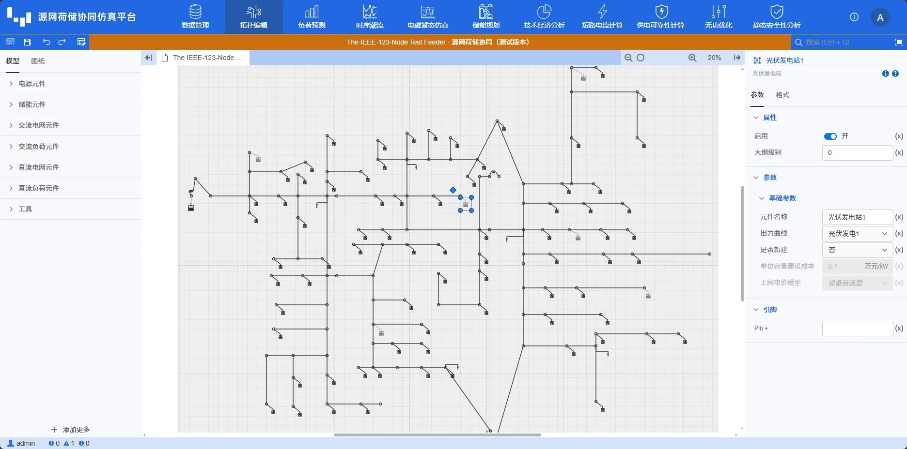
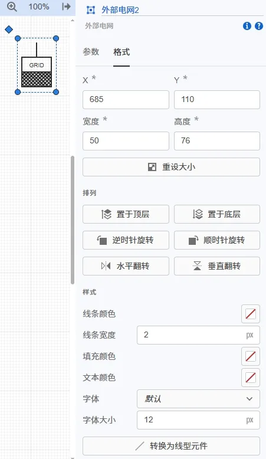
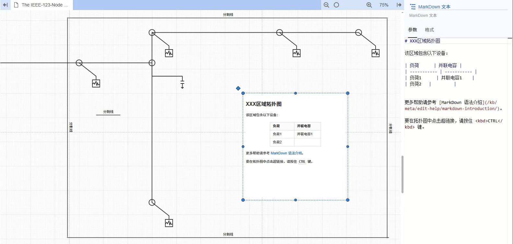

本节主要介绍源网荷储系统元件的拖拽连接搭建拓扑方法，并通过常见问题答疑帮助您快速熟悉。

## 功能说明

### 元件拖拽

平台提供电源元件、储能元件、交流电网元件、交流负荷元件、直流电网元件和直流负荷元件共6类原始元件模型供选择：

- **电源元件**有外部电网、风力发电站、光伏发电站、水力发电站、火力发电站、燃气发电站、生物质发电站和垃圾电厂；

- **储能元件**有电池；

- **交流电网元件**有串联电抗器、联络开关、变压器、三绕组变压器、并联电容/电抗器、杆塔和三相传输线；

- **交流负荷元件**有负荷；

- **直流电网元件**有交直流变换器、直流传输线和直流母线；

- **直流负荷元件**有负荷。

在拓扑编辑工作区左侧的**模型**选择源网荷储系统所需的元件，点击拖拽至工作区。

### 元件引脚连接

在拓扑编辑工作区左侧的**模型**选择元件并拖拽至工作区后，然后通过**引脚**将各个元件连接起来，搭建起源网荷储系统的拓扑模型。

引脚：每个模型（元件和自定义模型）都具备可互相连接的接口。引脚是模型与内部、外部的其它模型连接的输入输出接口。根据引脚类型的不同，电气引脚可分为交流和直流类型。 

:::tip
类型不同的引脚不能相连。
:::

引脚的连接方式有线连接和名称连接。  
1. 线连接：即直接利用“连接线”即可连接相应的引脚。  
2. 名称连接：在参数配置页面，指定连接到引脚的信号名称。若不同元件的引脚之间标注了相同的名称，则其相应的引脚即被认为是相连的。名称的默认颜色为蓝色。

### 拓扑布局优化

选择元件，右侧编辑区选择**格式**，格式栏主要负责对元件和文本的格式进行设置，主要有三大功能，分别是排列、样式和字体。

**排列**  
当不同元件重叠在一起时，排列功能可以设置它们的重叠先后顺序，选择**置于顶层或置于底层**。  
排列功能还可以设置元件的**旋转**角度，可以点击顺时针旋转、逆时针旋转、水平翻转和垂直翻转按钮。  
当框选多个元件时，排列功能可以设置它们的**对齐方式和分布方式**，如左对齐、水平居中、右对齐、顶端对齐、居中对齐、底端对齐、横向等距分布或纵向等距分布等。

**样式**  
主要包含线条颜色、线条宽度、填充颜色和文本颜色等设置。可以对元件的底色进行填充，修改元件边框的颜色以及线条的样式和粗细。

### 拓扑工具与美化

为了更好地美化系统拓扑，平台提供了拓扑编辑工具：超链接、分割线和 Markdown 文本。  
- **超链接**于指向平台系统内部的链接，如算例和元件链接等，一般应使用相对路径。如：dslab/diagram?simu_id=XXX，点击该超链接即可跳转到相应的算例。  
- **Markdown** 文本内容的编写支持 Markdown 语法，Markdown 是一种轻量级标记语言，支持文字格式调整，图片、图表、数学公式等的输入。在进行参数编写时，输出结果将实时渲染至工作台的显示框中。  
- **分割线**则可以更好地分割展示系统拓扑。

## 常见问题

如何看元件是否连接成功？  
:    平台会实时自动校验拓扑连接情况。可以在页面左下角的信息提升框查看，或者 <kbd>Ctrl</kbd> +  <kbd>M</kbd> 查看。

电力系统拓扑搭建有哪些技巧？
:    - 电力系统中不同电压等级至少需要一条母线，提供基准电压；
     - 元件较多时可以采用“名称”连接引脚。
