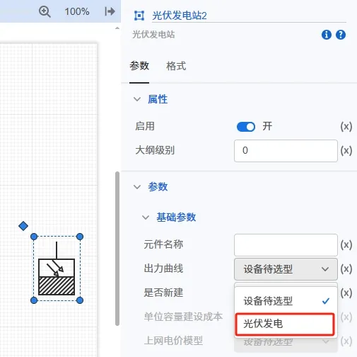
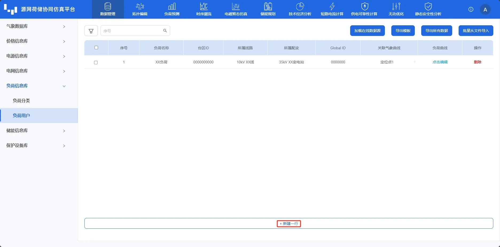
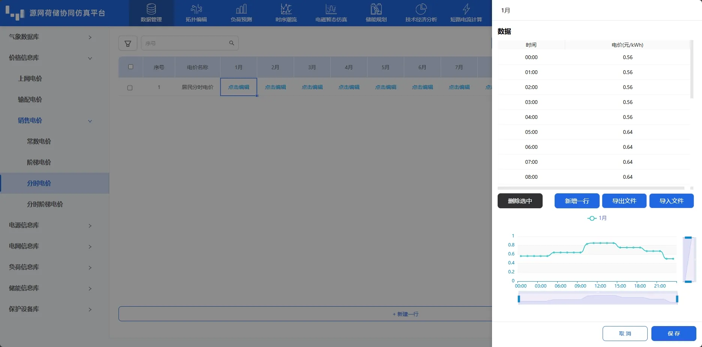
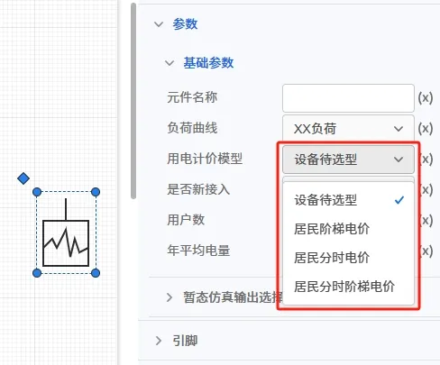

本节主要介绍了拓扑编辑模块绑定数据管理模块参数的方法，并通过常见问题答疑快速熟悉方法。

## 功能定义

在数据管理模块输入的**设备、负荷、价格信息**等基础参数，可以在拓扑编辑模块进行绑定。

## 功能说明

对源网荷储系统进行仿真模拟计算之前，需要设置合理的**已知条件**。主要包括：源网荷储系统电源出力、负荷曲线、源网储设备参数、初始状态和时序运行策略等。

:::tip 配置提醒
平台无法在不输入运行策略等边界条件的情况下直接给出运行策略和结果。只有录入了合理的边界条件后才可对系统进行高效准确的仿真模拟，计算系统在该策略下的状态；若录入的边界条件有误，可能引起模型方程不封闭或有误，导致无法计算或结果有误。
:::

### 设备参数绑定

在数据管理模块输入的源网荷储设备的基础参数后，拓扑模块搭建的元件可以绑定，用于仿真模拟设备的运行状态。

数据管理模块录入设备：

拓扑编辑模块绑定设备参数：

### 负荷绑定

负荷作为仿真模拟重要的边界条件，平台提供了**典型日负荷（8760h）**、**分月详细负荷**和**自定义负荷**三种模型供选择，在数据管理模块建立**直流/交流**负荷模型后后，拓扑模块拖拽出来的负荷元件可以进行绑定。

数据管理模块建立负荷模型：

拓扑编辑模块绑定设备负荷：

### 电价绑定

在数据管理模块建立**上网电价/输配电价/销售电价**价格模型后后，拓扑模块拖拽出来的电源元件、交流/直流负荷元件可以绑定。

数据管理模块建立价格模型：

对于**外部电源**元件，**购电计价**模型主要用于计算从外部电网购电所需的费用，为**项目支出**；**上网计价**模型主要用于计算光伏风机等新能源向外部电网反送电的收益，为**项目收入**。

对于**负荷**元件，**用电计价**模型主要用于计算源网荷储系统将能源供给给**负荷**的收益，为**项目收入**。

拓扑编辑模块绑定计价模型：

## 常见问题

可以不用绑定参数吗？哪些元件需要绑定参数？

:
    部分元件必须绑定参数，如对于设备和负荷，必须绑定参数；对于计价模型，不绑定则不会计算对应技经指标

数据管理模块输入参数后，为什么拓扑编辑模块找不到？ 

:
    您可以尝试： 1. 刷新页面或重新登录； 2. 检查数据管理模块是否保存成功。