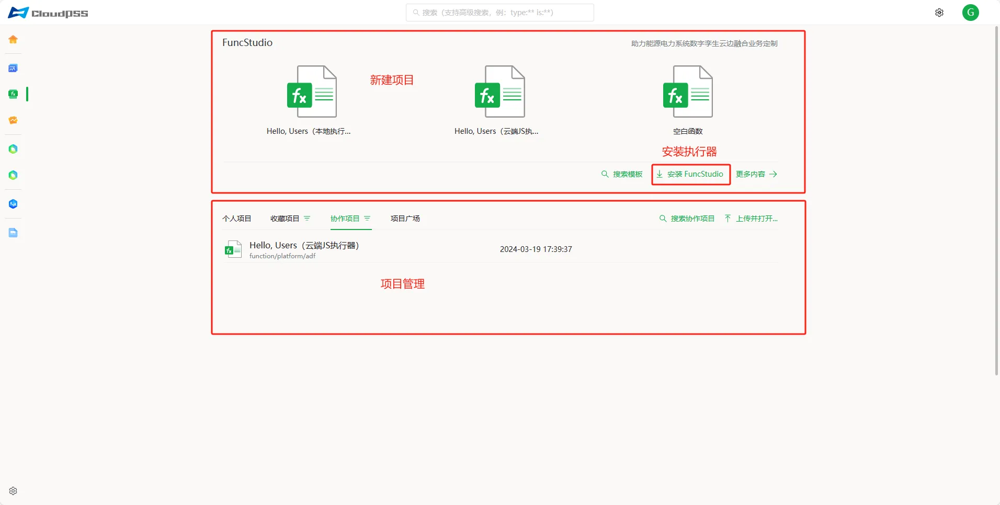
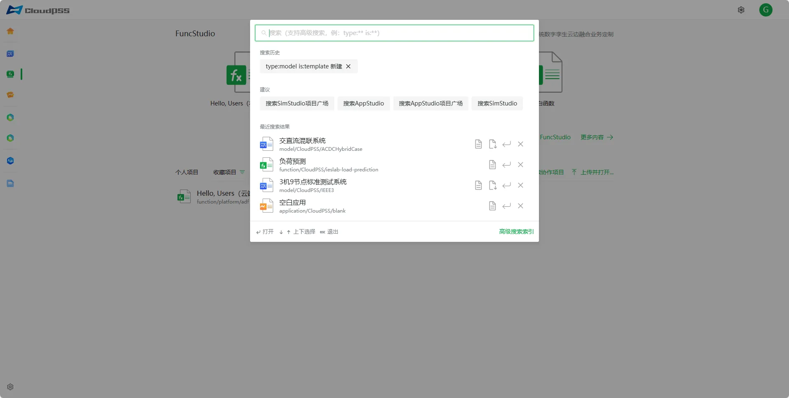
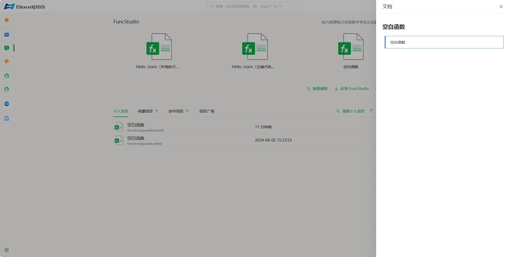
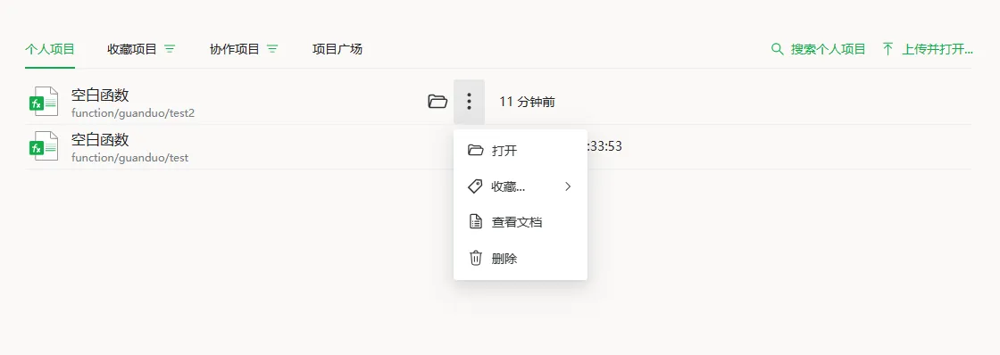
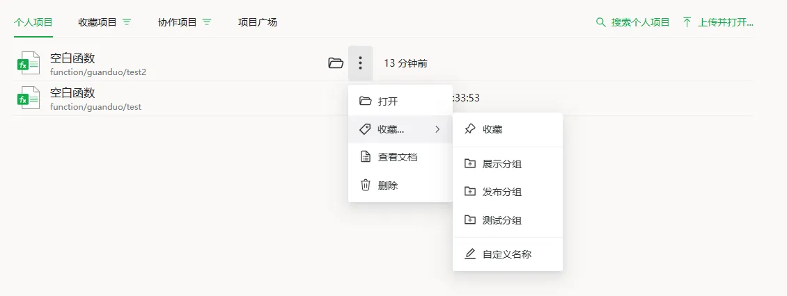
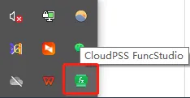
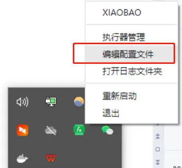
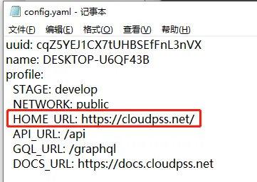
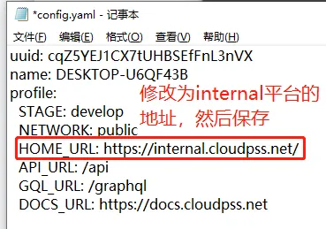
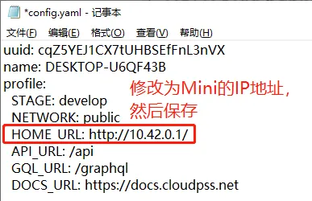

---

title: FuncStudio 云空间
description: CloudPSS 个人中心 FuncStudio 云空间介绍

tags: 
- 个人中心

---

本文档介绍 **个人中心** - **FuncStudio 云空间** 的主要功能，包括 新建项目、项目管理、执行器下载等功能。

## 页面功能

**FuncStudio 云空间**是 FuncStudio 函数工坊的项目管理页面，是进入 **FuncStudio 工作台** 的入口。

用户首先需注册并登录 **CloudPSS 个人中心**。根据 CloudPSS 平台部署方式的不同，注册及登录方法略有区别，具体如下

+ **CloudPSS公网主站（`www.cloudpss.net`）** 的用户，可参见 [注册并登录 CloudPSS 公网主站](../../10-register-and-login/10-cloudpss-public/index.md "注册并登录 CloudPSS 公网主站")。
+ **CloudPSS Mini、CloudPSS Pro** 等私有部署平台的用户，可参见 [登录 CloudPSS 私有部署平台](../../10-register-and-login/20-cloudpss-private/index.md "登录 CloudPSS 私有部署平台")。

成功登录后，在 **CloudPSS 个人中心** 点击 **FuncStudio** 的图标后，页面将跳转至 **FuncStudio 云空间**。如图所示，该界面包含新建项目、项目管理两部分区域。

### 新建项目

**FuncStudio 云空间** 提供了多种新建 FuncStudio 项目的方法。

+ **从“模板案例”新建**：在新建项目区域包含了“空白函数”、“Hello,Users(本地执行器)”、“Hello,Users(云端JS执行器)”等多种模型工坊项目模板。点击所选择的模板，进入工作台并自动以该模板为基础新建一个 FuncStudio 项目。
+ **直接进入 FuncStudio 工作台**：点击 **更多内容** 进入 **FuncStudio 工作台** 并自动打开 **新建向导**。用户可进一步基于 **新建向导** 新建 FuncStudio 项目。
+ **搜索模板新建**：点击**搜索模板**，用户可直接输入关键词查询相关模板，点击查询结果，进入工作台并自动以该模板为基础新建一个 FuncStudio 项目。搜索功能详情参见 [高级搜索功能](../../60-advanced-search/index.md "高级搜索功能") 帮助页。

### 项目管理

**FuncStudio 云空间** 的项目管理区以 **个人项目**、**收藏项目**、**协作项目** 和 **项目广场** 四个标签分组显示不同权限的项目，按照修改时间降序（最新优先）排列。

+ **个人项目**：显示当前用户创建的全部项目。
+ **收藏项目/已固定**：仅显示收藏的**个人项目**。点击**收藏项目/已固定**标签右侧的按钮，可切换显示不同收藏标签下的项目。
+ **协作项目**：显示当前用户所加入**协作组织**的协作项目。点击**协作项目**标签右侧的按钮，可切换显示不同组织管理的项目。有关协作组织的建立，可参见 [组织管理](../../40-general-account-settings/40-organization-management/index.md "组织管理") 帮助页。
+ **项目广场**：显示权限为**公开**的全部项目，包含其他用户创建的项目。 

:::tip 使用技巧
+ 点击每个标签或分组列表下的**搜索个人项目/收藏项目/协作项目/项目广场**，可打开全局搜索，用于快速查找项目。**全局搜索** 功能详情参见 [高级搜索功能](../../60-advanced-search/index.md "高级搜索功能") 帮助页。
:::

## 项目管理功能

**FuncStudio 云空间** 的项目管理区提供了项目打开、收藏、查看文档、删除、导入/导出、另存为等功能，方便用户高效管理大量模型项目。

### 项目基本操作

鼠标移至任一个项目文件，会显示 **打开** 和 **更多选项** 操作按钮。
+ 在项目文件上点击**打开**按钮，会跳转到工作台页面并打开该仿真项目。
+ 在项目列表中，任意点击一个项目，页面右侧会出现该项目的文档。项目文档可在 **FuncStudio 工作台** - **概览** 页面进行编辑。

+ 在项目文件上点击**更多选项**按钮，可对项目文件进行如下操作
    + **打开**：点击跳转到工作台页面并打开该仿真项目。
    + **收藏**：用于收藏该项目，**仅限个人项目**。
    + **取消收藏**：用于取消收藏该项目，**仅限已收藏的项目**。
    + **查看文档**：点击可快速查看该项目文档。
    + **删除**：点击可删除该项目，**仅限个人项目**。

 

### 收藏项目

#### 收藏

在个人项目列表中选中某项目，点击 **更多选项** - **收藏** 按钮，会弹出**收藏至默认**、**收藏至XXX**（例如：测试分组、发布分组、展示分组等）、**收藏至新的分组**多个功能按钮。

+ 点击 **收藏至默认** 按钮，会把当前项目加入至 **默认分组**；
+ 点击 **收藏至XXX** 按钮（例如：测试分组、发布分组、展示分组等），会把当前项目文件加入名为“XXX”的收藏分组（该选项仅在当前用户下存在自定义收藏分组时可用）；
+ 点击 **收藏至新的分组**，弹出自定义名称对话框，输入分组名称，可创建新的收藏列表。

#### 取消收藏

在选中某个被收藏的项目，点击 **取消收藏** 按钮，即可将该项目移出收藏列表。

#### 收藏分组操作

收藏分组不支持手动删除，但是当分组内的收藏项目为空，该分组会自动解散；分组项目不支持重命名。

## 案例介绍

### 执行器下载

执行一个构建好的函数项目，首先要给其分配执行器，因此，需要在本地安装 **FuncStudio** 的执行器，点击**安装 FuncStudio**按钮下载程序按照引导逐步安装完成即可。执行器的工作页面和 **FuncStudio** 的工作台一致，也可以在执行器内实现函数，如下图所示：

打开并登录执行器后，系统状态栏中会出现一个 **FuncStudio** 执行器的小图标，如下图所示：

### 编辑配置文件

右击系统状态栏中 **FuncStudio** 执行器的小图标，选择**编辑配置文件**的选项，点击后打开配置文件进行编辑，如下图所示：

import Tabs from '@theme/Tabs';
import TabItem from '@theme/TabItem';

<Tabs>
<TabItem value="js" label="公网平台配置文件编辑">

对于公网平台用户，配置文件如下图所示，安装时已默认完成配置，用户无需自行更改。

</TabItem>
<TabItem value="python" label="内网平台配置文件编辑">

对于非公网用户，如：**internal** 用户，需要将配置文件的 **HOME_URL** 配置为 `https://internal.cloudpss.net/`，如下图所示：

</TabItem>
<TabItem value="java" label="私有云平台配置文件编辑">

对于 **CloudPSS-Mini** 用户，需要将配置文件的 **HOME_URL** 配置为 **CloudPSS-Mini** 的 **IP地址** 如下图所示：

</TabItem>
</Tabs>

## 常见问题

