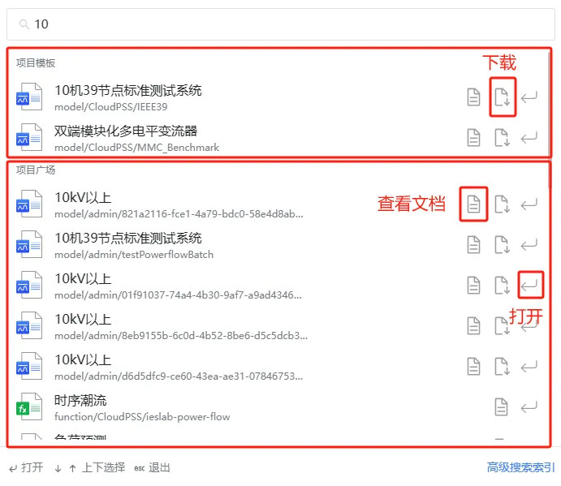
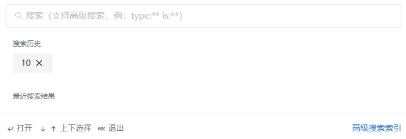
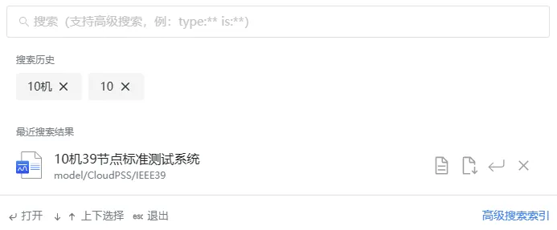

本节文档介绍 **CloudPSS 高级搜索**功能，通过多个使用案例帮助用户熟悉**高级搜索**的使用方法。

## 功能定义

高级搜索指定了一系列搜索条件（搜索关键字）来过滤搜索结果。搜索关键字为 **is**、**type**、**owner** ，各关键字支持相互排列组合。

```plain title="搜索关键字示例"
is:public 搜索公开项目（项目广场项目）
 
is:private 搜索个人项目

is:pinned 搜索收藏项目

is:collaboration 搜索协作项目

is:template 搜索模板案例

is:app 搜索 CloudPSS 应用

is:doc 搜索文档

type:model 搜索项目类型为 SimStudio 项目

type:application 搜索项目类型为 AppStudio 项目

type:function 搜索项目类型为 FuncStudio 项目

owner:admin 搜索项目所有者为 admin 的项目

```

## 页面介绍

高级搜索界面由输入框、搜索历史、最近搜索结果、提示信息四部分组成。


当输入搜索内容后，显示如下：



搜索内容按照以下顺序排列，若无则不显示该列：

**项目模板**、**个人项目**、**收藏项目**、**协作项目**、**文档**、**项目广场**

:::tip 使用提示
搜索结果支持使用键盘方向键上下 <kbd>↑</kbd> <kbd>↓</kbd> 切换、回车 <kbd>Enter</kbd> 打开，按下 <kbd>Esc</kbd> 退出搜索。
:::

搜索过的内容会显示在**搜索历史**中，方便用户再次找到历史搜索记录，允许用户手动删除**搜索历史**。



搜索并打开的记录会显示在**最近搜索结果**中，方便用户再次找到历史搜索并打开的记录，允许用户手动删除**最近搜索结果**。



:::tip 使用技巧
**SimStudio**、**FuncStudio**、**AppStudio** 页面存在**搜索模板**，**搜索个人项目**，**搜索固定项目**，**搜索项目广场**按钮，点击自动关联关键字
:::

## 案例

本节文档提供 3 个案例：

+ 案例 1：搜索 **SimStudio** 模板算例 **10 机 39 节点标准测试系统**

+ 案例 2：搜索 **AppStudio** 个人项目**空白应用**

+ 案例 3：搜索 **FuncStudio** 收藏项目**空白函数**

+ 案例 4：搜索 **SimStudio** 公开项目中 Maxwell 创建的**空白普通电力系统模型**

import Tabs from '@theme/Tabs';
import TabItem from '@theme/TabItem';

<Tabs>
<TabItem value="案例1">

```plain
is:template type:model 10机39节点
```


</TabItem>


<TabItem value="案例2">
```plain
is:private type:application 空白应用
```


</TabItem>

<TabItem value="案例3">

```plain
is:pinned type:function 空白函数
```


</TabItem>

<TabItem value="案例4">

```plain
is:public type:model owner:Maxwell 空白普通电力系统模型
```


</TabItem>


</Tabs>

## 常见问题

各种关键字允许自由组合吗？

:   允许自由组合关键字排列，但是同类型的关键字只会生效一个，组合关键字间需要以空格分隔。

