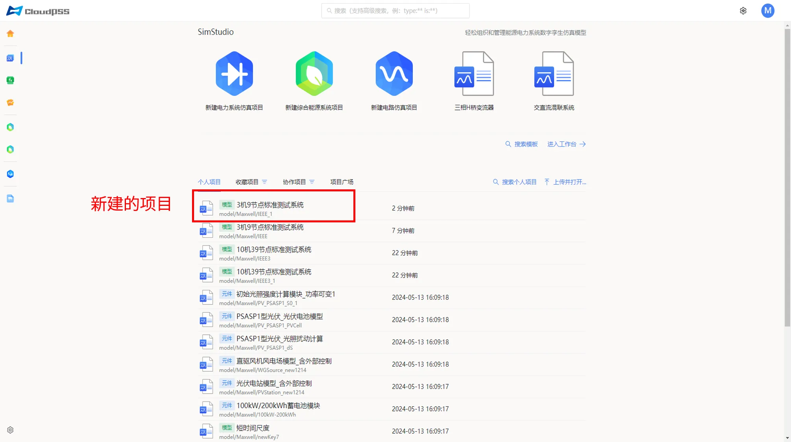
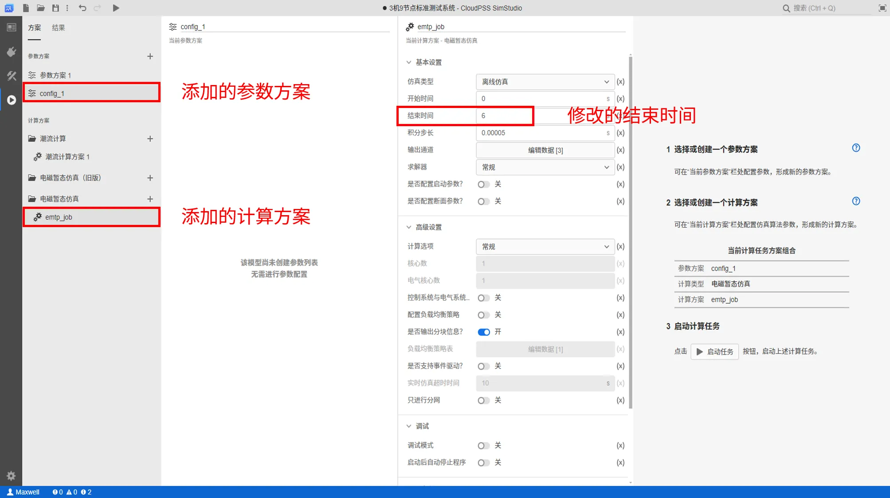
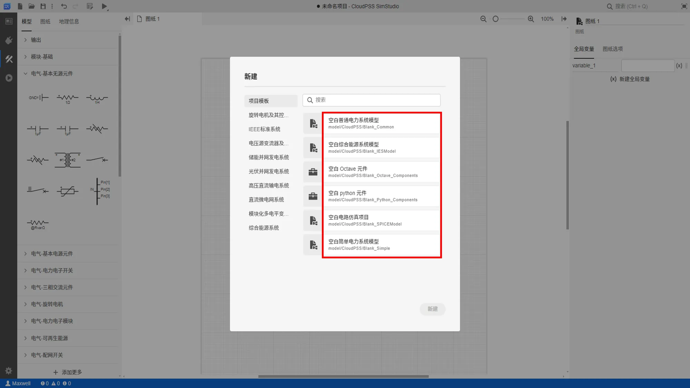

## 功能介绍

使用 EMTLab SDK 实现获取电磁暂态仿真项目信息、新建电磁暂态仿真项目、修改项目参数/计算方案、保存项目等功能。

## 使用说明

### 用到的 API

模型类：[`Class: Model`](../../../70-api/10-model/index.md#class-model)

+ 实例方法：
    | 方法     | 功能 | 
    | ---------------- | :-----------: | 
    | `model.rid` |   获取项目的 rid    | 
    | `model.name`                |  获取项目的名称  | 
    | `model.description`                |       获取项目的描述       | 
    | `model.revision`         |      获取项目的版本信息       |
    | `model.configs` |   获取项目的所有参数方案    | 
    | `model.jobs`                |  获取项目的所有计算方案  | 
    | `model.context`                |       获取项目的上下文相关信息       | 
    | `model.save(key=None)`         |      保存/另存项目       |
    | `model.createJob(jobType, name)` |   创建一个计算方案    | 
    | `model.addJob(job)`                |  将计算方案添加到项目中  | 
    | `model.getModelJob(name)`                |       获取指定名称的计算方案       | 
    | `model.createConfig(name)`         |      创建一个参数方案       |
    | `model.addConfig(config)` |   将参数方案添加到项目中    | 
    | `model.getModelConfig(name)`                |  获取指定名称的参数方案  | 
    

+ 静态方法：
    | 方法     | 功能 | 
    | ---------------- | :-----------: | 
    | `Model.fetch(rid)` |   获取指定 rid 的项目    | 
    | `Model.create(model)`                |  新建项目  | 
    | `Model.update(model)`                |       更新项目       | 
    | `Model.dump(model, file, format='yaml', compress='gzip')`         |      保存项目到本地文件       |
    | `Model.load(filePath, format="yaml")` |   加载本地项目文件    | 


### 调用方式


使用`Model.fetch(rid)`或者`Model.load(filePath, format="yaml")`静态方法，获取项目实例，对该项目实例调用上述方法进行管理。

## 案例介绍

通过一个完整的案例来展示如何基于上述 API 编写 Python 脚本完成**获取项目信息**、**新建项目**、**修改项目参数/计算方案**、**保存项目**等操作。

### 代码解析

在脚本中调试上述接口前，需要完成以下三个准备工作：

1. 导入 os 和 CloudPSS 模块
2. 指定项目所在的平台地址，即用户当前使用的平台网址，例如公网平台为`https://cloudpss.net/`
3. 申请并设置自己账户的 token, token 的申请和注销详见[SDK Token 管理](../../../../50-user-center/40-general-account-settings/30-sdk-token-managemment/index.md)帮助文档

```python title="准备工作示例代码" showLineNumbers
import os
import cloudpss   # 1. 导入 os 和 CloudPSS 模块
if __name__ == '__main__':
    # 2. 指定项目所在的平台地址，例如，公网地址为 https://cloudpss.net/
    os.environ['CLOUDPSS_API_URL'] = 'http://orange.local.cloudpss.net/'
    # 3. 申请并设置自己账户的 token
    cloudpss.setToken('{token}')  
```

完成上述准备工作后，即可在脚本中调用**Model 类**提供的相关接口方法。


+ 使用`Model.fetch(rid)`静态方法，获取指定 rid 的项目实例`model`，项目 rid 由**model/用户账号名称/保存模型算例是输入的唯一ID**构成，
可以在 SimStudio 云空间或项目当前页面的浏览器地址中查找

+ 调用具体的实例方法获取该项目的详细信息

```python title="获取项目详细信息的示例代码" showLineNumbers
    # 使用 Model.fetch(rid) 静态方法，获取指定 rid 的项目实例 model
    model =  cloudpss.Model.fetch('model/Maxwell/IEEE')
    # 使用实例方法获取该项目的详细信息
    rid = model.rid  # 获取项目的 rid
    print(f'项目的 rid 为：{rid}')
    name = model.name  # 获取项目的名称
    print(f'项目的名称为：{name}')
    description = model.description  # 获取项目的描述
    print(f'项目的描述为：{description}')
    revision = model.revision # 获取项目的版本信息
    print(f'项目的版本信息为：{revision}')
    configs = model.configs # 获取项目的所有参数方案
    print(f'项目的所有参数方案为：{configs}')
    jobs = model.jobs # 获取项目的所有计算方案
    print(f'项目的所有计算方案为：{jobs}')
    context = model.context # 获取项目的上下文相关信息
    print(f'项目的上下文相关信息为：{context}')
```

还可以使用`Model.create(model)`静态方法，新建项目，调用实例方法给该项目添加参数/计算方案，保存项目。

```python title="新建项目、添加参数/计算方案及保存项目代码" showLineNumbers
    model.rid = 'model/Maxwell/IEEE_1' # 修改该项目实例的 rid 
    cloudpss.Model.create(model)   # 基于该项目实例，新建一个项目
    model_new = cloudpss.Model.fetch('model/Maxwell/IEEE_1')   # 获取新建项目的实例
    job = model_new.createJob('emtp', 'emtp_job')  # 创建一个名为'emtp_job'的电磁暂态仿真计算方案
    job['args']['end_time'] = 6 # 修改计算方案，将结束时间设置为 6 秒
    model_new.addJob(job) # 将计算方案添加到项目中
    config = model_new.createConfig('config_1')  # 创建一个名为'config_1'的参数方案
    model_new.addConfig(config) # 将计算方案添加到项目中
    cloudpss.Model.update(model_new) # 更新项目
    # 将项目保存到本地文件
    cloudpss.Model.dump(model_new, 'E:\\FuncStudio3.0\\文档\\demo.cmdl')
    # 加载本地项目文件
    model_load = cloudpss.Model.load('E:\\FuncStudio3.0\\文档\\demo.cmdl')
```

### 结果展示

执行获取的项目详细信息的代码，输出结果如下所示：

```
项目的 rid 为：model/Maxwell/IEEE
项目的名称为：3机9节点标准测试系统
项目的描述为：Western Electricity Coordinating Council的IEEE-3机9节点标准测试系统。本算例支持潮流计算、电磁暂态计算、移频电磁暂态计算。支持从潮流断面稳态启动， 
支持长导线分网计算。
项目的版本信息为：<cloudpss.model.revision.ModelRevision object at 0x0000020F617B72C8>
项目的所有参数方案为：[{'args': {}, 'name': '参数方案 1', 'pins': {}}]
项目的所有计算方案为：[{'args': {'CheckInput': 1, 'MaxIteration': 30, 'ShowRunLog': 2, 'SkipPF': 0, 'UseBusAngleAsInit': 1, 'UseBusVoltageAsInit': 1, 'UseReactivePowerLimit': 1, 'UseVoltageLimit': 1}, 'name': '潮流计算方案 1', 'rid': 'function/CloudPSS/power-flow'}, {'args': {'begin_time': 0, 'end_time': 6, 'ess': 1, 'ess_time': 1e-06, 'initial_type': 0, 'load_snapshot': 0, 'load_snapshot_name': '', 'max_initial_time': 1, 'n_cpu': '1', 'numerical_oscillation_suppression': 1, 
'output_channels': [{'0': '三台电机转速wr', '1': 1000, '2': '1000', '3': 1, '4': ['canvas_0_1020', 'canvas_0_1022', 'canvas_0_1023'], 'ɵid': 113189357}, {'0': '三台电机端口功率PQ', '1': 1000, '2': '1000', '3': 1, '4': ['canvas_0_1024', 'canvas_0_1025', 'canvas_0_1026', 'canvas_0_1027', 'canvas_0_1028', 'canvas_0_1029'], 'ɵid': 1663197479}, {'0': '7号母线三相电压（电压表量测）', '1': 1000, '2': '1000', '3': 1, '4': ['canvas_0_1042'], 'ɵid': 816687018}], 'ramping_time': 0, 'save_snapshot': 0, 'save_snapshot_name': 'snapshot', 'save_snapshot_time': 1, 'shift_freq': 50, 'solver': 0, 'solver_option': '0', 'step_time': 0.001, 'task_queue': ''}, 'name': '移频电磁暂态方案 1', 'rid': 'function/CloudPSS/sfemt'}, {'args': {'@debug': '', '@priority': 0, '@queue': 1, '@tres': 'cpu=1', 'begin_time': 0, 
': 1, 'partition_option': 0, 'ramping_time': 0, 'realtime_timeout': 10, 'save_snapshot': 0, 'save_snapshot_name': 'snapshot', 'save_snapshot_time': 1, 'sim_option': 0, 'snapshot_cfg': 0, 'solver': 0, 'solver_option': 0, 'step_time': 5e-05, 'stop_on_entry': '0'}, 'name': '电磁暂态仿真方案 1', 'rid': 'function/CloudPSS/emtps'}] 
项目的上下文相关信息为：{'attribute': 'normal', 'auth': 'public', 'category': 'normal', 'currentConfig': 0, 'currentDiagramOpenList': [0], 'currentDiagramRoot': 0, 
'currentJob': 3, 'currentLabelStatus': True, 'diagram': {'currentCanvas': 0, 'openedCanvas': [{'key': 'canvas_0', 'pos': {'x': -83.5853271484375, 'y': 473.9573974609375, 'zoom': 1}}]}, 'graphic': {}, 'groupSubscriptions': [{'key': 'project-support:job-definition/cloudpss/emtp', 'name': 'EMTP 元件', 'type': 'official', 'visible': True}, {'key': 'project-support:job-definition/cloudpss/sfemt', 'name': 'SFEMT 元件', 'type': 'official', 'visible': True}, {'key': 'project-support:job-definition/cloudpss/power-flow', 'name': '潮流元件', 'type': 'official', 'visible': True}, {'key': 'project-support:job-definition/cloudpss/ies-simulation', 'name': '综合能
源系统元件', 'type': 'official', 'visible': True}], 'publicRead': True}
```

执行新建项目、添加参数/计算方案及保存项目代码，效果如下图所示：






## 调试技巧

若获取项目信息失败，可采用如下调试流程检查脚本代码：

+ 检查项目所在的平台地址是否设置正确
+ 确认 Token 是否完整有效
+ 检查 API 接口是否正确调用，特别注意参数的顺序和必填项
+ 确认 API 接口调用后的返回值是否正确
+ 调用实例方法时必须先实例化

## 常见问题

为什么调用`model.addJob(job)`和`model.addConfig(config)`添加参数和计算方案后，SimStudio 工作台中该仿真项目没有添加相应的参数和计算方案？

:   方案只是添加到了项目实例中，需要使用`Model.update(model)`方法在更新项目。

<!-- 如何新建空白模型项目？

：   

+ 1. 在新建项目对话框中查找想要构建的空白模型模板项目的 rid 
  


+ 2. 调用`Model.fetch(rid)`方法获取该空白模型模板项目实例 


```python showLineNumbers
    # 例如需要新建一个空白普通电力系统模型
    model =  cloudpss.Model.fetch('model/CloudPSS/Blank_Common')
```

+ 3. 基于该模板项目实例在自己账号下新建一个空白模型项目

```python showLineNumbers
    # 在自己账号下新建一个空白模型项目 
    model.rid =  'model/Maxwell/testdemo'
    cloudpss.Model.create(model)
``` -->


## 完整代码

```python title="案例完整代码" showLineNumbers
import os
import cloudpss   # 1. 导入 CloudPSS 模块
if __name__ == '__main__':
    # 2. 指定电磁暂态仿真项目所在的平台地址，例如：公网地址 https://cloudpss.net/
    os.environ['CLOUDPSS_API_URL'] = 'http://orange.local.cloudpss.net/'
    # 3. 申请并设置自己账户的 token
    cloudpss.setToken('{token}')  
    # 首先，使用`Model.fetch(rid)`静态方法，获取指定 rid 的项目实例 model
    model =  cloudpss.Model.fetch('model/Maxwell/IEEE')
    # 使用实例方法获取该项目的详细信息
    rid = model.rid  # 获取项目的 rid
    print(f'项目的 rid 为：{rid}')
    name = model.name  # 获取项目的名称
    print(f'项目的名称为：{name}')
    description = model.description  # 获取项目的描述
    print(f'项目的描述为：{description}')
    revision = model.revision # 获取项目的版本信息
    print(f'项目的版本信息为：{revision}')
    configs = model.configs # 获取项目的所有参数方案
    print(f'项目的所有参数方案为：{configs}')
    jobs = model.jobs # 获取项目的所有计算方案
    print(f'项目的所有计算方案为：{jobs}')
    context = model.context # 获取项目的上下文相关信息
    print(f'项目的上下文相关信息为：{context}')

    model.rid = 'model/Maxwell/IEEE_1' # 修改该项目实例的 rid 
    cloudpss.Model.create(model)   # 基于该项目实例，新建一个项目
    model_new = cloudpss.Model.fetch('model/Maxwell/IEEE_1')   # 获取新建项目的实例
    job = model_new.createJob('emtp', 'emtp_job')  # 创建一个名为'emtp_job'的电磁暂态仿真计算方案
    job['args']['end_time'] = 6  # 修改计算方案，将结束时间设置为 6 秒
    model_new.addJob(job) # 将计算方案添加到项目中
    config = model_new.createConfig('config_1')  # 创建一个名为'config_1'的参数方案
    model_new.addConfig(config) # 将计算方案添加到项目中
    cloudpss.Model.update(model_new) # 更新项目
    # 将项目保存到本地文件
    cloudpss.Model.dump(model_new, 'E:\\FuncStudio3.0\\文档\\demo.cmdl')
    # 加载本地项目文件
    model_load = cloudpss.Model.load('E:\\FuncStudio3.0\\文档\\demo.cmdl')

```