本文档介绍自定义 Octave 元件的创建和调用方法，并通过 3 个案例介绍自定义 Octave 元件的使用方法。阅读该文档，用户需熟悉 MATLAB/Octave 语言的基本语法。该功能仅支持在 EMTLab 平台使用。

## 功能定义
该功能支持使用 MATLAB/Octave 语言构建自定义电磁暂态仿真元件。

## 功能说明
### 创建元件
#### 方法1 直接创建 Octave 元件
在 EMTLab 工作台中，点击**新建**按钮，在弹出的向导窗口中选择**空白 Octave 元件**模板，点击新建按钮，新建元件，如下图所示。

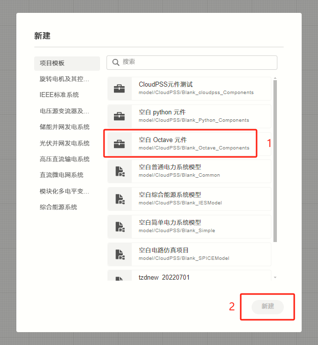

#### 方法2 从已有算例修改为 Octave 元件
在已有算例中，选择**总览**标签页，将**模型类型**切换为**元件**。


此时，在**实现**标签页中将出现**拓扑**、**电磁暂态**等子标签页。选中**电磁暂态**子标签页，点击**创建电磁暂态 - Octave 实现**按钮，即可创建 Octave 用户自定义控制元件。

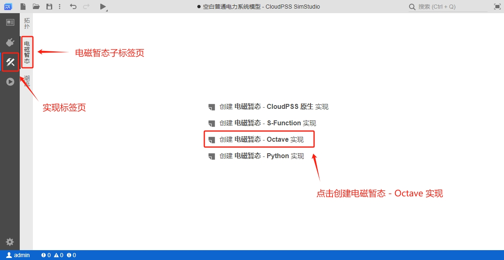

创建成功后，在**电磁暂态**子标签下将会出现 Octave 代码编辑器。

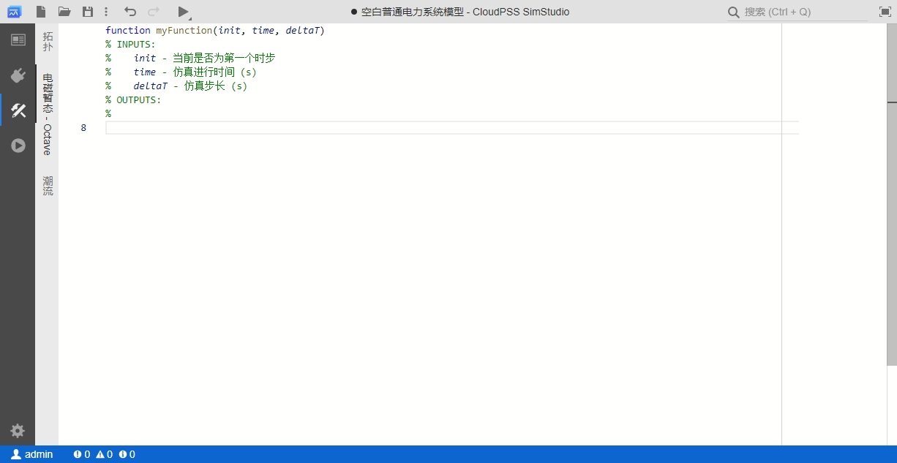

### 参数、引脚设置
自定义 Octave 元件的参数、引脚设置与其它用户自定义元件类似，在**接口**标签页中进行配置。参数、引脚的类型和定义可以参考 [模块封装](../../../simstudio/basic/moduleEncapsulation/index.md)。

参数、引脚定义后，将在代码编辑中作为变量被调用。


### 代码编辑
切换到**实现**标签页，选择**电磁暂态**子标签，跳转到电磁暂态元件代码编辑窗口。

此时，如果已定义好元件的参数和引脚，它们的键名会自动识别并列出。同时，EMTLab 已提供了三个内置变量，分别是 `init`（当前是否为第一个时步）、`time`（仿真进行时间）和 `deltaT`（仿真步长），用户可以直接使用这三个变量参与控制逻辑实现。

用户可以在代码编辑器中以 `args.键名` 的形式调用自定义的元件参数，也可以通过 `global` 的方式定义全局变量，用于在时步之间传递数据。

代码编写时需要给所有输出引脚赋值。


### 调用方式
自定义 Octave 元件根据触发方式的不同可分为 3 种，分别是：每时步触发、固定频率触发和外部触发。

- **每时步触发**：  
    即仿真运行的每个时步都会调用 Octave 元件，与其它常规元件的调用方式一致。

- **固定频率触发**：  
    当需要以某一固定频率调用 Octave 元件时，可以使用 EMTLab 提供的内置参数 **Trigger**，参数类型为**实数**，含义为**触发频率**。该参数需要用户在参数列表手动添加后才能修改，否则默认为每时步触发。

    在**接口**标签页的参数列表定义栏，新建一个参数，设置其键名为 **Trigger**，详细描述为“触发频率”，类型为**实数**，如下图所示。
  
    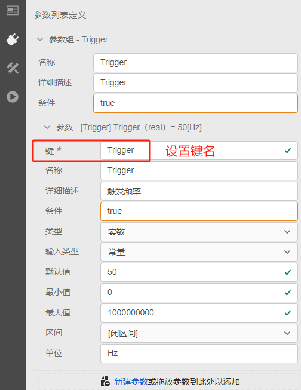
    
    用户也可以在创建 Octave 元件时，选择新建**空白 Octave 元件（固定频率触发式）**，直接打开一个带有 Trigger 参数的 Octave 元件模板，并在其基础上修改。

    

    在元件参数面板修改 Trigger 的值后，Octave 元件将按所设置的触发频率被调用。

- **外部触发**：
    当需要用一个外部信号触发来调用 Octave 元件时，可以将 EMTLab 提供的内置参数 **Trigger** 的参数类型需设为**虚拟引脚**，虚拟引脚的连接类型为**输入**，含义为**外部触发信号输入端口**，需要注意，这个信号为**上升沿触发**。该参数需要用户在参数列表手动添加后才能生效，否则默认为每时步触发。

    在**接口**标签页的参数列表定义栏，新建一个参数，设置其键名为 **Trigger**，详细描述为“外部触发信号输入端口（上升沿触发）”，类型为**虚拟引脚**，连接类型为**输入**，如下图所示。

    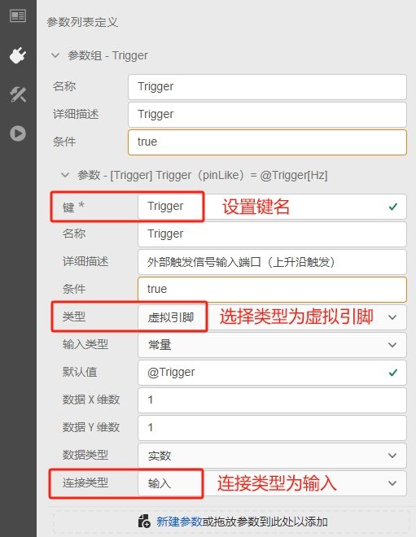
    
    用户也可以在创建 Octave 元件时，选择新建**空白 Octave 元件（外部触发式）**，直接打开一个带有 Trigger 虚拟引脚输入参数的 Octave 元件模板，并在其基础上修改。

    

    在元件参数面板的 Trigger 栏填入 **@前缀**的控制信号，Octave 元件将按该信号的上升沿触发被调用。


## 案例

本文档提供 3 个案例：
- 案例 1：每时步触发的简单 Octave 控制元件；
- 案例 2：固定频率触发的并带有全局变量的 Octave 控制元件；
- 案例 3：外部触发的含多维输入、多维输出的 Octave 控制元件。

import Tabs from '@theme/Tabs';
import TabItem from '@theme/TabItem';

<Tabs>
<TabItem value="case1" label="案例 1">

**简单控制元件，每时步触发**

本案例以一个可调斜率和分段点的分段函数，展示 Octave 元件的创建和使用方法。

- 新建 Octave 元件  

    在 SimStudio 工作台，点击左上角的**新建**，在弹出的窗口中，选择项目模板下的**空白 Octave 元件**。点击窗口右下角的新建按钮，即可完成新建。

    

- 参数与引脚定义

    在**接口**标签页的参数列表定义栏新建一个参数组，并新建参数。本例中需要添加的参数有：第一段函数斜率 **k1**、第二段函数斜率 **k2**、分段点横坐标 **a** 和分段点纵坐标 **b**。可如下图所示新建参数。

    

    在**接口**标签页的引脚列表栏新建引脚。本例中需要添加的引脚有：输入引脚 **input** 和输出引脚 **output** 。可如下图所示新建引脚。

    

-  元件图形设计
    
    在**接口**标签页的元件图形设计窗口绘制元件图标，并添加两个引脚，分别与 input 和 output 绑定。

    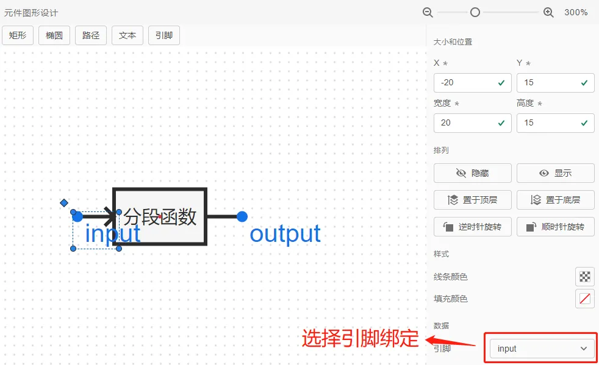

- 代码编辑

    切换到**实现**标签页，选择**电磁暂态**子标签，跳转到 Octave 元件代码编辑窗口。此时，由于已经定义好元件的参数和引脚，它们的键名会自动识别并列出。

    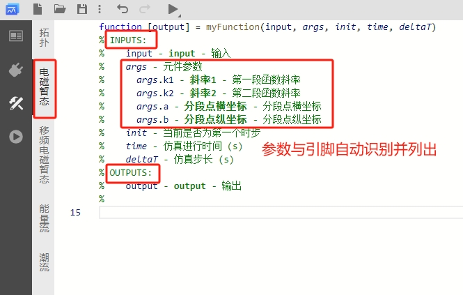

    在代码编辑窗口编写可调斜率和分段点的分段函数代码：

    ```
    if input < args.a
        output = args.k1 * input + args.b - args.k1 * args.a;
    else
        output = args.k2 * input + args.b - args.k2 * args.a;
    end
    ```
    
    注意变量名称为 **args.键名**的形式。
    
    

- 元件名称与权限设置

    切换到**总览**标签页，输入元件的名称，并设置元件的**权限**和**元件标签**。
    
    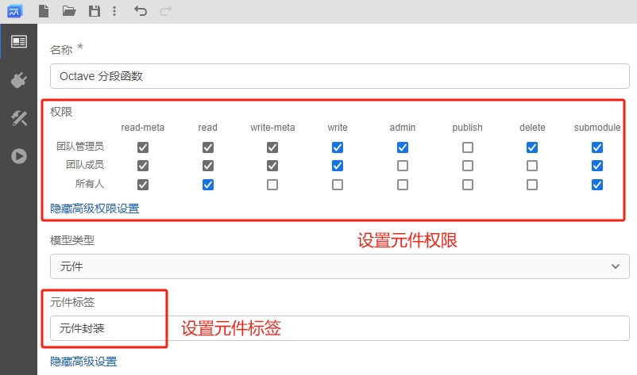
    
    保存的元件可以在设置的元件标签中查找，也可通过搜索查找。

至此，一个使用自定义 Octave 功能的分段函数元件构建完成。可以新建一个**普通项目**，在对应的**元件标签**中找到该元件，验证其控制效果。

- 控制效果验证

    新建一个普通项目，调用 Octave 分段函数元件。在其输入引脚连接一个**时间输入**元件，在其输出引脚连接一个**输出通道**观测输出结果。
 
    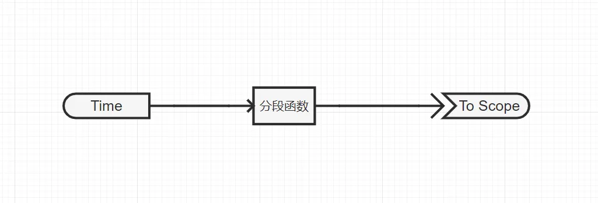

    

    配置电磁暂态仿真方案和输出通道，运行电磁暂态仿真，得到如下图所示结果。曲线的分段点和斜率与设置参数一致。
    
    


**案例 1** 算例文件下载：[model_admin_Octave_Test_Case1.zip](./model_admin_Octave_Test_Case1.zip "案例 1 算例文件")

</TabItem>

<TabItem value="case2" label="案例 2">

**带有全局变量的控制元件，固定频率触发**

本案例以一个阶梯爬坡信号发生器，展示带有全局变量且固定频率触发的 Octave 元件的创建和使用方法。

- 新建固定频率触发的 Octave 元件  

    在 SimStudio 工作台，点击左上角的**新建**，在弹出的窗口中，选择项目模板下的**空白 Octave 元件（固定频率触发式）**。点击窗口右下角的新建按钮，即可完成新建。

    

    也可以新建普通的**空白 Octave 元件**，在参数定义时添加键名为 **Trigger** 的参数，设置固定触发频率。

- 参数与引脚定义

    在**接口**标签页的参数列表定义栏新建参数。本例为固定频率触发式 Octave 元件，因此已添加有键名为 **Trigger** 的参数，还需要添加的参数有：初始值 **InitValue** 和爬升高度 **Step**。新建参数后，参数列表如下图所示。

    

    在**接口**标签页的引脚列表栏新建引脚。本例中需要添加的引脚为：输出引脚 **output** 。可如下图所示新建引脚。

    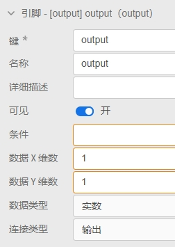

-  元件图形设计
    
    在**接口**标签页的元件图形设计窗口绘制元件图标，并添加引脚，与 output 绑定。

    

- 代码编辑

    切换到**实现**标签页，选择**电磁暂态**子标签，跳转到 Octave 元件代码编辑窗口。此时，由于已经定义好元件的参数和引脚，它们的键名会自动识别并列出。

    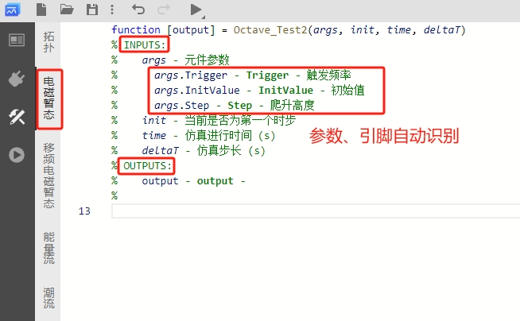

    在代码编辑窗口编写阶梯爬坡信号实现的代码：

    ```
    global StepMemory = args.InitValue;
    output = StepMemory;
    StepMemory = output + args.Step;
    ```
    
    注意变量名称为 **args.键名**的形式。代码中的 `StepMemory` 为全局变量，可存储每次调用 Octave 时所赋的值。
    
    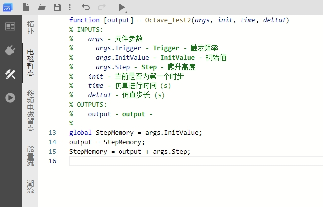

- 元件名称与权限设置

    切换到**总览**标签页，输入元件的名称，并设置元件的**权限**和**元件标签**。
    
    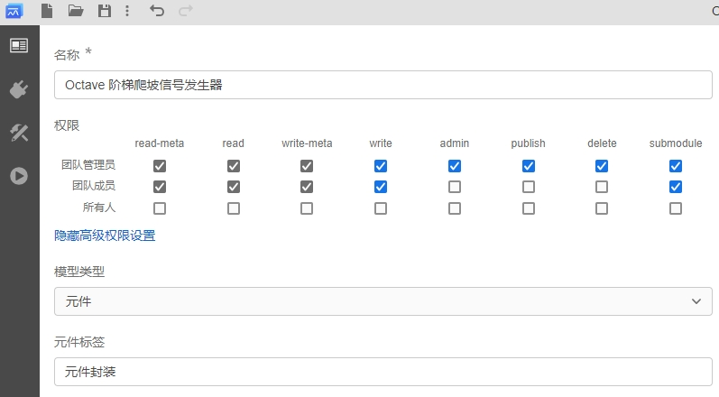
    
    保存的元件可以在设置的元件标签中查找，也可通过搜索查找。

至此，一个带有全局变量并使用固定频率触发的 Octave 元件构建完成。可以新建一个**普通项目**，在对应的**元件标签**中找到该元件，验证其效果。

- 效果验证

    新建一个普通项目，调用 Octave 阶梯爬坡信号发生器元件。在其参数面板设置**触发频率**为 1 Hz，**初始值**为 10，**爬升高度**为 20。在其输出引脚连接一个**输出通道**观测输出结果。
 
    

    

    配置电磁暂态仿真方案和输出通道，运行电磁暂态仿真，得到如下图所示结果。元件的输出从 10 开始，每 1 秒爬升 20，与设置参数一致。
    
    


**案例 2** 算例文件下载：[model_admin_Octave_Test_Case2.zip](./model_admin_Octave_Test_Case2.zip "案例 2 算例文件")

</TabItem>

<TabItem value="case3" label="案例 3">

**含多维输入、多维输出的控制元件，外部触发**

本案例以一个三相瞬时功率计算元件，展示含多维输入、多维输出且外部触发的 Octave 元件的创建和使用方法。

- 新建外部触发的 Octave 元件  

    在 SimStudio 工作台，点击左上角的**新建**，在弹出的窗口中，选择项目模板下的**空白 Octave 元件（外部触发式）**。点击窗口右下角的新建按钮，即可完成新建。

    

    也可以新建普通的**空白 Octave 元件**，在参数定义时添加键名为 **Trigger** 的**虚拟引脚型**参数，设置为外部触发信号输入端口。

- 参数与引脚定义

    在**接口**标签页的参数列表定义栏新建参数。本例为外部触发式 Octave 元件，因此已添加有键名为 **Trigger** 的参数，注意参数类型为**虚拟引脚**，连接类型为**输入**。参数列表如下图所示。

    

    在**接口**标签页的引脚列表栏新建引脚。本例中需要添加的引脚为：输入引脚 **V** 和 **I**，注意它们的数据 X 维数为 3，数据 Y 维数为 1；输出引脚 **PQ**，数据 X 维数为 2，数据 Y 维数为 1。可如下图所示新建引脚。

    

-  元件图形设计
    
    在**接口**标签页的元件图形设计窗口绘制元件图标，并添加引脚，分别与 V、I、PQ 绑定。

    

- 代码编辑

    切换到**实现**标签页，选择**电磁暂态**子标签，跳转到 Octave 元件代码编辑窗口。此时，由于已经定义好元件的参数和引脚，它们的键名会自动识别并列出。

    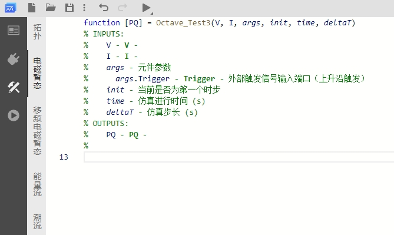

    在代码编辑窗口编写三相瞬时功率计算的代码：

    ```
    Ps = V(1)*I(1) + V(2)*I(2) + V(3)*I(3);
    Qs = (( V(2)*I(3) - I(2)*V(3) ) + ( V(3)*I(1) - I(3)*V(1) ) + ( V(1)*I(2) - I(1)*V(2) ))/(-sqrt(3));
    PQ(1) = Ps;
    PQ(2) = Qs;
    ```
    
    注意变量名称为 **args.键名**的形式。由于输入、输出引脚都为多维，在引用引脚信号的变量时需要注意索引。
    
    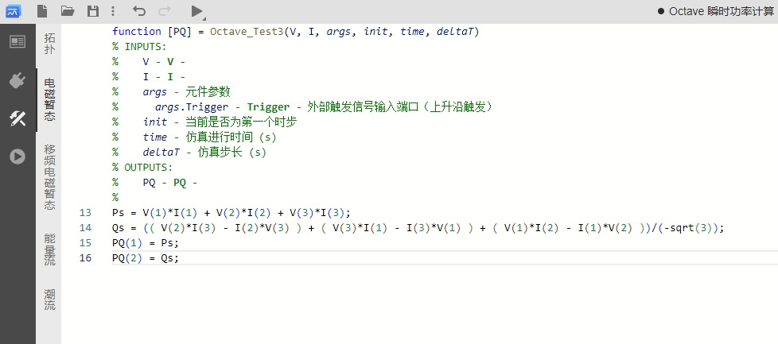

- 元件名称与权限设置

    切换到**总览**标签页，输入元件的名称，并设置元件的**权限**和**元件标签**。
    
    
    
    保存的元件可以在设置的元件标签中查找，也可通过搜索查找。

至此，一个含多维输入、多维输出并使用外部触发的 Octave 元件构建完成。可以新建一个**普通项目**，在对应的**元件标签**中找到该元件，验证其效果。

- 效果验证

    新建一个普通项目，调用 Octave 三相瞬时功率计算元件。  
    
    在**实现**标签页，添加两个**正弦发生器**分别模拟电压信号和电流信号，电压信号与一个**斜坡发生器**相乘后输入 Octave 三相瞬时功率计算元件，模拟电压不断增大的过程。由于 Octave 元件的输入和输出引脚都是 3 维，因此还需要添加两个**多路信号合并**元件，将正弦发生器的 3 个 1 维输出合并为 1 个 3 维的输出。添加一个**方波发生器**，其输出作为 Octave 元件外部触发的触发信号。
    
    构建如下图所示的测试算例。
    
    

    各元件的参数、引脚面板设置如下图所示。

    

    注意方波发生器的输出引脚填入 **@Trigger**，该信号将作为虚拟输入信号传入 Octave 元件的外部触发信号端口，频率设为 10Hz，即每 0.1s 检测到方波的上升沿时调用一次 Octave 元件。

    

    配置电磁暂态仿真方案和输出通道，运行电磁暂态仿真，得到如下图所示结果。元件输出一个两维的数据，分别是计算得到的瞬时有功 P 和瞬时无功 Q，每 0.1s 计算一次，与设置的 Octave 元件外部触发频率一致。
    
    


**案例 3** 算例文件下载：[model_admin_Octave_Test_Case3.zip](./model_admin_Octave_Test_Case3.zip "案例 3 算例文件")

</TabItem>
</Tabs>

## 常见问题
同时设置了一个元件的“拓扑”和“电磁暂态”的两种实现方法，为什么“拓扑”中的内容没有正确地生效？

:
    需要注意的是，在存在**电磁暂态**标签页的具体实现时，**拓扑**的实现方法将会失效。用户可以右键选择**电磁暂态**的子标签，并点击**删除**按钮，删除 Octave 的元件实现方法，保留**拓扑**实现方法，如下图所示。当然，也可以根据需要，自行选择需要保留的实现方法类型。
    
    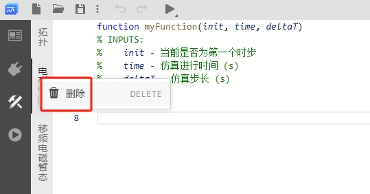

为什么带有 Octave 元件的算例运行很慢？

:   
    对于含有 Octave 元件的算例，在仿真的过程中需要根据 Octave 元件的触发频率调用 Octave 的解释器，导致仿真速度较慢。用户可以根据需求，选用拓扑模块封装等速度更快的方式进行模块构建。

仿真运行报错："The function belongs to the image package from Octave Forge which seems to not be installed in your system."

:   
    该报错原因为在代码中存在未识别的函数，目前暂不支持调用外部函数。

为什么使用 disp( ) 函数没有效果？

:   
    目前暂不支持直接输出 `disp( )` 的结果。用户可通过添加输出引脚，输出 Octave 元件中需要观测的结果。