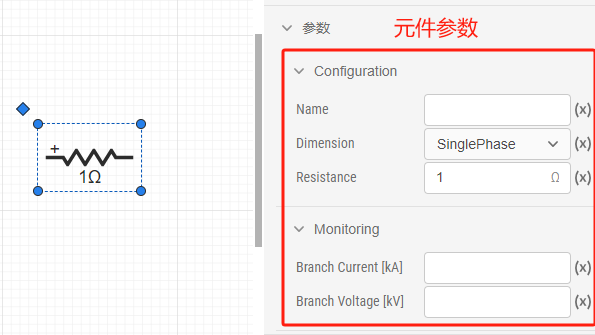
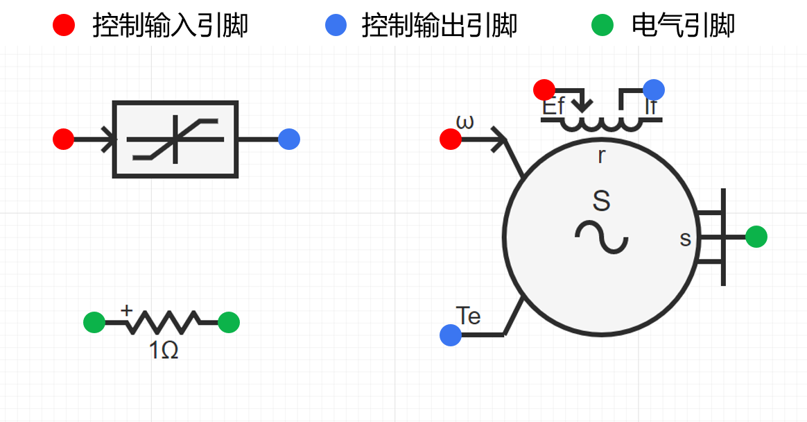

该文档为 SimStudio 参数、变量及引脚体系的介绍文档，用户可阅读该文档学习参数、变量、引脚之间的区别和联系，利用该体系灵活、快速地构建算例。

SimStudio 提供了一套以**参数**、**变量**及**引脚**为核心的建模系统。用户可使用不同类型的参数、变量及引脚实现对模块（包括元件和模型）的灵活维护和管理，进而实现各种高级仿真功能。SimStudio 中的每个模块（包括自带库元件和用户自定义模型）都享有一套独立的参数、变量及引脚体系，它包含参数、变量和引脚三个部分。

```mermaid
graph TD
A[模块] --> B[参数]
A --> C[变量]
A --> D[引脚]
B --> E[实数型]
B --> F[整数型]
B --> G[文本型]
B --> H[代码型]
B --> I[布尔型]
B --> J[选择型]
B --> K[多选型]
B --> L[表格型]
B --> M[虚拟引脚型]
M --> |仿真中可变| N[虚拟输入引脚型]
M --> |内部量量测| O[虚拟输出引脚型]
D --> P[电气引脚]
D --> Q[控制引脚]
D --> R[热力引脚]
Q --> S[输入引脚]
Q --> T[输出引脚] 
```
## 参数

参数是定义及描述元件特征的度量数据，比如电阻的阻值，电压源的幅值等。

参数主要有两种用法：

+ 用法1: 作为普通模型项目的**全局参数**，配合参数方案配置功能进行使用，用于多场景仿真等应用。具体操作方法参见[参数方案配置](../parameterSystem/index.md)帮助页。
+ 用法2: 用于模块封装过程中的参数列表定义，关于每种类型参数的定义，参见[定义元件/模块参数列表](../moduleEncapsulation/parameter-list/index.md)帮助页。

## 变量

变量即图纸中的全局变量，是指作用于项目内部的变量。全局变量可以引用元件参数进行赋值或计算，它只能在**当前项目内部使用**，与外部没有接口。

## 引脚

引脚是模块与内部、外部的其它模块连接的输入输出接口。根据引脚类型的不同，引脚可分为电气引脚、控制引脚、热力引脚三种不同类型。类型不同的引脚不能相连。控制引脚为有向引脚，根据数据流方向又分为输入引脚和输出引脚两类引脚。

关于每种模块引脚的定义，详见[定义元件/模块引脚列表](../moduleEncapsulation/pins-list/index.md)。

## 虚拟引脚

参数类型中的虚拟引脚型参数本质上也可以算作控制引脚。因此，虚拟引脚也可以分为虚拟输入引脚和虚拟输出引脚。控制输入、输出引脚和电气引脚一般都绑定在元件图形上，而虚拟引脚只会出现在元件的参数面板中。虚拟引脚的合理使用可以使元件的拓扑图形更加简洁。

虚拟引脚的使用方法是需要在信号名前添加符号前缀，虚拟输入引脚的前缀是`@`符号，虚拟输出引脚的前缀是`#`号。

### 虚拟输入引脚

虚拟输入引脚可以理解为一个**动态参数**，可以赋予元件内部的某个量一个变化的数值，虚拟输入引脚在电机元件中和一些动态限幅参数中比较常见。

- 电机元件的`S2M`电压源-电机切换信号和`L2N`转子方程解锁信号，通过虚拟输入引脚的方式可以在仿真过程中改变电机的状态或控制 
  方式;
- 限幅器的动态限幅上下限参数，通过虚拟输入引脚的方式可以在仿真过程中动态改变幅值。

### 虚拟输出引脚

虚拟输出引脚可以**输出元件内部的状态变量**，可用于**量测**，虚拟输出引脚一般是在元件的`Monitoring`参数组中。

- 首先，最常见的，电阻、电感、电容的电流值输出，这些都是虚拟输出引脚，不会出现在元件拓扑上，但是可以通过
  `#`号加信号名(用户自定义)的方式将其引出，作为支路电流的量测信号；
- 其次，还有一些复杂元件例如传输线元件的瞬时电流、电流有效值、传输功率等，都可以引出观测或参与控制。

## 参数、变量及引脚设置

每一个元件都有一个参数面板和引脚面板，可以对它的参数和引脚进行设置，变量在图纸的全局变量里面设置。参数、变量及引脚的值支持 **(x)**“值”模式和**f(x)**“表达式” 模式这两种输入类型，用户可随时切换输入类型，适配不同模型构建需求。

### “值”模式

点击参数、变量及引脚值输入框右侧，切换到显示 **(x)** 时，此时为“值”模式输入，只能输入一个常量。

### “表达式”模式

切换到显示**f(x)**时，此时为“表达式”模式输入，可以填入**表达式**或**引用其他的参数和变量**，表达式支持`math.js`数学库。

关于更多的`math.js`用法可以学习[math.js 表达式](https://mathjs.org/)。

在表达式输入模式下，选中输入框后，按 Ctrl 键可呼出输入框的**扩展编辑界面**。在扩展编辑界面中，支持输入和编辑多行复杂表达式。

:::tip

切换到表达式模式下输入栏的边框会变成黄色，边框为黄色的输入栏只能输入表达式。

从表达式模式切换回值模式时原本输入的表达式会丢失。

输入框会自动检查表达式的状态，若表达式输入有误，选中输入栏后，会在最右侧出现报错提示，鼠标悬浮到上面会显示报错信息；若表达式输入正确，会在最右侧自动计算出表达式的当前值。
:::

### 参数设置

用户可采用以下方法对算例中的模块（包括自带库元件和用户自定义模型）进行参数配置：

- 1.点击相应模块的图标后，选择右侧参数标签，即可调出参数配置面板，对参数进行配置。

- 2.使用元件表进行批量的参数配置，详见[元件表帮助](../../basic/componentTable/index.md)。

### 变量设置

点击图纸，在平台右侧出现全局变量栏，点击新建全局变量，然后填写变量名和变量的值即可。变量设置需要注意以下几点要求：

- 变量名应以字母或`_`符号开头，每个全局变量以及当前模块参数的变量名都应是唯一的；
- 变量的值支持**值/表达式模式输入**，可以引用元件定义的参数进行赋值或计算，变量之间也可以互相引用。
  
  

- 在模块参数中引用全局变量作为参数值时，输入栏应切换到**表达式形式**，且在全局变量前冠以`$`标识符为前缀，例如全局变量名为`R`时，引用该全局变量时应切换为表达式输入模式填写`$R`。

  

全局变量有哪些应用场景呢？

- 1.当多个元件共用一个参数时，可以使用全局变量，通过一次输入就批量、统一地修改参数值；
- 2.可以在全局变量栏快速地修改参数，对于元件数量多、规模庞大的复杂算例效果更明显，无需定位和选中元件，可
  以更高效便捷地修改参数值；
- 3.可以用于简单的公式计算，而无需通过搭建数学函数模型来实现。
- 4.可以调用其它的变量。

### 引脚设置

模块引脚连接一共有两种方式。

- 1.连线连接，点击某一个引脚后，按住鼠标左键，移动到另一个需要连接的引脚上松开左键，就可以完成连线；
- 2.**引脚名连接**，将需要连接的两个引脚改为同一个引脚名，就可以完成引脚的连接。

虚拟引脚由于不出现在拓扑图上，所以只能采用引脚名连接的方式。

:::warning 
引脚连接的时候需要注意:
- 连接的两个引脚维数必须一致;
- 电气引脚之间可以互相连接，控制输出引脚可以连接到控制输入引脚；
- 电气引脚也可以连接到控制输入引脚，此时传入控制系统的数值是电气引脚处的节点电压，单位为V，但是我们不推荐使用这种连法，有
  另外的电气量量测方法，详见[电磁暂态仿真的量测与输出系统](../../../../emtlab/emtp-calc/measure/index.md)。
:::

当采用引脚名连接时，可配置模块参数一样用户同样可以采用以下方法可对的模块进行引脚配置：

- 点击相应模块的图标后，选择右侧引脚栏，即可调出引脚配置面板，对引脚进行配置。
- 使用元件表进行批量的参数配置。

## 参数、变量的作用域

在某一模块内定义的参数和变量，其作用域仅局限在该模块内，无法在其外层或内层的模块中进行直接引用。若必须跨层传递参数数值，只能通过在外层或内层模块中设置相应参数，实现参数值传递。

## 常见问题

参数与变量的区别？

:   针对某一模块，参数可以与模块外层、内层元件之间交互参数数据的方式，而变量则只能在模块内层交互数据。例
    如：SimStudio 平台提供的元件，由于用户无法看到元件内部信息，故从外部只能看到参数。