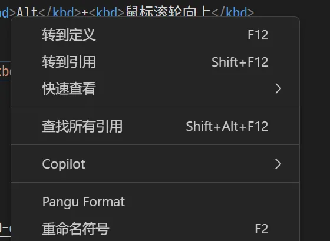
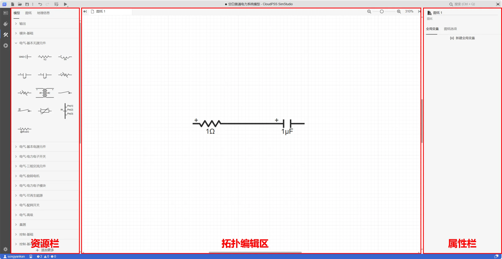

本文档介绍 CloudPSS 帮助、教程类文档的撰写和审阅规范。

## 格式要求

### 基础格式要求

CloudPSS 文档基于用 MarkDown 语法编写。请严格按照以下 4 项指南要求基础格式撰写、审阅文档。
1. [MarkDown 语法介绍](../10-markdown-introduction/index.md)：CloudPSS 文档支持的 MarkDown 语法说明
2. [文档组织](../20-folder-structure/index.md)：文档命名、目录结构基本要求
3. [Front-matter 介绍](../30-frontmatter-introduction.md)：文档头（元数据）编写方法介绍
4. [中文文案排版指北](../40-copywriting.md)：中文文档排版的基本格式

### 特殊格式要求

在满足上述格式要求基础上，CloudPSS 文档中针对部分需要特殊强调的文字或段落，须遵循以下格式。

#### 专有名词

**首次出现**、或者需要**重点强调**的专有名词，须加粗显示。

效果：
> **实现标签页**、<strong>运行标签页</strong>。

语法：
> `**实现标签页**、<strong>运行标签页</strong>`。

:::warning 请勿过分使用 
过分使用加粗效果对所有专有名词出现的位置进行装饰，会令文档缺少焦点。
:::

#### 界面元素、按钮

在介绍操作方法时，涉及到需要与 CloudPSS 软件界面上的元素、按钮交互时，相应的**元素**采用**加粗**格式。多级按钮中间用分隔符 `-` 隔开。

一般效果：
> 根据当前标签页的不同，工具栏会显示不同的特殊快捷按钮，如接口标签页下的**预览**、实现标签页下的**元件表**、实现和运行标签页下的**启动任务**。

> 选择保存在**协作项目**时，必须在**资源 ID** 中选择**协作组织 ID**，填入**项目 ID** 和**名称**，点击保存按钮即可实现项目文件的保存。

语法：

> `根据当前标签页的不同，工具栏会显示不同的特殊快捷按钮，如接口标签页下的 **预览**、实现标签页下的 **元件表**、实现和运行标签页下的 **启动任务**。`

> `选择保存在**协作项目**时，必须在**资源 ID** 中选择**协作组织 ID**，填入**项目 ID** 和**名称**，点击保存按钮即可实现项目文件的保存。`

需要重点突出某 **按钮** 时，按钮两侧应添加空格。

重点强调效果：
> 本文档主要介绍 **SimStudio 工作台** - **工具栏** 的各项功能。

> 本文档介绍 **SimStudio 工作台** - **实现标签页** - **拓扑编辑区** 的基本操作。

语法：
> `本文档主要介绍 **SimStudio 工作台** - **工具栏** 的各项功能。`

> `本文档介绍 **SimStudio 工作台** - **实现标签页** - **拓扑编辑区** 的基本操作。`

#### 参数 `key`

在介绍 CloudPSS 参数项、格式项时，其 `key` 应用行内代码样式标注。

效果：

> 可通过**二极管关断电阻** `RDoff` 定位参数并修改。

语法：

> ``可通过**二极管关断电阻** `RDoff` 定位参数并修改。``

#### 代码块

使用说明或案例介绍中，用到代码的部分，

1. 须以代码块的形式展示代码；
2. 须使用语言标签，高亮语言；
3. 对代码进行解释时，所附代码须展示行号
4. 重点介绍的代码段须高亮。

使用方法见 [代码块](../10-markdown-introduction/10-code.md) 帮助页。

#### 公式

行内公式应视作英文单词处理，与前后文本之间用**空格**隔开。不要在公式中使用汉字和中文标点。

效果：

> 式中 $\Delta p$ 是进出口压差（kPa），$p_{in}$、$p_{out}$ 分别为流体进出口压力（$\mathrm{kPa}$），$k$ 是局部压降系数（$\mathrm{kPa/(m^3 \cdot s^{-1})^2}$），$m$ 是质量流量（$\mathrm{kg/s}$），$\rho$ 是密度（$\mathrm{kg/m^3}$），$Q$ 是太阳能集热器的供热功率（$\mathrm{kW}$），$A$ 为总面积，$\eta$ 为光热转换效率，$r$ 为这一时间段内的实际光强（$\mathrm{W/{m^2}}$），$h_{in}$、$h_{out}$ 分别为工质的进出口比焓（$\mathrm{kJ/kg}$）。

语法：

> ```式中 $\Delta p$ 是进出口压差（kPa），$p_{in}$、$p_{out}$ 分别为流体进出口压力（$\mathrm{kPa}$），$k$ 是局部压降系数（$\mathrm{kPa/(m^3 \cdot s^{-1})^2}$），$m$ 是质量流量（$\mathrm{kg/s}$），$\rho$ 是密度（$\mathrm{kg/m^3}$），$Q$ 是太阳能集热器的供热功率（$\mathrm{kW}$），$A$ 为总面积，$\eta$ 为光热转换效率，$r$ 为这一时间段内的实际光强（$\mathrm{W/{m^2}}$），$h_{in}$、$h_{out}$ 分别为工质的进出口比焓（$\mathrm{kJ/kg}$）。```

#### 键盘按键

须用特殊格式重点标注。

效果：
> <kbd>Ctrl</kbd>+<kbd>Alt</kbd>+<kbd>Del</kbd>、<kbd>Alt</kbd>+<kbd>鼠标滚轮向上</kbd>

语法：
> `<kbd>Ctrl</kbd>+<kbd>Alt</kbd>+<kbd>Del</kbd>、<kbd>Alt</kbd>+<kbd>鼠标滚轮向上</kbd>`

#### 链接

链接的文本应与前后文本之间用**空格**隔开。

效果：

> 使用方法见 [代码块](../10-markdown-introduction/10-code.md) 帮助页。

:::tip
使用 Pangu 插件可以自动在 Markdown 文档中添加空格。


:::

#### FAQ

文档的 FAQ 部分采用定义的格式组织。

效果：

有效值

: 在相同的电阻上分别通过直流电流和交流电流，
  经过一个交流周期的时间，如果它们在电阻上所消耗的电能相等的话，
  则把该直流电流（电压）的大小作为交流电流（电压）的有效值。
  $$
  G_{rms} = \sqrt{\frac{1}{T} \int_{-\frac{T}{2} } ^{\frac{T}{2} }{ g(t)^{2} \operatorname{d}\! t } }
  $$
  正弦电流（电压）的有效值等于其最大值（幅值）的 $\frac{1}{\sqrt{2}}$ ，
  约 $0.707$ 倍。

语法：
```
有效值

: 在相同的电阻上分别通过直流电流和交流电流，
  经过一个交流周期的时间，如果它们在电阻上所消耗的电能相等的话，
  则把该直流电流（电压）的大小作为交流电流（电压）的有效值。
  $$
  G_{rms} = \sqrt{\frac{1}{T} \int_{-\frac{T}{2} } ^{\frac{T}{2} }{ g(t)^{2} \operatorname{d}\! t } }
  $$
  正弦电流（电压）的有效值等于其最大值（幅值）的 $\frac{1}{\sqrt{2}}$ ，
  约 $0.707$ 倍。
```

#### 容器类文档块的使用场景

CloudPSS 文档只允许以下 4 类文档块。

1. 介绍技巧、介绍提示时，使用 **tips** 文档块，并写明标题，如：**使用技巧**。
2. 介绍可用但可能带来错误或警告的操作时，使用 **warning** 文档块，并写明标题。
3. 介绍错误操作时，使用 **danger** 文档块，并写明 **错误操作**。
4. 介绍重要信息时，使用 **info** 文档快，并写明给标题。

除上述 4 种情况外，不应使用文档块。请勿在一篇文档中滥用文档块，导致文档花里胡哨。

## 命名要求

### 中文名

应使用规范、统一的**短语**或**无主句**作为文档标题、图片、表格题注。专有名词必须统一。

例如：
1. 新建项目
2. 鼠标左键拖拽标签以调整顺序
3. 元件表

### 英文名

文件夹、文件、图片、算例压缩包等元素名称须用**英文小写**单词与间隔符 `-` 进行命名，不要随意使用缩写。基本规则见 [文档组织](../20-folder-structure/index.md) 帮助页。

### 借助 GPT 翻译

建议借助 GPT-3.5 及以上生成式 AI 工具设计英文文件名。

可采用如下提示词。

```
假设你是一名电力仿真软件的说明文档撰写员。软件界面是中文，现在需要你对软件的每篇说明文档的名称进行翻译，并为每篇文档设计合理的英文文件名。英文文件名采用小写字母单词全拼格式，多个单词中间用'-'分隔符进行连接。
    
从现在开始，我将中文文件名称批量发送给你，你为每个中文文件名设计 3 个合理的、简洁的英文文件名，并分别给出每个翻译的中文解释说明，不要说多余的话。

例如，我将发给你如下内容：

    快速入门
    软件产品
    XStudio
    软件介绍
    探索典型案例	

你需要回复：

1. 快速入门
    * quick-start: 直接翻译，指向新用户的快速入门指南。
    * getting-started: 另一种常见表达，便于新用户理解其作用。
    * beginner-tutorial: 强调面向初学者的教程性质。  
2. 软件产品
    * software-products: 直接翻译，覆盖所有软件产品相关信息。
    * product-overview: 强调产品概览，更侧重于概述。
    * software-suite: 表示一套软件产品，强调多个软件的集合。
3. XStudio
    * xstudio: 保留原名称，简单易识别。
    * xstudio-suite: 强调 XStudio 作为一套工具或软件的概念。
    * xstudio-platform: 指出 XStudio 是一个平台，包含多个工具和功能。
4. 软件介绍
    * software-introduction: 直接翻译，清晰明了。
    * about-xstudio: 特定于 XStudio 的介绍。
    * introduction-to-xstudio: 更正式的对 XStudio 进行介绍。
5. 探索典型案例
    * explore-case-studies: 直接翻译，强调“探索”和“案例学习”的意图。
    * case-studies-overview: 强调是对典型案例的概述。
    * typical-examples: 更简洁的表达，突出“典型”的例子。

准备好了，请说“开始”。
```

## 行文要求

CloudPSS 文档行文过程应遵循以下规范。

1.  统一全篇专有名词。如存在不明确的用词，应与部门负责人、产品负责人沟通商定。首次引用新的重要专有名词时，应附带解释。例如：

    - 在文档系统首次详细介绍 **SimStudio** - **实现标签页** 时，应首先介绍该标签页的功能：

      > CloudPSS SimStudio **实现标签页** 用于构建、修改、管理当前模型项目的内部实现细节，是 SimStudio 最重要的功能页。

    - 对页面进行解释后，再开始介绍页面上的功能细节。

      > SimStudio 作为 CloudPSS 多个仿真软件的建模工作台，内嵌了潮流计算、电磁暂态仿真、综合能源系统仿真模拟等多类模型和仿真内核。为兼容不同类型模型的编辑和管理功能，CloudPSS SimStudio 提供了**拓扑实现**、**代码实现**、**外部导入实现**等多种模型实现方法。

      > 根据 CloudPSS SimStudio 所提供的仿真功能不同，**实现标签页**具备不同的建模界面。

2.  介绍操作流程时应尽量采用标准、简洁、无明显语气的**无主句**方式介绍操作流程。应避免使用人称代词（你、我、他等），必要时使用**用户**代替；应避免使用时间连接词（首先、然后等），针对流程较长的操作，应采用顺序列表方式介绍步骤。

    **正确用法**

    > 用户可按照以下步骤熟悉并学习 CloudPSS IESLab 建模仿真平台。

    错误用法

    > 建议您按照以下步骤使用 CloudPSS IESLab 建模仿真平台。

    **正确用法**

    > 超链接工具使用方法包含 2 步：
    >   1. 获取被指向目标元素的链接，包括
    >       * 图纸链接或图纸上元素的链接
    >   2. 添加超链接
    >       * 在模型标签栏，从模型库的工具分组拖拽超链接元件至拓扑编辑区；
    >       * 在拓扑编辑区，点击选中添加的超链接元件，粘贴链接地址到其参数卡的目标地址栏。

    错误用法

    > 超链接工具使用方法包含 2 步：首先，获取被指向目标元素的链接，然后，添加超链接。

## 图片要求

CloudPSS 文档中的图片应满足以下标准：

#### 自制图片

+ 自制图统一使用 SimStudio 工作台或 PowerPoint 制作，优选保存为矢量图格式，次选 PNG 格式。
+ 图片中的文字须使用免费字体（如**思源黑体**），不得在图片中添加过多的解释性文字。点击下载 [思源黑体][SourceHanSans]。
+ 图片命名遵循本文档中的命名要求执行。

#### 截图

+ 统一使用 demo 用户（截图中不得出现除 demo 外的其他用户名）、使用亮色模式工作台或页面进行截图。
+ 截图统一保存为 PNG 格式，统一使用 PowerPoint 编辑和保存。
+ 截图中的说明文字须使用免费字体（如**思源黑体**）、纯**黑色**或**红色**，不得在图片中添加过多的解释性文字。点击下载 [思源黑体][SourceHanSans]。
+ 截图中的矩形标记框的边框宽度为 1.5 磅，颜色为纯**红色**。
+ 选取的截图需要有实际意义，不得出现与当前功能介绍无关的文字、名称、连接线、元件等元素。
+ 注意对齐添加的文字和矩形框。
+ 图片命名遵循本文档中的命名要求执行。



#### GIF

+ 尽可能避免使用 GIF 图片。

## 内容重用要求

基础类文档，如个人中心、XStudio 工作台等文档应满足内容重用，其中的图片和文字应同时适配 EMTLab、IESLab 和 DSLab 平台的介绍。

内容重用方法，参见 [重用内容](../../20-examples/40-reuse/index.md) 帮助页。

## 内容和逻辑要求

撰写人和审查人应注意检查文档内容的完备性和介绍逻辑的合理性。

每篇文档的介绍应覆盖当前介绍页面/功能的全部元素。

每篇文档的介绍应按照由浅入深、循序渐进、由整体到局部的方式进行合理介绍。应避免跳跃性的功能介绍。

[SourceHanSans]: https://mirrors.tuna.tsinghua.edu.cn/adobe-fonts/source-han-sans/SuperOTC/SourceHanSans.ttc.zip