本节首先介绍 Octave 元件的**参数配置**和**不同的调用方法**，然后通过3个案例介绍自定义 Octave 元件的使用方法，阅读该文档，用户需熟悉 Matlab/Octave 语言的基本语法。该功能仅支持在 EMTLab 平台使用。

## 功能定义
该功能支持使用 Octave、MATLAB 语言构建自定义电磁暂态仿真元件。

## 功能说明

### 创建元件

#### 方法1 直接创建 Octave 元件

在EMTLab工作台中，点击“新建”按钮，在弹出的向导窗口中选择“空白 Octave 元件”模板，点击新建按钮，新建元件，如下图所示。

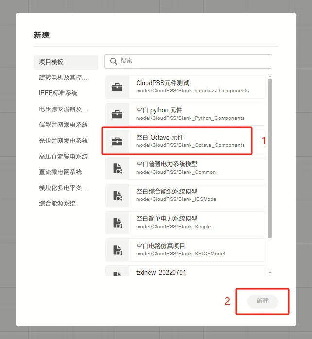

#### 方法2 从已有算例修改为 Octave 元件

选择已有算例中，选择“总览”标签页，将“模型类型”切换为“元件”。

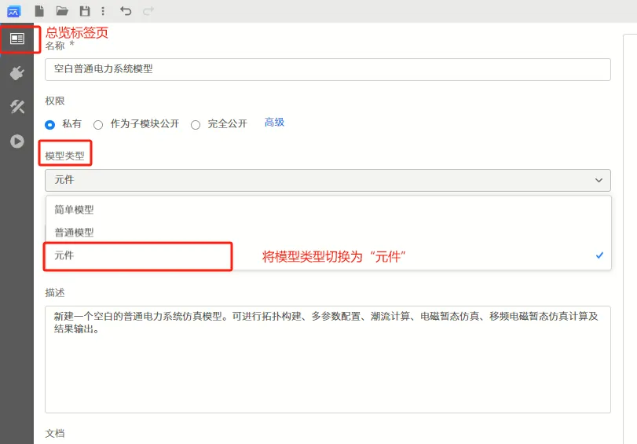

此时，在“实现”标签页中将出现“拓扑”、“电磁暂态”等子标签页。选中“电磁暂态”子标签页，点击“创建电磁暂态 Octave 控制实现”按钮，即可创建 Octave 用户自定义控制元件。

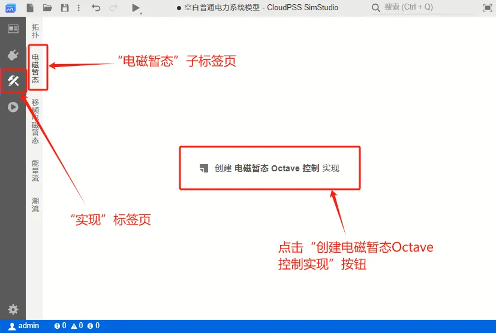

创建成功后，在“电磁暂态”子标签下将会出现 Octave 代码编辑器。

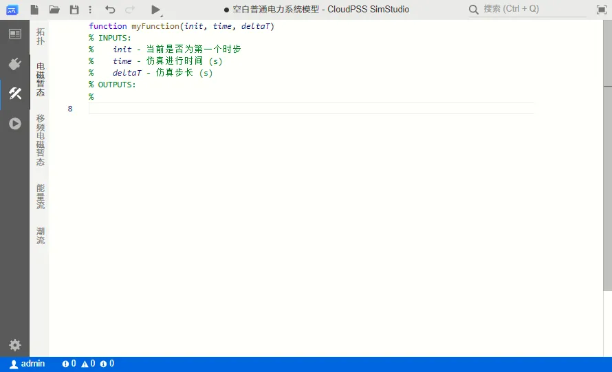

### 参数、引脚设置

用户自定义 Octave 元件的参数、引脚设置与其它用户自定义元件类似，主要在“接口”标签页中进行配置，可以参考[模块封装](https://docs.cloudpss.net/simstudio/features/Basic/Mask)。

接口标签页包含三部分：参数编辑栏、引脚编辑栏、元件图形设计窗口。

#### 参数编辑
参数编辑栏可实现对参数组、参数的配置。参数组为参数的分组，添加参数前必须为其新建一个分组。

点击“新建参数组”即可添加新的参数分组。然后点击“新建参数”，即可在该分组下添加参数。

点击某一参数，右键参数菜单可选择执行剪切、复制、创建副本、删除、预览等操作。

在添加参数时可以选择不同的参数类型，包括实数型、整数型、文本类型、布尔类型、选择类型、多选类型、表格类型以及虚拟引脚类型8种。

点击“新建引脚”，即可添加模块的外部引脚。右键菜单可选择执行剪切、复制、创建副本、删除、预览等操作。

#### 引脚编辑

引脚编辑栏的配置表格如下所示：

|名称|描述|示例|
| :--- | :--:  | :--- |
|键|键对应的英文单词，可认为是该引脚的表示名称|如，InputPort，ControlPort，Udc等|
|名称|该引脚的英文描述|如，The input port of the control block|
|详细描述|该引脚的中文描述|如，控制模块的输入引脚|
|可见| |无|
|条件|该元件显示的条件，可与参数编辑栏的参数键配合使用，以便控制引脚的显示与否|如，Switch==1，Key>10 等|
|数据X维数|该引脚所对应数据的X维数|根据该引脚连接元件的数据类型进行填写，例如该引脚链接了三相电阻(3X1维数据类型)的一端，则此处写3|
|数据Y维数|该引脚所对应数据的Y维数|根据该引脚连接元件的数据类型进行填写，例如该引脚链接了三相电阻(3X1维数据类型)的一端，则此处写1|
|数据类型|该引脚所连接元件的数据类型，可以为 real(实数型)、integer(整数型)、logical(逻辑型)、text(文本型)|根据该引脚连接元件的数据类型进行选取，例如该引脚链接了电阻，则此处选取为 real；该引脚链接了PI控制器的输入，则此处选取为 real|
|连接类型|该引脚所连接元件的类型，可以为 electrical(电气类型)、input(输入类型)、output(输出类型)|根据该引脚连接元件的类型进行选取，例如该引脚链接了电阻，则此处选取为 electrical；该引脚链接了 PI 控制器的输入，则此处选取为 input|

总结来说，添加引脚给模块提供了与外部电路连接的实体引脚，而虚拟引脚类型参数提供了与外部电路连接的虚拟引脚。

#### 图标绘制窗口

图标绘制窗口预置了包括矩形、圆形、直线、文字、自定义图形以及引脚6种类型的图形库。鼠标左键点击相应图形，并拖拽到绘图窗口内可实现图形的放置，点击图形的蓝色选中框或旋转按钮，可实现图形的缩放及旋转。

图形可通过点击“线条和填充”来设置线条及填充属性。通过“条件”输入框，可实现图形显示与否与参数配置之间的联动。

例如，在参数组Configuration分组下新建键名为 Switch 的实数型参数，在“条件”框内输入“true”或置空，则表示该图形一直**显示**；在“条件”框内输入“Switch>=10”，则表示该图形仅在参数 Switch 的值大于等于 10 的条件下才**显示**；在“条件”框内输入“false”，则表示该图形一直**不显示**；

自定义图形支持用户输入 SVG 的 path 代码来自由构建复杂的图形。基本方法为：利用 IE 浏览器查看 SVG 图形的 path 代码，并将该代码复制到自定义图形的输入框内。

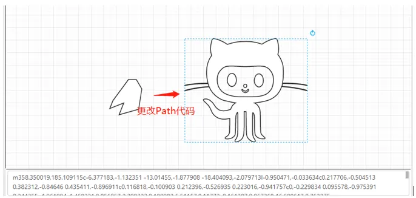

引脚图形需要与引脚编辑栏中实际的引脚进行配对绑定，例如在引脚编辑栏新建键名为Input的实数型输入引脚，选中引脚图形，在“引脚”框内下拉选择“Input”键名，即可完成引脚的配对绑定。

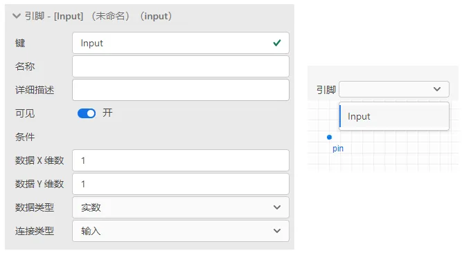 

### 调用方式

切换到实现标签页，选择电磁暂态标签，跳转到电磁暂态元件代码编辑窗口。

此时，如果已定义好元件的参数和引脚，它们的键名会自动识别并列出。同时，CloudPSS SimStudio 已提供了三个内置变量，分别是 init（当前是否为第一个时步）、time（仿真进行时间）和 deltaT（仿真步长），用户可以直接使用这三个变量参与控制逻辑实现。

用户可以在代码编辑器中以“args.键名”的形式调用自定义的元件参数，也可以通过 global 的方式定义全局变量，用于在时步之间传递数据。

模型编写时需要给所有输出引脚赋值。

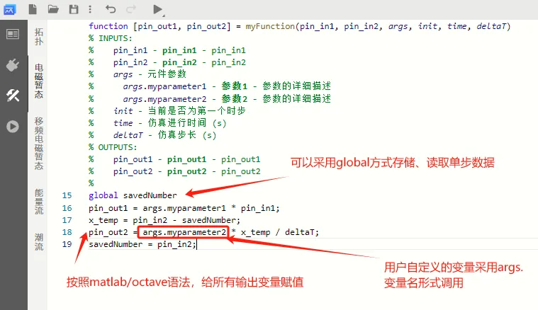

## 案例

### 简单控制元件
案例1：简单控制元件，每时步触发，重点讲述基础用法。

本节以一个可调斜率和分段点的分段函数，展示 Octave 元件的创建和使用方法。

#### 新建 Octave 元件  

在 CloudPSS SimStudio 工作台，点击左上角的`新建`，在弹出的窗口中，选择项目模板下的**空白 Octave 元件**。点击窗口右下角的新建按钮，即可完成新建。

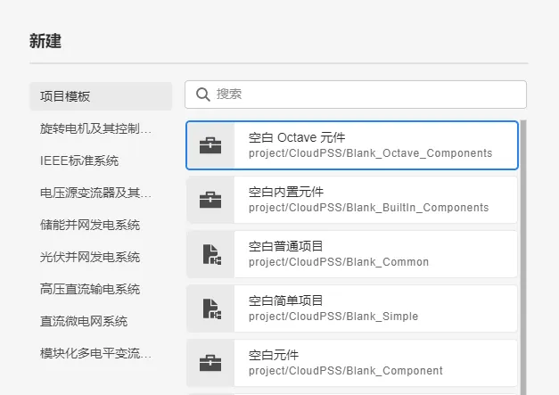

#### 参数与引脚定义

元件的参数与引脚类型可参考[参数及引脚体系](/docs/docs/software/xstudio/simstudio/basic/parameterSystem/index.md)帮助文档，参数与引脚的添加和设置方法可参考[模块封装](/docs/docs/software/xstudio/simstudio/basic/moduleEncapsulation/index.md)帮助文档。    
  

本例中需要用到的可设置参数有第一段函数斜率 *k1*、第二段函数斜率 *k2*、分段点横坐标 *a* 和分段点纵坐标 *b*。 在`接口标签页`的参数列表定义中作如下设置。  

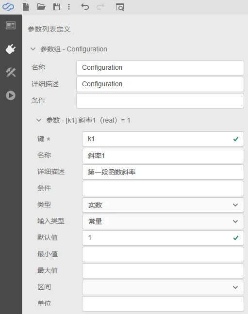

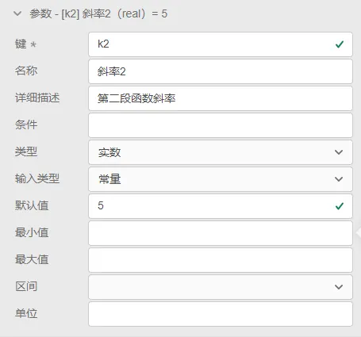

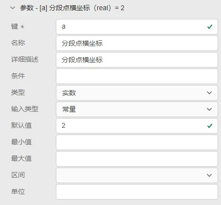

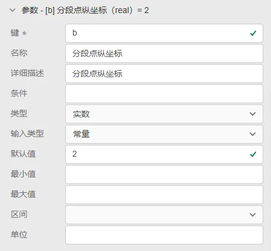

本例中需要用到的引脚有一个输入引脚和一个输出引脚。在`接口标签页`的引脚列表定义中作如下设置。

#### 元件图形设计

在元件图形设计窗口绘制元件图标，并添加两个引脚，分别与input和output绑定。

#### 编辑代码

切换到`实现标签页`，选择`电磁暂态`标签，跳转到电磁暂态元件代码编辑窗口。此时，由于已经定义好元件的参数和引脚，它们的键名会自动识别并列出。

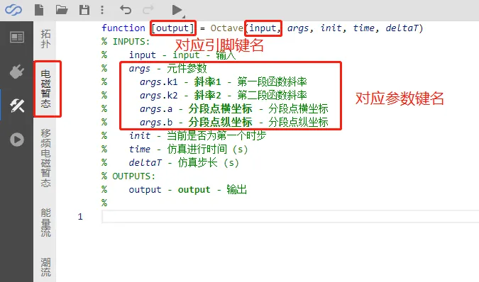

CloudPSS SimStudio已提供了三个内置变量，分别是 *init* （当前是否为第一个时步）、 *time* （仿真进行时间）和 *deltaT* （仿真步长），用户可以直接使用这三个变量参与控制逻辑实现。

将可调斜率和分段点的分段函数代码填入代码编辑窗口。

注意变量名称为`args.键名`的形式。

#### 元件名称与权限设置

切换到`总览标签页`，输入元件的名称，并设置元件的`权限`和`元件标签`。权限设置为`私有`时，该元件仅用户自己可见；设置为`公开`时，该元件会出现在项目广场中，所有用户可见。`元件标签`为该模块在模型库中的分组。

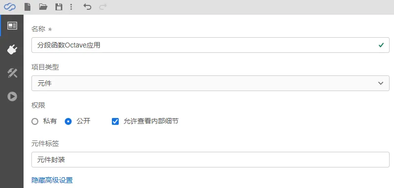

保存的元件可以在设置的元件标签中查找，也可通过搜索查找。

#### 效果展示

至此，一个使用 Octave 语言的分段函数元件构建完成。可以新建一个`普通项目`，在对应的`元件标签`中找到该元件，并验证仿真结果。

### 带有全局变量的控制元件
案例2：带有全局变量的控制元件，外部信号触发，重点讲述不同的触发方式设置。

### 多维输入、多维输出控制元件
案例3：多维输入、多维输出控制元件，内部定时触发，重点介绍多维信号时的状况。

## 常见问题

我同时设置了一个元件的“拓扑”和“电磁暂态”的两种实现方法，为什么“拓扑”中的内容没有正确地生效？

:   需要注意的是，在存在“电磁暂态”标签页的具体实现时，“拓扑”的实现方法将会失效。用户可以右键选择“电磁暂态”的子标签，并选择“删除”按钮，删除Octave的元件实现方法，保留“拓扑”实现方法，如下图所示。当然，也可以根据用户需要，自行选择需要保留的实现方法类型。

    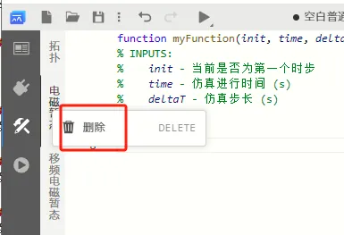

带有octave元件的算例运行很慢？

:   对于含有 octave 元件的算例，在仿真的过程中每个时步都需要调用 octave 的解释器，导致仿真速度较慢。用户可以根据需求，选用拓扑模块封装等速度更快的方式进行模块构建。

