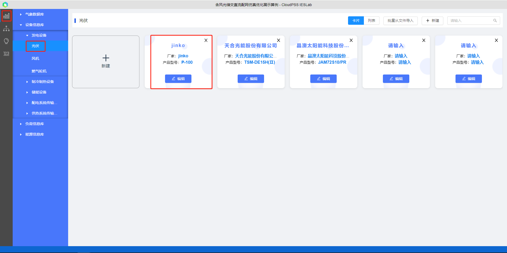
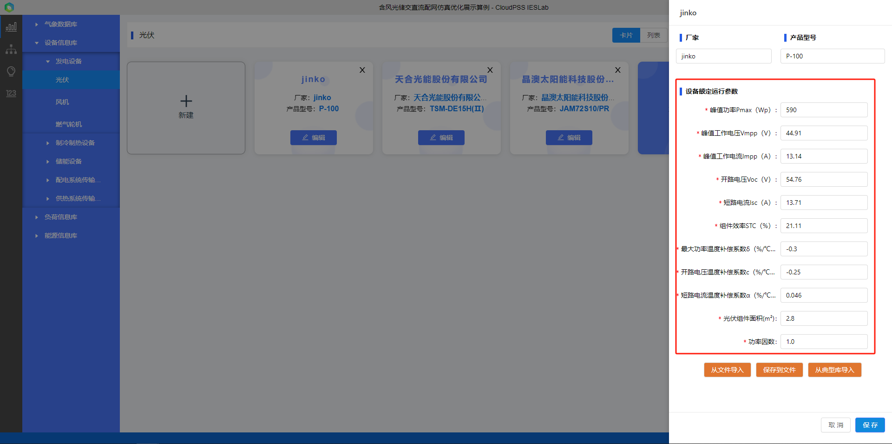
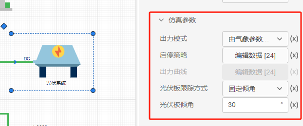
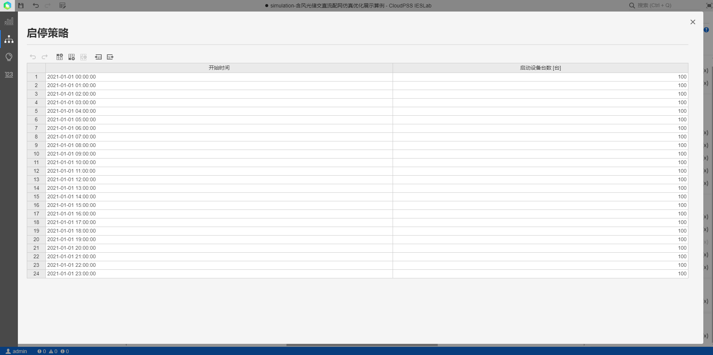
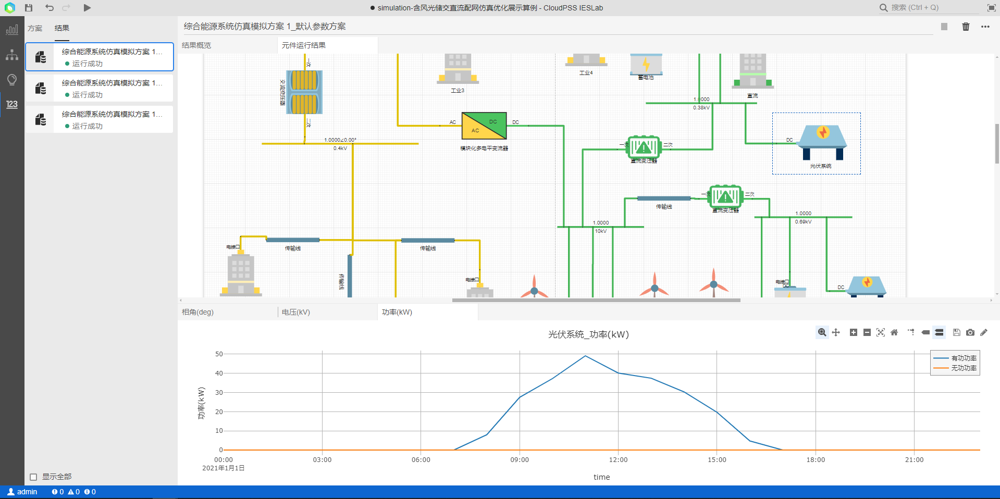
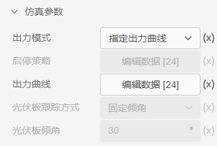
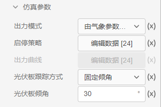

本节首先介绍光伏系统元件的参数配置，然后通过具体案例介绍该元件的使用方法和实现的效果，最后对常见问题进行回答。该元件用于 **IESLab 建模仿真平台**。

## 元件定义

### 元件功能

该元件用以建模光伏发电系统，能够根据**气象数据**、**IV 曲线**及**特性参数**模拟光伏发电系统在**实际工况下的 MPPT 输出功率**。

### 元件原理

太阳能电池组件是光伏系统元件的基础和核心，它的输出功率与 IV 曲线和光照强度、温度等气象参密切相关，输出功率为：

$$
P=P_{mppt}\eta
$$

式中：$P_{mppt}$为实际工况的 MPPT 输出功率，根据模型（工况气象参数、IV 曲线及特性参数）得到，η 为综合折损效率。光伏发电系统在能量流计算中可看作** PQ 节点**。

## 元件说明

光伏系统元件参数标签页包括**属性**、**参数**、**引脚**三类参数，下面对每类参数进行详细说明。

### 属性

CloudPSS 提供了一套统一的元件属性功能，关于元件属性参数的配置，详见[元件属性配置](/docs/docs/soft/xstudio/simstudio/basic/moduleEncapsulation/index.md)页面。

### 参数

#### 基础参数

| 参数名 | 键值 (key) | 单位 | 备注 | 类型 | 描述 |
| :--- | :--- | :--- | :--: | :--- | :--- |
| 元件名称 | CompName |  | 自定义元件名称 | 文本 | 此处输入光伏系统元件的名称（可缺省），方便管理及结果查看。|
| 元件类型 | CompType |  | 选择元件类型 | 选择 | 选择**交流元件**时输出交流电，为**光伏交流系统**；选择**直流元件**时输出直流电，为**光伏直流系统**。 |
| 设备配置台数 | DeviceNumber | 台 | 配置光伏系统的台数 | 整数（常量） | 此处输入光伏系统元件的数量（默认是1）, 相当于多台光伏系统连在同一个母线上。|
| 待选设备类型 | DeviceSelection |  | 从设备库中选择设备类型 | 选择 | **选择数据管理模块录入的设备型号**，将光伏系统元件的厂家、产品型号、额定运行参数自动绑定为对应设备在数据管理模块中录入的参数。|
| 损失系数组 | LossCoes |  | 配置光伏系统各个环节的能量损失系数 | 表格 | 可配置的损失类型包括直流电缆损失、光伏组件串并联不匹配损失、灰尘及雨雪遮挡损失、交流线路损失、逆变器 MPPT 的效率损失、太阳辐射入射（IAM）损失、变压器损失等， 当仿真参数组的**出力模式**项为**指定出力曲线**时失效。|

#### 仿真参数

在仿真参数中编辑光伏系统的仿真边界条件，主要包含**运行方式**和**运行策略曲线**。

| 参数名 | 键值 | 单位 | 备注 | 类型 | 描述 |
| :--- | :--- | :--- | :--: | :--- | :--- |
| 出力模式 | PowerMode |  | 选择光伏系统的出力模式 | 选择 | 在输入仿真运行策略前需要指定设备运行模式。有**由气象数据计算**和**指定出力曲线**两种模式。若选择**由气象数据计算**，则光伏系统出力根据气象数据计算得到。若用户已经计算或得到了光伏系统的出力曲线，可以修改为**指定出力曲线模式**，在**出力曲线**参数中录入出力曲线即可。|
| 启停策略 | Strategy |  | 配置光伏系统在不同时刻的设备启停策略 | 表格 | 仅当**出力模式**项为气象数据计算时生效，在表格中录入**各个时间段对应的设备启停策略**。 **开始时刻**对应每个仿真时刻，**启停设备台数**不能超过**设备配置台数**。|
| 出力曲线 | PowerCurve |  | 自定义光伏系统的出力曲线 | 表格 | 仅当**出力模式**项为**指定出力曲线**时生效，在表格中录入**各个时间段对应的光伏系统的出力**。 **开始时刻**对应每个仿真时刻。|
| 光伏板跟踪方式 | TrackingMethod |  | 选择光伏板跟踪方式 | 选择 | 仅当**出力模式**项为**由气象数据计算**时生效。可选择**固定倾角**或**单轴跟踪（NS轴）**|
| 光伏板倾角 | DigAngle | ° | 配置光伏板倾角 | 实数（常量） | 仅当**出力模式**项为**由气象数据计算**且**光伏板跟踪方式**项为**固定倾角**时生效。调节范围 0-360° |

#### 优化参数

在优化参数中编辑光伏系统的优化条件。

| 参数名 | 键值 | 单位 | 备注 | 类型 | 描述 |
| :--- | :--- | :--- | :--: | :--- | :--- |
| 是否优化该设备 | OptimizationChoice |  | 是否对光伏系统元件的运行方式进行优化 | 选择 | 仅当仿真参数组的**出力模式**项为**由气象数据计算**时生效。选择**是**，则设备的运行策略由系统优化得到，不读取仿真参数中设置的运行模式和运行策略；选择**否**，则系统按照仿真参数的运行模式和运行策略运行。|

### 引脚

光伏系统只有一个**电接口**引脚，用于将光伏系统元件与其他电设备连接，支持**线连接**和**信号名**的连接方式。

引脚的**名称、键值、维度、定义描述**的详细说明如下表所示。

| 引脚名 | 键值 | 维度 | 描述 |
| :--- | :--: | :--- | :--- |
| 电接口 | DC/AC | 1×1 | 可以在引脚处输入相同的字符使得光伏系统与其他电元件相连，当基础参数**元件类型**项是**直流元件**时，键值为**DC**；**元件类型**项是**交流元件**时，键值为**AC**。|

## 案例

### 光伏系统出力模式为由气象参数计算得到

以建模仿真平台**含风光储交直流配网仿真优化展示算例**为例。

- 首先在**数据管理模块**录入不同类型的光伏设备；

  

- 配置光伏设备的**额定运行参数**；

  

- 然后将**基础参数**的**待选设备类型**和数据管理模块中录入的光伏设备绑定；

  

- 最后将**仿真参数**的**出力模式**项配置为**由气象参数计算**；

  

- 并设定启停策略；

  

- 从仿真结果中可以看到该光伏系统元件的运行方式是由**气象参数**和**运行策略决定**的。

  

### 光伏系统出力模式为指定出力曲线
可继续补充，丰富案例。
### 光伏系统运行方式优化
可继续补充，丰富案例。

## 常见问题

### 光伏系统的交直流元件有什么区别？

选择交流时输出交流电，为光伏交流系统，已经包含组串、支架跟踪、逆变、变压等主辅系统;

选择直流时输出直流电，为光伏直流系统，已经包含组串、支架跟踪等主辅系统，但不包含逆变设备。

在能量流计算过程中均为 PQ 节点。

注意，交流元件和直流元件不能直接相连。

### 光伏系统元件在建模仿真平台使用时需要配置哪些元件参数？数据管理模块需要配置哪些数据？

在对光伏系统元件进行仿真模拟前，务必录入编辑元件的**基础参数**和**仿真参数**；

在数据管理模块需要配置**光伏设备**的**额定运行参数**。并在基础参数中绑定数据管理模块的光伏设备。

### 光伏系统元件的运行方式有哪几种配置方式？

光伏系统元件的运行方式目前有三种配置方式：

1. **指定出力曲线**

    若用户已经有光伏系统的出力曲线，此时光伏系统元件的运行方式可完全由用户自己设定。

    只需要将**仿真参数**的**出力模式**项设置为**指定出力曲线**，并在**出力曲线**项中录入**各个时间段对应的光伏系统出力**即可。

    

2. **出力由气象数据计算得到，运行方式不进行优化**

    此时光伏系统元件的运行方式由气象数据和启停策略计算得到。

    只需要将**仿真参数**的**出力模式**项设置为**由气象数据计算**，配置光伏板的跟踪方式、光伏板倾斜角等与气象有关的参数，并在**启停策略**项中录入**各个时间段对应的设备启停策**即可。

    

3. **出力由气象数据计算得到，运行方式优化**

    此时光伏系统元件的运行方式由系统优化得到，**不读取仿真参数中设置的出力模式和运行策略**。

    只需要将**优化参数**的**是否优化该设备**项设置为**是**即可。

    

### 启停策略和出力曲线的开始时刻必须和仿真时刻一致吗？

建议保持一致，若启停策略和出力曲线的开始时刻与仿真时刻不一致，平台会**自动采用插值和外推算法填充**。

