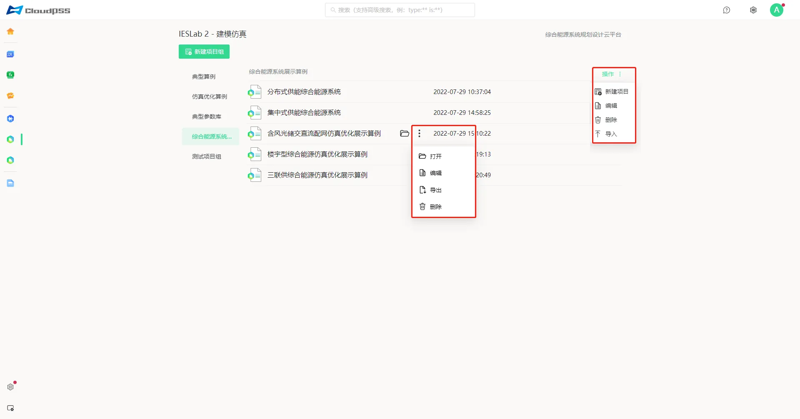
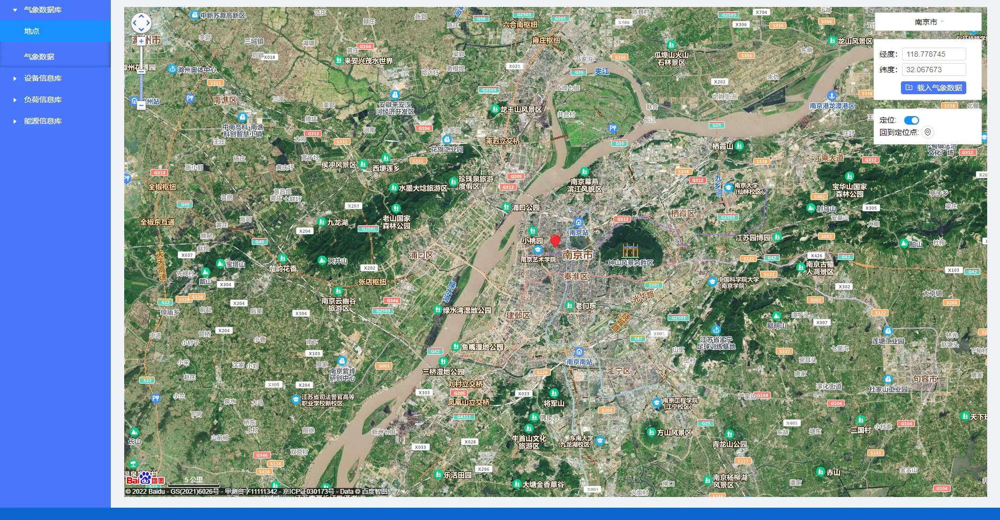
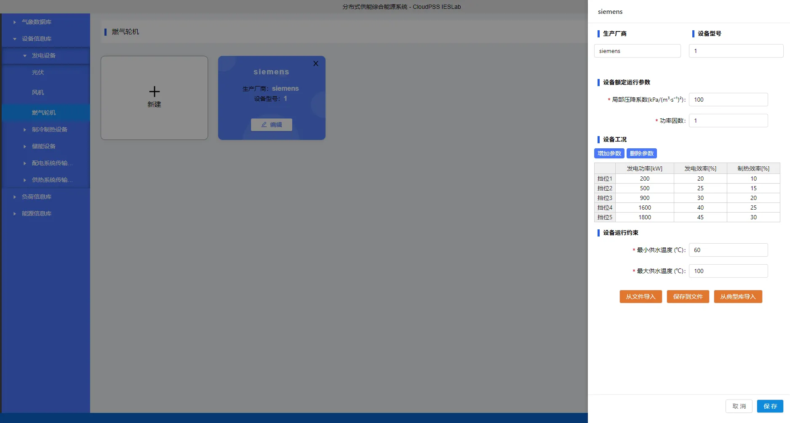
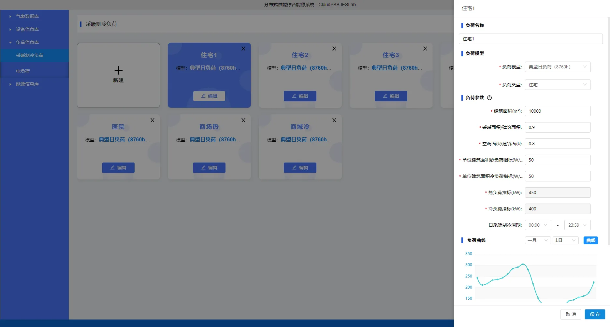
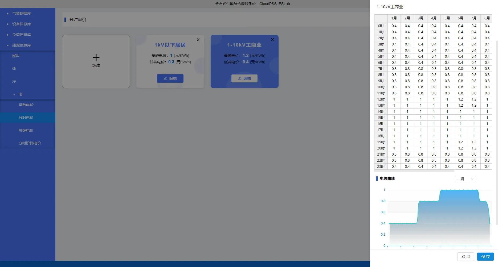
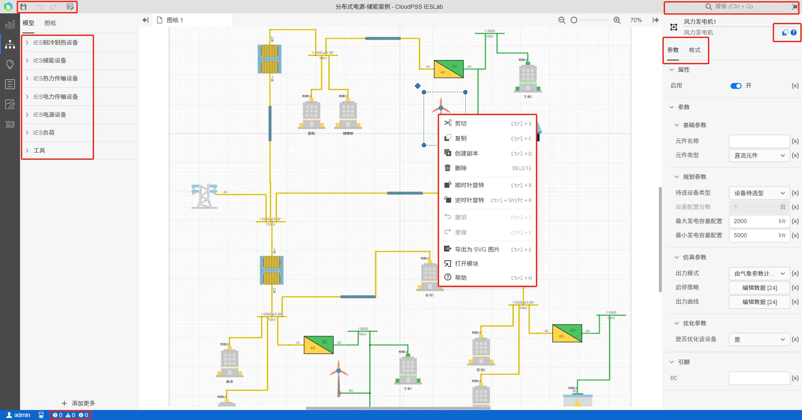
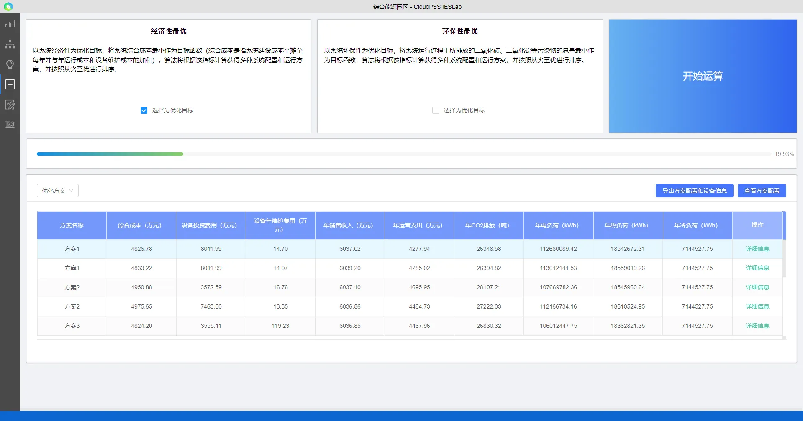

## 综合能源系统

中国提出，力争于2030年前达到峰值，努力争取2060年前实现碳中和。要实现“碳达峰”、“碳中和”目标，核心是推动能源低碳转型和能源革命，本质措施是`控制和缩减化石能源消费量`、`增加可再生能源发电比例`、`提升社会整体能效水平`，这与发展综合能源的思路理念不谋而合，综合能源有效整合光伏、风电、热泵、三联供、余热余压利用等分布式能源，从多种能源协同发展的角度设计优化能源生产模式，从多能耦合角度探索可再生能源供给比重扩大模式，打造以可再生能源为主体的综合能源低碳供能新结构。

综合能源系统在一定区域内利用先进的物理信息技术和创新管理模式，整合区域内煤炭、石油、天然气、电能、热能等多种能源，实现'多种异质能源子系统'之间的**协调规划、优化运行，协同管理、交互响应和互补互济**。在满足系统内多元化用能需求的同时，要有效地提升能源利用效率，促进能源可持续发展的新型一体化的能源系统。

能源世界正在经历革命性的转变，新的能源时代已经到来。在新能源世界里，能源被安全、绿色、高效、智慧地利用，新生态同样也需要新伙伴——安全、高效、智慧的建模仿真工具。综合能源系统的**发展、规划、设计、优化运行和协同调度**离不开建模仿真工具，由于综合能源系统是多尺度的复杂动态系统，具有很强的非线性、不确定性和随机性，不同能源的建模差异巨大难以对综合能源系统统一建模。

发展综合能源系统与新型电力系统建设、双碳目标实现思路不谋而合。但是，目前尚在综合能源系统建模研究的起步阶段，仍缺乏相关综合能源系统的规划设计工具，设计人员仍依靠自己的经验设计；在大力发展综合能源系统的背景下，为了避免综合能源系统未经科学合理的设计就盲目匆忙上马，亟需设计一款综合能源规划设计与评估软件。

**数字孪生**是充分利用物理模型、传感器更新、运行历史等数据，集成多学科、多物理量、多尺度、多概率的仿真过程，在虚拟空间中完成映射，从而反映相对应的实体装备的全生命周期过程。数字孪生是一种超越现实的概念，可以被视为一个或多个重要的、彼此依赖的装备系统的数字映射系统。基于数字孪生技术开发的平台更加贴近真实综合能源系统，其基础数据和模型来源于实际系统和运行数据，能够更加有效地指导综合能源系统的规划设计和评估
。

## 平台介绍

综合能源系统规划设计平台平台主要面向**区域电能、热能、太阳能、风能、电池与储能、天然气**等多种能源系统，实现多能源系统的不同方案之间的建模仿真、运行优化与综合评估。综合能源系统规划设计平台平台基于`Web技术、数据中台、云计算`等相关技术，由三个子系统组成，分别为Web工作区、数据交换平台和仿真引擎。用户在Web工作区构建综合能源系统模型，通过数据交换平台将每个仿真任务都打包为Docker容器，即虚拟仿真引擎（VSE）。综合能源系统规划设计平台部署后，用户只需一台安装有`浏览器`的终端（PC/Mac/平板/手机）即可访问，其友好的用户界面和帮助系统使得用户可以迅速上手。系统软件进行了数据稳定安全设计和全面保护，所有数据均存储在本地，真正做到`数据隐私`的全面保护，安全可靠。

综合能源系统是推动传统电网向能源互联网转型的重要载体，为研究综合能源系统以及设备的运行特征，提升对综合能源项目的设计及控制能力，与传统的综合能源系统仿真工具不同，平台集成了`20`余种常见的综合能源系统设备模型，提供功能强大的建模工作台；平台提供配电系统、供暖制冷系统等多能源系统耦合网络的规划设计与运行优化等功能。允许用户灵活搭建任意能量梯级利用形式的综合能源系统，拓扑结构不受约束，实现高效快速的系统全生命周期的规划设计，并对规划设计方案进行综合评估。
主要应用场景有：

1.	传统能源发电、分布式新能源(风、光)、配电网、储能等多种能源形式构成的综合电网系统
2.	热电联产、热力锅炉、制冷制热等构成的综合热力系统
3.	城市级、区域级、园区级综合能源系统规划设计

平台旨在为用户在综合能源系统的规划设计、能量管理、运行优化等方面提供帮助，未来将陆续加入更多的功能满足用户的多样化需求。

> **仿真步骤：**
> 
> 1.	注册登录CloudPSS平台，从个人中心进入CloudPSS IESLab 2规划设计平台
> 2.	建立项目组及项目，可从本地或模板导入
> 3.	数据管理模块：录入编辑项目基础参数
> 4.	拓扑编辑模块：搭建拓扑，设置约束条件
> 5.	典型日模块：对规划的气象和负荷等分析，生成典型规划场景
> 6.	方案优选模块：选择优化目标，利用智能启发算法进行优化
> 7.	方案评估模块：选择优化方案，输入基础评价参数，计算评价指标。

## 初次使用

###	注册登录

首次使用请注册，支持用户用手机号、邮箱等方式注册。
注册登录后，登录进入基于数字孪生的综合能源规划设计系统。

###	项目管理

1. 新建项目组：输入项目组信息，其中项目组是多个项目的集合，项目组下可以有多个互相关联的项目。用户新建项目组时可以从已有项目组导入，直接复制该项目组。
   
2. 新建项目：在项目组下新建项目，可从模板或已有项目创建；另外，用户可以编辑修改项目名称，在描述里添加编辑修改项目信息。
从已有项目创建时直接复制该项目，方便用户直接修改编辑；同时，平台内置了模板算例，选择从模板创建新项目时，直接导入模板算例。

>**特别提示**
>
>为方便算例移植拷贝，平台支持将算例导出到本地和从本地文件导入功能：点击算例的点号可以将算例导出为本地文件，点击项目组右侧的“操作”或点号可以将本地文件导入到平台。由于算例文件中的多年气象数据较多，导入导出时加载较慢，请耐心等待。

3. 打开已有项目：选中项目点击所在行，或点击“文件夹”按钮打开；通过“更多选型”按钮打开、编辑或删除。

## 数据管理模块

**在`数据管理模块`输入仿真参数，输入参数信息后平台在`规划设计模块`中将自动关联**

`数据管理模块`提供了友好的可视化界面，方便用户进行各类数据的录入、编辑和浏览，该模块主要由`气象数据库`、`设备信息库`、`负荷信息库`、`能源信息库`四个部分组成，平台内置数据典型库，包含常见厂家的多种型号设备、全国各地近几年的气象数据、13种典型电冷热8760负荷等。

  左侧为数据导航栏，主要有以下几个部分：气象数据库、设备信息库、负荷信息库、能源信息库。

  工作区上方的便捷工具主要有：切换卡片/列表展示模式，新建项目、筛选项目、搜索项目、从文件导入、批量从文件导入等。在“卡片”展示模式下，工作区有“新建”卡片可以便捷新建项目，卡片右上方的“×”可以删除卡片，选中对应卡片或点击“编辑”按钮可以打开编辑区，编辑区可以便捷设备信息，其主要快捷功能有：从文件导入、保存到文件和从典型库导入，平台内置常见常见的多种型号设备，方便用户录入设备。点击空白处会弹出“保存、不保存、返回”提示框。

### 气象数据

`气象数据库`内置中国大陆区域近几年的`8760小时`数据，如`环境温度`、`太阳辐射强度`、`风速`等气象数据，主要用于`新能源如光伏风电`的计算，计算前需载入气象数据。地点模块内置地图插件，在后台服务器联网时可以对地图进行拖曳平移缩放等，支持搜索项目地点所在城市切换地图。通过输入项目GPS经纬度坐标、地图选点定位等方式选择项目地点，点击“载入气象数据”按钮载入气象数据。因数据量大，等待一段时间后载入气象数据成功后回自动进入“气象数据”模块展示。。

*气象数据库：*

通过“气象数据”模块左上方的工具栏可以气象数据导出为excel文件，并支持`用户上传气象数据`，参考导出文件的格式。右侧的下拉框可以便捷选择日期。打开“编辑”按钮后，气象数据表格为可编辑状态，用户编辑后平台回自动校验用户编辑的数据合法性，数据格式不对时会提示“验证错误，请检查格式!”，关闭“编辑”按钮后，平台会自动更新并提示“更新数据成功”。

气象数据模块下方为图表展示区，用户选择数据类目查看曲线及保存图片等。

### 设备数据

`设备数据库`中，设备信息库中，用户可以将设备参数录入到设备数据库中进行管理，用户录入设备数据后，拓扑编辑模块可以选择对应设备并自动关联该设备所对应的参数。

>平台设备模型均为稳态模型，支持建立多挡位的变工况设备模型，以更好地模拟设备启停及复杂运行工况。平台设备主要分为发电设备、制冷制热设备、储能设备、配电系统传输设备和供热系统传输设备5类。
>
> 1.	发电设备有风机、光伏、燃气轮机
> 2.	制冷制热设备有燃气锅炉、热泵、热管式太阳能集热器、电压缩制冷机、吸收式制冷机
> 3.	储能设备有储热水罐和蓄电池
> 4.	配电系统传输设备有变压器、模块化多电平换流器MMC、传输线
> 5.	供热系统传输设备有离心泵与管道

### 负荷数据

`负荷信息库`中有电负荷和采暖制冷负荷数据。平台提供了`典型负荷`、`分月详细模型`和`自定义负荷`三种不同的录入形式，其中典型负荷按照设计规范进行负荷设计，内置住宅、学校、医院、办公、酒店、仓储、商场、小型工业、大型工业、影剧院、赛事馆、博物馆、超市共`13种典型8760h`负荷数据，并支持用户查看不同月份不同日期的负荷曲线。分月详细模型中，用户需录入各月份各时段的负荷；自定义负荷模型中，用户需按照平台给定的格式上传负荷曲线文件，平台会自动校验文件中数据格式问题。当用户上传的负荷曲线中时间与仿真时间不一致时，平台采用了`插值算法`计算仿真时间电对应的负荷。

*负荷参数填写：*

### 能源信息

`能源信息库`中，用户可建立`燃料`、`电`、`冷`、`热`等能源的价格等信息，用于计算系统`经济性及环保性`指标。拓扑编辑模块可以选择对应价格模型，用户绑定该能源信息后平台将自动关联并纳入环保性和经济性的计算中，计算完成后对项目方案进行经济性评价。
燃料：主要包含煤炭天然气等，分月的燃料波动价格用于计算燃料购置费，污染物排放系数则用于计算CO2等污染物排放量。
冷热价格模型分为按热量计价和按面积计价。
电价模型平台提供了分月`常数电价`、`分时电价`、`阶梯电价`和`分时阶梯电价`。在综合能源项目中，运营商一般通过向电网购电，通过建设高效的综合能源系统，向用户提供能源并获取盈利。平台绑定用电/冷/热计价模型用于计算项目收入。电网及用燃料的设备的计价模型则用于计算项目支出。

## `拓扑编辑模块`

**`拓扑编辑模块`用于系统拓扑结构的搭建、计算参数设置以及计算结果的展示。用户在此可以根据需要灵活搭建综合能源系统的拓扑结构、图纸和元件格式的调整、选择设备元件（或设备类型待选，此时设备型号和设备容量由规划算法计算）、约束条件（主要是设备容量范围、储能始末蓄电量偏差、柔性负荷范围等）。**

### 功能简介

> 1) **模型**
> 模型标签内放置了仿真拓扑构建中所需要的典型综合能源系统元件，主要包括电源设备、制冷制热设备、储能设备、电力传输设备、热力传输设备和负荷。
为更好地管理算例拓扑，模型新增工具：超链接、分割线和Markdown文本。超链接于指向平台系统内部的链接，如算例和元件链接等，一般应使用相对路径。如：ieslab/ies/diagram?simu_id=XXX，点击该超链接即可跳转到相应的算例。Markdown文本内容的编写支持MarkDown语法，Markdown是一种轻量级标记语言，支持文字格式调整，图片、图表、数学公式等的输入。在进行参数编写时，输出结果将实时渲染至工作台的显示框中。
> 2) **拓扑编辑窗口**
> 拓扑编辑窗口是进行仿真拓扑构建的编辑区域。用户可将模型库中的元件拖拽至拓扑编辑窗口内，进行元件连线及配置，并组织成完整的仿真拓扑。
鼠标右键可以选择剪切、复制、粘贴、创建副本、删除、全选、撤销、重做、顺时针旋转、逆时针旋转、导出为SVG图片、更新元件、元件表操作，或者通过快捷键实现上述操作。
> 为方便搭建算例，平台支持跨网页复制。可以将单个或多个元件复制到不同的算例中（即，不同的网页），实现单个或多个元件构成的复杂参数和拓扑的复制使用。
> 3) **快捷工具**：
> 拓扑编辑模块左上角的快捷工具主要有保存、撤销、恢复和元件表。其中，元件表提供了当前项目中，拓扑编辑窗口内所有的元件的信息列表，包括元件名称、参数以及引脚信息。元件表可用于批量化管理元件信息，例如复制粘贴元件参数、统一修改元件参数等操作。
> 4) **校验信息**
> 平台支持实时对算例拓扑的连接关系等进行合法性校验，并在校验信息处提供错误、警告和信息，点击信息平台会自动跳转到该错误源。
> 5) **图纸**
> 当仿真拓扑图过大时，可以使用图纸功能来对拓扑图进行分区划分及管理，不同的图纸间可通过引脚标号进行连接。一个项目内不同图纸上的拓扑，本质上为同一级别。
> 6) **参数栏**
> 参数栏用于对元件特性进行配置。一个典型的参数栏由参数和引脚两部分组成，参数部分可有多个分组，每个分组下可有多个参数。
> 7) **格式栏**
> 格式栏用于对元件或页面进行格式配置。支持配置拓扑编辑窗口的网格、视图、尺寸等显示特性，支持配置元件的排列、样式、字体等显示特性。
> 8) **搜索**
> 搜索框支持对元件、参数、文字、图纸、引脚名称等内容的智能搜索。

### 搭建拓扑

拓扑结构是真实物理系统的模型：进入`建模仿真模块`，在左侧模型库内选择模型拖至工作区，将各个元件连接起来搭建项目的模型，平台用不同颜色标识了交直流流和水流连接线，方便用户正确识别不同子系统的连接关系。

**拓扑注意事项**

>1. 每个元件的连接点/端口/引脚都有属性（直流、交流、流体），不同属性的引脚不能直接相连
>2. 电力系统中，每一个电压等级至少需要一条母线。一般来说，外部电源（理想大电源，slack bus）需要先与母线相连，传输线和变压器两侧都要连接母线。

### 约束条件

在对综合能源系统进行配置规划（设备选型定容）时，需要指定`设备的型号和容量范围`等约束条件。在规划设计中，目标函数的优化结果优劣主要受变量的取值范围等约束条件影响，约束函数可用等式或不等式描述，对于综合能源系统而言，等式约束主要是综合能源系统的`潮流、水热力、网络方程`等等式约束，是系统模型需要满足的基本物理规律，用户无需填写；而不等式约束则主要是`设备型号容量以及运行过程需要满足的限制范围`。对于综合能源系统规划来说，约束条件主要是设备容量范围、制冷制热范围、储能始末蓄电量偏差、柔性负荷范围等。

用户可通过右侧参数面板对规划参数进行编辑，：1.输入元件名称，选择绑定选择数据管理模块内已有的模型参数或设备类型待选；2.若选择设备类型待选，需输入设备约束范围。

**约束条件设置注意事项**

> 1. 电力相关元件，首先需要指定元件类型：交流/直流
> 2. 设备容量上下限一定要合理：设备容量上下限要能够满足实际的负荷需求等，一般要比实际负荷大。
> 3. 在规划时，若用户已有设备的运行方式，首先选择对应设备，并输入设备的仿真策略（如功率、温度曲线等），并在优化参数处，选择“否，使用仿真策略”。
> 4. 对于风机、光伏等发电设备，用户若已经计算功率出力曲线，可以修改为“指定出力曲线”模式，上传预测的功率曲线即可。
> 5. 在规划时，优化参数处，默认选择“是”，用户输入的仿真策略仅作为参考，方案中典型日的运行结果主要由智能优化算法求解得到。

## 方案优选

### 功能简介

用户在方案优选模块中选择`优化目标`，点击开始计算后，平台算法会自动根据优化目标自动生成优化问题，调用规划优化的算法（平台使用智能启发算法）求解计算，并将计算得到的可行解按照从劣至优进行显示。
在方案信息展示表格中，用户可以清楚的看到方案的`综合成本`、`经济性`、`环保性`和`负荷统计指标`，并支持导出方案配置和设备信息、查看方案配置等功能。

**注意**
由于启发式算法的计算量比较大，且平台支持变挡位设备，编码空间大；连续变量较大，计算时间可能较长，具体计算时长与算例优化变量、优化空间和算例设置有关；由于启发式算法为近似算法，容易陷入局部最优中，而大量随机性又会增大计算量，平台在计算规模和准确性进行了平衡，一般而言，系统算例的多次规划设计最优可行解基本一致，初始方案（可行解）可能不同。

### 优化方案

项目拓扑结构及算例生成后，用户需要首先选定`优化目标`，点击开始运算，平台会首先对项目进行设备`选型定容`等型号配置，确定后会对全年各月份的`典型日进行动态优化`得到各个时间点的设备出力、负荷情况、电网、热网潮流情况，最终对形成的方案进行指标统计，经济性指标包括设备投资费用、设备年维修费用、年销售费用、年运营支出，环保性能指标包括年CO2，NOX，烟尘排放量。同时统计能耗情况如电负荷，冷热负荷等相关参数。在经济性和环保性中进行综合权衡并生成多种方案，选择最合适的方案。

平台的优化目标包括`经济性`和`环保性`目标。其中**经济性最优目标**：以系统经济性为优化目标，将系统`综合成本最小`作为目标函数（综合成本是指系统建设成本平摊至每年并与年运行成本和设备维护成本的加和），算法将根据该指标计算获得多种系统配置和运行方案，并按照从劣至优进行排序。
**环保性最优**：以系统环保性为优化目标，将系统运行过程中所排放的二氧化碳、二氧化硫等`污染物的总量最小`作为目标函数，算法将根据该指标计算获得多种系统配置和运行方案，并按照从劣至优进行排序。

经济性和环保性的系统配置主要受`能源价格`、`可再生能源`和`储能电池`的规划容量与价格，供冷供热系统的设计（方案设计如是否包含蓄热蓄冷、空气源/水源/地热源热泵、压缩式制冷机和吸收式制冷机等，是否包含燃媒/气锅炉、燃气轮机、CHP、CCHP等排污设备），可供选择的设备的能效及价格等影响；一般来说，以经济性为目标时，平台会选择能源价格低（如煤炭，尽管其污染更多）的供能形式，当可再生能源性价比高时，经济性和环保性方案均会选择，当可再生能源性价比低时，仅环保性方案会选择；当峰谷电价差较大，储能电池能够提供收益时，经济性方案会选择。对于冷热系统的设备型号及容量选择，经济性方案会选择投资相对较低，环保性方案则更倾向于能效相对较高的设备，以减少能源消耗，减少污染物排放。

平台的优化目标为`单目标优化`，但平台建立了详细的综合评价体系和评价指标，对于任意优化目标下的优化方案，平台均会计算所有评价指标（如经济性、环保性）和统计结果；用户在选择经济性目标时，仍可能看到环保性评价指标，方便用户综合评价方案，尽可能兼顾多个优化目标。

### 方案详细信息

用户点击方案右侧的“详细信息”可以进入详细方案信息页面。查看改方案的`具体设备配置及评价参数`、方案在每一个典型日的`运行优化结果`。用户也可以在页面右上角点击“返回方案列表”返回，或重新选择其他方案。

方案详细信息页面分为上下两部分，上半部分为方案的`详细描述`，包括设备配置参数（厂家、型号、台数、采购价格及运维费用）、收入及支出等经济性参数、年CO2排放量和方案统计信息。下半部分为`运行优化结果`，默认显示不包括母线、外部电源和统计信息等项目的负荷信息、收入及支出、运维和碳排放量等表格信息；当用户在元件参数行的右侧点击“查看”后，下半部分会显示该元件在每一个典型日的运行优化结果曲线，支持切换典型日、参数类型和下载结果数据。

注意：首先应检查方案结果是否有误，避免因约束等算例设置错误导致计算不收敛，一般可以查看电网潮流结果（如检查电压、功率、传输线电损范围等）、热力参数（流量、温度、流向等）。

## 方案评估

用户在方案评估模块中选择一个方案，设定基础参数，平台算法会根据财务模型和工程经济学等相关模型自动计算评价指标，并显示计算得到的评价指标，平台支持将结果导出。
 

方案评估模块主要包含：
财务评价：录入基础参数，保存，评价结果：计算、对比及导出结果
环保评价：计算项目生命周期内年份月份的污染物排放量，计算及导出。其污染物排放量根据燃料的排污系数和燃料使用量计算得到。
能效评价：计算项目生命周期内系统及各个设备不同年份月份的能源消耗、能效水平和可再生能源利用比例，计算及导出。
 

其中，财务评价基于工程经济学，通过财务模型对项目进行综合评价，主要有以下3个方面：
综合能源项目的投资估算：固定资产投资估算和流动资金的估算；
综合能源项目的收益估算：工程项目成本费用估算和税金估算；
综合能源项目的投资估算：主要包含静态指标和动态指标。静态指标有静态投资回收期、简单投资收益率、静态计算费用等。动态指标有净现值、净年值、费用现值、费用年值、将来值、内部收益率、外部收益率、净现值指数等。
财务综合评价还包括三大基本报表（利润表，现金流量表，资产负债表）和辅助报表，供项目投资决策时参考。若用户已有财务模型，平台也提供了SDK，可以根据SDK将优化方案结果数据（如设备型号参数、成本、配置、典型日运行曲线、统计数据等）导出后，利用用户的财务模型进行评价。
