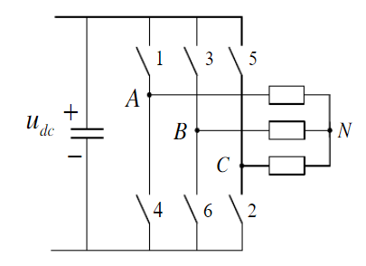
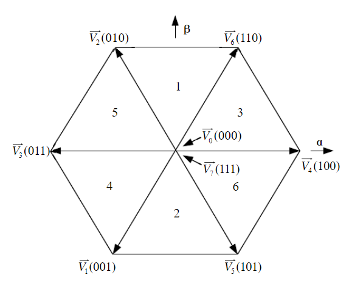

## 基本描述

> **该元件用以产生基于空间矢量脉宽调制(SVPWM)的脉冲信号或调制波信号**

## 参数列表
### Configuration
| 参数名                      | 备注       | 类型  | 描述                                 |
| :-------------------------- | :--------- | :---: | :----------------------------------- |
| Name                        | 元件名称   | 文本  | 此处输入空间矢量调制模块的名称（可缺省）   |
| Output Signal Type | 输出信号类型   | 选择  | 选择调制模块的输出为脉冲序列或者调制波信号   |
| Carrier Frequency | 载波频率 | 实数（常量）  | 载波频率 |

## 端口列表

| 端口名 | 数据维数 | 描述                      |
| :----- | :------: | :------------------------ |
| Alpha  |   1×1    | 输入两相坐标的alpha轴分量 |
| Beta   |   1×1    | 输入两相坐标的beta轴分量  |
| Gate   |   6×1    | 输出脉冲序列端口，仅当输出信号类型选择为脉冲序列时有效 |
| Um     |   3×1    | 输出调制波形端口，仅当输出信号类型选择为调制波信号时有效 |

## 使用说明

SVPWM 的理论基础是平均值等效原理，即在一个开关周期内通过对基本电压矢量加以组合，使其平均值与给定电压矢量相等。下图示出了一个三相电压源变流器的拓扑图：

根据该图可得出空间矢量图，在某个时刻，电压矢量旋转到某个区域中，可由组成这个区域的两个相邻的非零矢量和零矢量在时间上的不同组合来得到。

使用该模块时，需在输入的Alpha及beta端接入两相静止坐标下的alpha轴及beta轴分量，该分量通常可由Clark变换器输出。SVPWM模块自动计算各矢量作用时间，并根据用户配置，输出6路7段式PWM波形或输出3路调制电压波形。
## 相关元件

