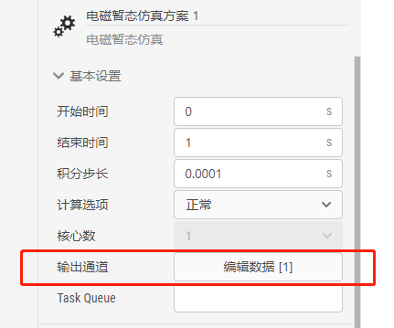
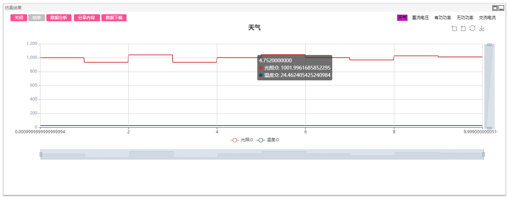

CloudPSS SimStudio提供了灵活的量测方法及量测/输出元件供用户使用。

## 电气量量测方法

对于电气量(电压、电流、功率等)的量测主要有三种方法：
+ 对于电气节点，可以直接测量其电压信号（单位为V），将`输出通道`和电气节点直接相连即可。
+ 利用量测元件(如电压表、电流表、功率表等)得到量测信号名称(以#号开头)或量测信号输出引脚；
+ 利用元件参数设置->Monitoring填写输出量测信号名称(以#号开头)，详见[参数及引脚体系](../ParameterSystem/index.md)页面。

例如要实现对某一电阻的电流测量可拖拽`电流表`与该电阻串联，并设置该电流表输出信号名称，或在该电阻的`参数设置->Monitoring`填写Branch Current [kA]对应的标签名称，如图所示。量测所得的信号或引脚可进一步连接至其余的控制、电气或输出元件。


## 信号整理

某些元件的量测信号为多维信号，例如`三相交流电压源->Monitoring->3 Phase Source Votage Vector`所对应的信号即为三维信号。用户若需要其中某一维的信号，如A相，则可利用`控制-基础->多路信号分离`进行信号拆分，详见[多路信号分离元件说明](../../../components/comp_PSS/comp_PSSControl/BasicComp/DeMerge.md)。同理，若要将多路信号合并为多维信号进行绘图，则可利用`控制-基础->多路信号合并`进行信号合并，详见[多路信号合并元件说明](../../../components/comp_PSS/comp_PSSControl/BasicComp/Merge.md)。

## 信号输出

为实现对某一信号的输出显示，必须完成以下配置：
+ 将需要输出的信号与一个`输出通道`相连，这里需要注意输出通道的维数应与待测信号一致。
+ 将待输出的通道列入仿真的计算方案中。具体来说，在`运行`标签页下，`计算方案`-`电磁暂态方案`的配置中，找到`基本设置`下的`输出通道`选项，点击`编辑数据`按钮，可弹出`输出通道`的可编辑表格。在该表格中可添加`输出窗口`、并将需要输出的`输出通道`添加到`示波器输出通道`栏中，如下图所示。




在一个仿真项目中，`输出通道`和`输出窗口`理论上可存在任意个，用户可根据待输出信号的类型、大小范围等合理设置`输出窗口`所选中的通道信号，便于仿真结果分析。

## 输出窗口类型

CloudPSS提供了四种示波器窗口类型，用户可选择每个示波器的显示模式，如下图所示。


一共有四种模式可选，其含义分别如下：
1. Compressed Time Axis Window: 默认模式，时间坐标轴最大值随仿真时间变化，最小值为仿真开始时间不变，如下图所示。


2. Global Time Axis Window: 时间坐标轴最大值为仿真结束时间不变，最小值为仿真开始时间不变，如下图所示。


3. Moving Time Axis Window: 默认模式，时间坐标轴最大值随仿真时间变化，时间坐标轴范围为参数Window Width指示的值，如下图所示。


1. Oscilloscope Time Axis Window: 与示波器显示模式相近，仿真窗口时间轴范围为Window Width指示的值，如下图所示。


[^_^]:
    ## 结果下载，待实现的功能！

    仿真运行结束后（需手动点击`结束`按钮），可在弹出的波形展示界面中选择`数据下载`，即可选择相应的数据通道进行下载。
    

    

    

    ::: tip
    只有**保存后**的算例项目才可进行数据下载。
    :::

    下载的数据为经过压缩存储的数据格式。可通过以下MatLab代码进行解析。解析后每个通道的数据存储在结构体`Ch_X`中（`X`为序号，`Ch_X.Name`为通道名称，`Ch_X.Data`为通道数据。）

    ::: tip
    若解析代码报错，请重新下载最新的代码进行尝试。
    :::

    ```matlab 将数据导入 MatLab /features/./CloudPSSDataImport.m CloudPSSDataImport.m
    clear;
    clc;

    [fname,pname]=uigetfile('*.*','open');
    filename = strcat(pname,fname);

    fid = fopen(filename,'r','n','utf-8');
    config = fgetl(fid);
    data = fscanf(fid,'%f');
    fclose(fid);


    textcell = regexp(config,'<[|]>','split');

    starttime = textcell{1};
    tempcell = regexp(starttime, '=', 'split');
    Tstart = str2double(tempcell{2});

    endtime = textcell{2};
    tempcell = regexp(endtime, '=', 'split');
    Tend = str2double(tempcell{2});

    ChannelNo = length(textcell) - 2;

    dataloc = 1;
    for ptr = 1: ChannelNo
        loc = ptr + 2;
        temp = textcell{loc};
        tempcell = regexp(temp, '=', 'split');
        ChannelName{ptr} = tempcell{1};
        tempNum= regexp(tempcell{2}, ',', 'split');
        ChannelSpTime(ptr) = str2double(tempNum{1});
        ChannelPointNum(ptr) = str2double(tempNum{2});
        %generate Channel
        ChNo = sprintf('Ch_%d',ptr);
        Channel{ptr} = ChNo;
        %generate Channel Name
        eval(sprintf('%s.Name = ChannelName{ptr};',ChNo));
        %initialize Channel Data
        eval(sprintf('%s.Data = zeros(ChannelPointNum(ptr),2);',ChNo));
        %generate Timeline
        deltaT = 1/ChannelSpTime(ptr);
        timeline = (Tstart + deltaT):deltaT:(Tstart + deltaT*ChannelPointNum(ptr));
        timeline = timeline.';
        eval(sprintf('%s.Data(:,1)= timeline;',ChNo));
        eval(sprintf('%s.Data(:,2)= data(dataloc:(dataloc-1)+ChannelPointNum(ptr));',ChNo));
        
        %%
        dataloc = dataloc + ChannelPointNum(ptr);
    end


    disp('导入完成!');

    for ptr = 1: ChannelNo
        fprintf('Ch_%d -> %s\n',ptr,ChannelName{ptr});
    end

    clear Channel ChannelNo ChannelPointNum ChannelSpTime ChNo config data dataloc deltaT endtime fid filename fname loc pname ptr starttime temp tempcell tempNum Tend textcell timeline Tstart ans
    ```


