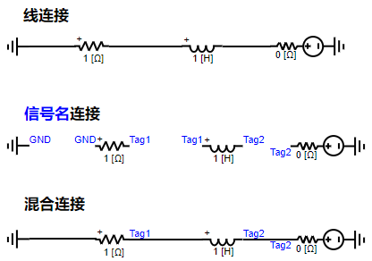
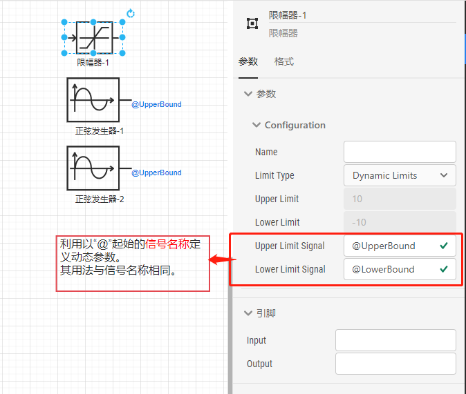
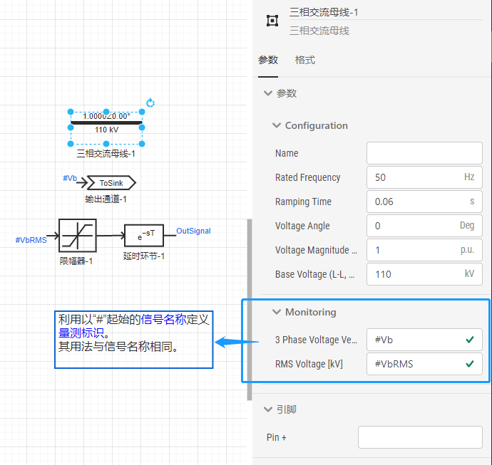
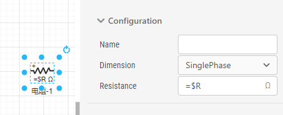
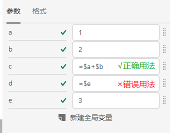

::: info
**摘要**
该文档为CloudPSS SimStudio参数及引脚体系的介绍文档。用户可阅读该文档学习参数、变量、引脚之间的区别和联系，并学会利用该体系灵活、快速地构建算例。
:::

CloudPSS SimStudio提供了一套以`参数（Parameter）`和`引脚（Pin）`为核心的建模系统。用户可使用不同类型的参数和引脚实现对模块（包括元件和模型）的灵活维护和管理，进而实现各种高级仿真功能。

关于模块的参数及引脚的定义，详见[模块封装](../Mask/index.md)页面。

采用以下方法可对算例中引用的模块（包括自带库元件和用户自定义模型）进行`参数配置`：
1. 点击相应模块的`图标`后，选择右侧`参数`标签，即可调出`参数配置`面板，对参数进行配置。
2. 使用`元件表`进行批量的参数配置，详见[元件表](../ComponentTable/index.md)页面。

采用以下方法可对算例中引用的模块进行`引脚配置`：
1. 点击相应模块的`图标`后，选择右侧`引脚`栏，即可调出`引脚配置`面板，对引脚进行配置。
2. 使用`元件表`进行批量的参数配置，详见[元件表](../ComponentTable/index.md)页面。

如图，CloudPSS 中的每个模块（包括自带库元件和用户自定义模型）都享有一套独立的参数和引脚体系。每个模块都包含`参数`、`变量`和`引脚`三个部分，其中，
1. `参数`是定义及描述模块特征的度量数据（如额定电压、电阻值等信息）。参数分为`实数`、`整数`、`文本`、`布尔`、`选择`、`多选`、`表格`、`虚拟引脚`八种类型。
2. `变量`可以引用`参数`进行赋值或计算，但数值无法从外层传入。`变量`仅能在模块内部访问到，其引用方法与`参数`一致。
3. `引脚`是模块与内部、外部的其它模块连接的输入输出接口。根据引脚类型的不同，引脚可分为`电气引脚`、`控制引脚`、`热力引脚`三种不同类型。类型不同的引脚不能相连。`控制引脚`为有向引脚，根据数据流方向又分为`输入引脚`和`输出引脚`两类引脚。

::: tip
**参数、变量的作用域**
在某一模块内定义的参数和变量，其作用域仅局限在该模块内，无法在其外层或内层的模块中进行直接引用。若必须跨层传递`参数`数值，只能通过在外层或内层模块中设置相应`参数`，实现`参数值传递`。
:::

```mermaid
graph TD
A[模块] --> B[参数/变量]
A --> C[引脚]
B --> D[实数型]
B --> E[整数型]
B --> F[文本型]
B --> G[布尔型]
B --> H[选择型]
B --> P[多选型]
B --> Q[表格型]
B --> R[虚拟引脚型]
R --> |仿真中可变| I[虚拟输入引脚型]
R --> |内部量量测| J[虚拟输出引脚型]
C --> K[电气引脚]
C --> L[控制引脚]
C --> M[热力引脚]
L --> N[输入引脚]
L --> O[输出引脚] 
```

## 参数/变量

参数和变量分为实数型、整数型、文本型、布尔型、选择型、多选型、表格型、虚拟引脚型八类。用户可直接在模块的参数列表框输入/选择相应类型的参数值和变量值。参数和变量具备如下特性：
1. 实数型参数/变量支持输入[math.js表达式](https://mathjs.org/)；
2. 虚拟引脚型参数/变量其本质即为引脚，可以通过名称与引脚相连。

::: tip

**参数与变量的区别**

针对某一模块，`参数`可以与模块外层、内层元件之间交互参数数据的方式，而`变量`则只能在模块内层交互数据。例如：CloudPSS平台提供的元件，由于用户无法看到元件内部信息，故从外部只能看到`参数`。

:::

## 引脚

每个模块（元件和自定义模型）都具备可互相连接的接口（端子），称为`引脚`。引脚之间的连接方式有线连接、信号名连接和混合连接三种，如图所示。

1. **线连接**：即直接利用“连接线”即可连接相应的引脚。
1. **信号名连接**：在参数配置页面，指定连接到引脚的`信号名称`。若不同元件的引脚之间标注了相同的`信号名称`，则其相应的引脚即被认为是相连的。为便于区分`引脚名称（Pin Name）`和`信号名（Signal Name）`，`引脚名称`的默认颜色为黑色，`信号名称`的默认颜色为蓝色。 
1. **混合连接**：即可同时使用上述两种连接方式。如图。

## 虚拟引脚型参数与引脚

虚拟引脚型参数与控制引脚本质均为引脚，因此相同类型的参数或引脚之间可以通过**信号名连接**方式进行连接。

### 虚拟输入引脚型参数

虚拟输入引脚型参数，或称`动态参数`，其等同于模块的输入信号名称。信号名以`@`标识符为前缀，其使用方法与一般的引脚名称相同。例如：限幅器、线性传递函数的动态限幅参数均为类输入型参数。

### 虚拟输出引脚型参数

虚拟输出引脚型参数，或称`量测标识`，其等同于模块的输出信号名称。信号名以`#`标识符为前缀，其使用方法与一般的元件名称相同。例如：元件`Monitoring`参数页的全部参数、电压表、电流表中的`Name`参数均为虚拟输出型参数。

::: tip

**引脚的特殊用法**

`电气引脚`可以与`控制-输入引脚`直接相连，此时，传入控制系统的数值为电气引脚处的**节点电压（单位：V）**。但CloudPSS不建议此类用法。常规的操作是利用电压表测量节点电压，并利用`量测标识`传入控制系统。

:::

## 全局变量

全局变量定义在当前算例范围内。全局变量名加上`$`标识符前缀时，可在算例范围内被各个元件使用。全局变量以字典的形式存储，可在不选中任何其它元件或模块时，在右侧`参数`标签下进行编辑。
 

每个全局变量包含`变量名`、`数值/表达式`两个设置选项。其中，
1. `变量名`应以字母或“_”符号开头，每个`全局变量`以及当前模块参数的`变量名`都应是独一无二的。
2. `数值/表达式（Value/Expression）`定义了全局参数的数值或包含全局参数的[math.js表达式](https://mathjs.org/)。
3. 在元件或自定义模型中调用全局变量时应为表达式形式，且在全局变量前冠以`$`标识符为前缀，例如全局变量名为`R`时，在元件处调用该全局变量时应填写`=$R`，如下图所示。
4. **特别注意：现在在调用全局变量时，必须使用“=”符号构建表达式！（这一点和CloudPSS 4.0版本不同）**

[^_^]:
    在使用全局变量过程中，需要注意以下几点：
    1. 全局参数仅用于配置元件参数，因此必须在仿真开始前赋值，参数在仿真过程中不可改变。
    2. 后定义的全局参数可引用较先定义的全局参数，反之不可以。如图。

        