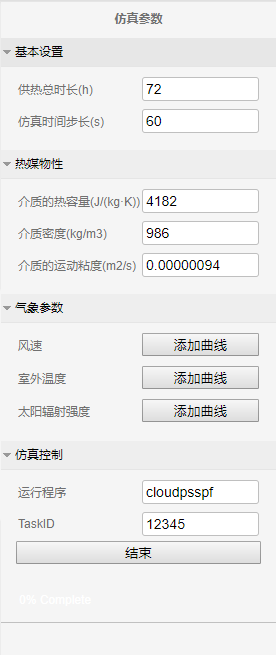

## 模块功能

区域集中供热系统运行仿真模块于 2018 年 12 月 25 号正式上线，该模块在 2017 年 12 月 6 日发布的热网潮流分析模块的基础上进行了更新和扩展，主要面向区域集中供热系统，分析其运行特性，为系统的运行调节和优化提供帮助。在该模块中，用户可根据实际需要，对网络拓扑、气象条件、设备配置等参数进行设置，系统将计算出供热系统中所有有效对象的稳态运行工况参数，并且通过图表等形式展示相应结果。

目前，本模块主要支持以下功能和应用场景：

1. 建筑物热负荷预测
2. 室内温度变化预测
3. 热源供热计划制定

上述功能旨在为用户提供集中供热系统运行方案优化、节能降耗等方面的帮助。未来本模块将陆续加入更多的功能满足用户的多样化需求。

## 元件介绍

本模块的元件主要位于页面左侧的元件面板“基本元件”模块内，包括建筑物（负荷）、热源、连接点、中继泵 4 种元件，另外还有管道元件，需通过其它元件相连而得，现依次对其进行介绍。

### 建筑物（负荷）

建筑物（负荷）元件代表集中供热系统中的热用户，诸如居民建筑、学校、医院等都可以用该元件进行表示。建筑物（负荷）元件的图标如下所示：



建筑物（负荷）元件共有 1 个引脚可与其它元件相连，引脚位于图标上方竖线的顶端，该引脚只允许其它元件连入而不允许连出。

### 热源

热源元件代表集中供热系统中提供热量的设备，诸如热电厂、供暖锅炉、热泵等。热源元件的图标如下所示：



热源元件共有 1 个引脚可与其它元件相连，引脚位于图标上方竖线的顶端，该引脚只允许连出而不允许其它元件连入。

### 连接点

连接点元件代表集中供热系统中实现多股热介质汇聚和分流的设备，诸如管汇、三通等。连接点元件的图标如下所示：



连接点元件共有 1 个引脚可与其它元件互连，引脚位于黑色圆圈的中心位置，需要注意的是该引脚与其它元件连接时应至少保证有一个连入和一个连出。

### 中继泵

中继泵元件代表集中供热系统中给热介质的输送提供动力的设备，实际中泵的种类较多，如离心泵、螺杆泵、滑片泵等。中继泵元件的图标如下所示：



中继泵元件共有 2 个引脚可与其它元件相连，分别为入口引脚和出口引脚，且各自都只能与最多一个元件相连。其中入口引脚位于元件图标左侧凸起处，该引脚只允许其它元件连入而不能连向其它元件；出口引脚位于元件图标顶端凸起处，该引脚只允许连向其它元件而不能由其它元件连入。

### 管道

管道元件用于热介质的输送。本模块中管道元件并不位于元件面板内，而是需要通过连接其它元件获得，如下图将一个热源和一个建筑物（负荷）的引脚相连便得到相应的管道元件（图中 pipeLine_7），需要注意的图中连接的管道实际上同时代表了供水管道和回水管道：

元件的连接方法可参考[快速入门](../guide/index.md)。

## 参数输入

### 算例模板

在新建区域集中供热系统运行仿真的工程之后，会出现算例模板的输入面板，如下图所示：

算例模板的选项主要包括工程名、工程描述、节点数目、供热时长和供热场景。这里主要介绍节点数目、供热时长和供热场景。

- 节点数目

  节点数目包含两个选项，分别是 1 热源 3 负荷和 1 热源 5 负荷，代表算例的初始热源和建筑物（负荷）的数量情况，用户也可以根据自己需要在这两个算例的基础上新建（或删除）元件。

- 供热时长

  供热时长包含三个选项，分别是 3 天、5 天和 7 天，代表了集中供热系统需要进行仿真模拟的运行时长，用户也可以根据自己需要在这两个算例的基础上增加或减少仿真时长。

- 供热场景

  供热场景包含两个选项，分别是室内温度预测和供热计划制定，其各自含义可以参见区域集中供热系统运行仿真的[算例文档](../examples/HeatingSystem.md)。在进入算例后，用户也可以根据自己需要调整应用场景。

### 全局参数

在进入区域集中供热系统运行仿真模块的工作页面后，全局参数位于页面右侧仿真参数面板内，主要分为基本设置、热媒物性、气象参数和仿真控制四个模块儿，如下图：

下面分别对四个模块的参数进行介绍：

- 基本设置

  基本设置中包含供热总时长和仿真时间步长两个选项，其中供热总时长即为算例模板中的“供热时长”，仿真时间步长代表每两次全局稳态仿真的时间间隔。通过供热时长和仿真时间步长的大小可以计算出总共的稳态仿真次数，通常建议仿真次数不超过一万次，否则会因为输入的大量数据而导致网页响应过慢。

- 热媒物性

  热媒物性表示供热系统中热流体（或热介质）的物理性质，主要包括热容量（即比热容）、密度和运动粘度。

- 气象参数

  气象参数包括风速、室外温度和太阳辐射强度三个参数，用户可以点击“添加曲线”按钮进行数据输入或修改。以风速为例，其它参数与之类似，在点击“添加曲线”按钮后会出现如下图所示的表格：

  

  表格中第一列数据代表仿真时间的序列，第二列代表风速的数值，第 i 行即代表第 i 个时间步时当前室外风速的数值。该表格的行数取决于供热时长和仿真时间步长的大小，不能自行进行增删。另外，用户还可以通过点击“请选择文件夹”上传包含对应行数和列数的 EXCEL 文件自动录入数据。

  切换表格上方的选项卡至“曲线”，可以查看当前数据对应的散点图，如下图。用户还可以通过拖拽其中的散点动态地更改数据，但我们不建议在数据量较大时这样做。

  

- 仿真控制

  通过点击仿真控制面板中的“开始”按钮可以启动仿真计算。

### 建筑物负荷参数

当选中建筑物（负荷）元件后，在页面右侧会出现建筑物（负荷）的参数面板，包括参数配置和格式面板，对于格式面板的使用可以参考[快速入门](../guide/index.md)，参数配置面板的形式如下图：

建筑物（负荷）的输入参数主要包括水力控制条件、热力控制条件和建筑物属性三个模块，各项参数的具体含义可以参见该元件的[说明文档](../components/compHeatLoad_Building.md)。其中部分参数需要添加曲线，其表格形式与使用方法与全局参数中的风速等参数的表格相同。

### 热源参数

当选中热源元件后，在页面右侧会出现热源的参数面板，如下图：

热源的输入参数主要包括水力控制条件、热力控制条件和建筑物属性三个模块，各项参数的具体含义可以参见该元件的[说明文档](../components/compHeatSource.md)。其中部分参数需要添加曲线，其表格形式与使用方法与全局参数中的风速等参数的表格相同。

### 连接点参数

当选中连接点元件后，在页面右侧会出现连接点的参数面板，如下图：

当前版本的连接点暂不需要输入任何参数。

### 中继泵参数

当选中中继泵元件后，在页面右侧会出现中继泵的参数输入面板，如下图：

中继泵的输入参数主要包含设备安装和参数设置两个模块，各项参数的具体含义可以参见该元件的[说明文档](../components/compPump.md)。其中部分参数需要添加曲线，其表格形式与使用方法与全局参数中的风速等参数的表格相同。

### 管道参数

当选中管道元件后，在页面右侧会出现管道的参数输入面板，如下图：

管道的输入参数主要包括供水管道参数设置、回水管道参数设置、管道剖面参数设置三个模块，各项参数的具体含义可以参见该元件的[说明文档](../components/compPipeline.md)。

## 进行仿真

### 开始仿真

当正确设置完所有元件参数后，即可开始仿真。点击工作空间中任意空白处，在页面右侧会显示仿真参数面板，点击仿真控制模块中的“开始”按钮即可开始仿真。

### 仿真信息

如果想监测仿真是否正常运行，可在页面左下侧的系统信息栏进行查看.本模块正常运行状态下的仿真信息结果如下：


run ends
run start


目前本仿真模块目前共有四种异常报警信息，下面分别对其进行介绍。

- 无连接管道报警信息

  当网络拓扑中没有管道时，开始仿真将会在系统信息面板出现无连接管道报警信息，如下：

  
  There is no pipeline in network!
  

- 拓扑多连通报警信息

  当网络拓扑图为多连通时将出现报警信息，所谓多连通是指网络拓扑中有个多个连通子结构，如下图存在两个连通子结构。

  

  报警信息如下：

  
  The original topological graph are multi-connected!
  

- 方程不封闭报警信息

  当热源和建筑物（负荷）的控制条件设置不当时，将导致控制条件数量不等于所需条件数量，而使求解方程不能封闭。报警信息如下：

  
  The equation system can not be solved: 8 control conditions required, while 9 control conditions specified!
  

  对于任意热网拓扑来说，其需要的控制条件等于 2 倍热源的数目加上建筑物（负荷）的数量再加 1。

- 求解报错信息

  求解报错信息如下：

  
  The matrix is ill-conditioned or singular, might be caused by three reasons: 1. Incorrect connection pattern, see help for components. 2. No solution or more than one solutions existed for current control conditions. 3. Huge differences in magnitude for current control conditions.
  

  造成求解报错的原因可能有三个：

  1. 不正确的连接方式，比如未保证连接点元件至少有一个输出引脚连线
  2. 在当前的边界条件设置情况下不存在解或者存在多解
  3. 各参数数量级上差异较大

## 结果展示

当仿真计算结束后，可以通过点击查看各元件的仿真结果。

### 建筑物（负荷）和热源

这里以建筑物（负荷）为例，点击建筑物（负荷）元件，可以在页面左下侧的系统监控面板中看到如下图所示的仿真结果：

对于建筑物（负荷）或者热源，主要包括 4 组数据，分别是温度、热负荷（或供热量）、压力及流量。

通过切换图形上方的选项卡可以切换数据组，通过点击下方的图例，可以选择隐藏或显示对应数据，如下图就只显示了建筑物室内温度的仿真结果：

### 连接点

当前版本的连接点无数据可以显示。

### 中继泵

点击中继泵元件，可以在页面左下侧的系统监控面板中看到如下图所示的仿真结果：

对于中继泵，主要包括 3 组数据，分别是压力、温度及流量。

### 管道

点击管道元件，可以在页面左下侧的系统监控面板中看到如下图所示的仿真结果：

管道的仿真结果主要包含 5 组数据，分别是温度、流量、流速、压力和热损。
