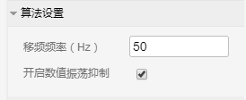

CloudPSS 提供了移频电磁暂态仿真平台。

## 移频电磁暂态仿真基本原理
移频电磁暂态模型是一类基于`希尔伯特变换（Hilbert Transform）`的暂态建模方法。其原理是将传统交流电力系统中的电气量等效成以工频正弦波为载波调制后的`带通信号（Bandpass Signal, BS）`，进而通过`Hilbert变换`，将传统电气量信号无损变换为只含有单边频谱的`复数解析信号（Analytical Signal）`。

对解析信号的频谱向左平移一个工频，形成`解析包络（Analytical Envelope）`。可见，解析包络中的最大频率小于原始实信号，解析包络变化相对较缓慢。

 


黄实线代表原始信号，橙实线代表原始信号的Hilbert变换，蓝实线代表解析信号，蓝虚线代表解析包络。


## 一个简单的移频电磁暂态模型——以电阻-电感支路为例
对于系统实域下的任何微分方程，均可以用化为解析信号的形式。以电感、电阻串联支路为例：

$$L\frac{di}{dt}+Ri=u$$

对两边分别作Hilbert变换，可得

$$L\Bbb H\left(\frac{di}{dt}\right)+R\Bbb H\left(i\right)=u$$

注意到`Hilbert变换`本质为卷积操作，其具有卷积的微分性质，故上式可化为：

$$L\frac{d\mathbb{H}\left[i\right]}{dt}+R\mathbb{H}\left[i\right]=\mathbb{H}\left[u\right]$$

与原式线性相加，即得：

$$L{ {d{\bf{z} }\left[ i \right]} \over {dt} } + R{\bf{z} }\left[ i \right] = {\bf{z} }\left[ u \right]$$

整个系统都可以用类似的方法，直接对解析信号进行仿真。事实上，直接对解析信号进行仿真与传统的对时域信号进行仿真是完全一样的，既不会增多信息、也不会丢失信息。进一步，令${\bf{z} }\left[ x \right] = X \cdot {e^{j{\omega _s}t} }$，其中$X$为将解析信号${\bf{z} }\left[ x \right]$移频后的信号。代入RL支路的微分方程，可得：

$$L{ {d\left( {I \cdot {e^{j{\omega _s}t} } } \right)} \over {dt} } + R\left( {I \cdot {e^{j{\omega _s}t} } } \right) = U \cdot {e^{j{\omega _s}t} }$$

利用乘法的微分性质，可以得到：

$${ {d\left( {I \cdot {e^{j{\omega _s}t} } } \right)} \over {dt} }{\rm{ = } }{ {dI} \over {dt} }{e^{j{\omega _s}t} } + I{ {d{e^{j{\omega _s}t} } } \over {dt} } = {e^{j{\omega _s}t} }\left( { { {dI} \over {dt} } + j{\omega _s}I} \right)$$

约去${e^{j{\omega _s}t} }$，即原式化为：

$$L{ {dI} \over {dt} } + j{\omega _s}LI + RI = U$$

这即为移频电磁暂态中的电感-电阻支路元件应满足的连续域下的方程。

这样的移频操作本质是用解析的方法求解、将原信号平移了一段频率，并对移频后的信号进行离散化求解。因此和解析信号仿真是不同的。

由于`希尔伯特变换`仍然是一类线性变换，移频电磁暂态仿真方法适用于线性元件建模。当相关元件电气瞬时信号的傅立叶频谱集中于交流载波频率附近时，可采用移频电磁暂态建模和仿真方法对其进行大步长的时域仿真。

## 移频频率的给定

在移频暂态仿真中，系统移频的频率是可以自行给定的。一般情况下，选择交流系统的工频频率作为移频频率，因为在这种情况下仿真的准确度会更高、可以用更大的仿真步长进行仿真。

在CloudPSS中，可以在右侧的`控制面板-算法设置`中更改移频的频率，如下图所示。

## 案例

详见[IEEE39节点系统](../examples/IEEE39SFEMT.md)案例及模板，此处不再详述。
