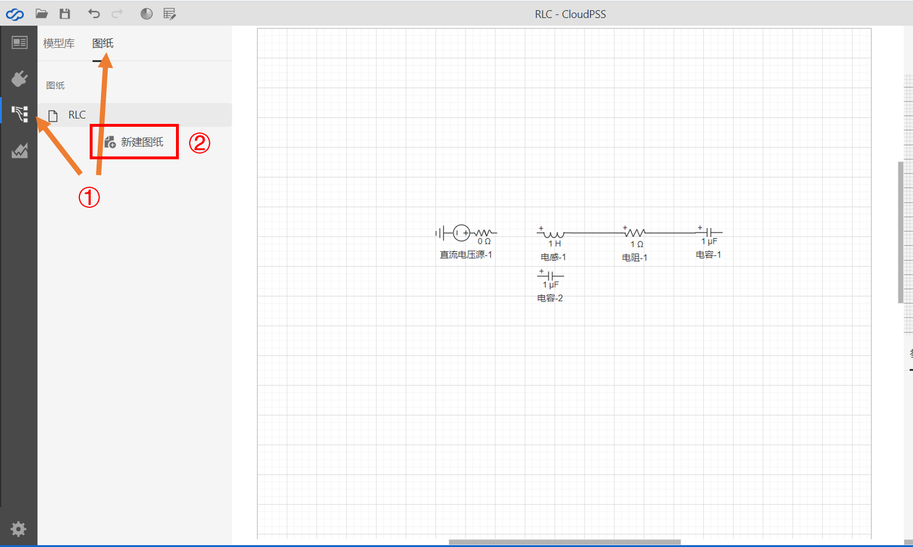
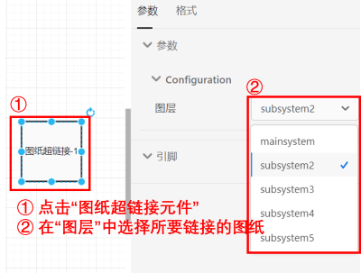

当仿真拓扑较大时，可利用`图纸`功能将拓扑分开放置到不同的图纸上，图纸间的元件引脚通过标号进行连接。

:::tip

**注意：每个项目至少包含一个图纸。**

:::

## 添加图纸

对任意的项目都可添加任意数量的图纸。以在“RLC”系统中添加新的图纸为例，操作方法如下图所示，首先点击`实现`标签页的`图纸`选项，然后点击`新建图纸`即可：

:::tip

**注意：新添加的图纸名称不能重复，否则会报错。**

:::

## 删除图纸

选择待删除的图纸，[[鼠标右键]]选择`删除`即可完成删除。图纸删除后，该图纸内的所有元件也将随之删除。以删除“RLC”系统中的“voltage_sourse”为例，删除图纸的方法如下图所示：

## 重命名图纸

选择待重命名的图纸，[[鼠标右键]]点击该图纸，选择`重命名`即可编辑。用户输入图纸新名称后，点击空白处即可完成图纸名称修改。图纸的名字也会在屏幕左侧图纸处进行相应更改。

## 图纸超链接

当仿真模型较大且具有大量的图纸时，为了便于快速定位到某一特定图纸，CloudPSS提供了**图纸超链接**功能。该功能类似于Windows系统的快捷方式，使用方法为：拖拽[图纸超链接](../../../../components/comp_PSS/comp_PSSTool/CanvaHyperlink/index.md)元件至工作空间，点击该元件并在右侧参数面板的`图层`选项中选择想要链接的图纸。完成后，双击该元件，可直接跳转到所链接的图纸。使用方法如下图所示：

