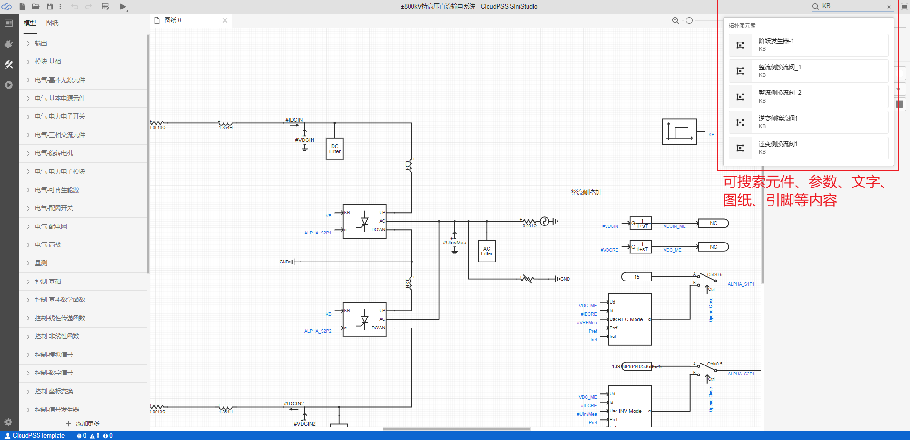
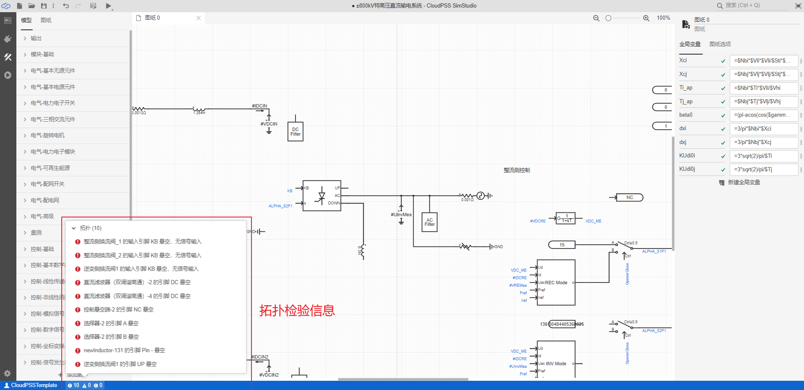

::: info

**`实现`标签页用于进行仿真拓扑构建，用户在该标签页内可进行元件的选取、拓扑的连接及构建、元件参数的配置、以及页面格式/元件格式的调整。**

:::

`实现`标签页如下图所示，主要具有如下8块子功能：

### 1)	模型
模型标签内放置了仿真拓扑构建中所需要的典型元件，包括电气、控制、量测、输出、系统、工具、BPA、PSASP、IEEEStd在内的9种类型、100余种元件，并支持用户自定义分类元件。

### 2)	图纸
当仿真拓扑图过大时，可以使用图纸功能来对拓扑图进行分区划分及管理，不同的图纸间可通过引脚标号进行连接。一个项目内不同图纸上的拓扑，本质上为同一级别。图纸的使用方法详见[图纸](./Canvas/index.md)功能帮助。

### 3)	拓扑编辑窗口
拓扑编辑窗口是进行仿真拓扑构建的编辑区域。用户可将模型库中的元件拖拽至拓扑编辑窗口内，进行元件连线及配置，并组织成完整的仿真拓扑。

### 4)	参数栏：
参数栏用于对元件特性进行配置。一个典型的参数栏由参数和引脚两部分组成，参数部分可有多个分组，每个分组下可有多个参数。例如电感元件则有两个参数组（Configuration、Monitoring），每个参数组下具有2~3个参数。用户可在参数的配置框内进行参数的输入或选择。引脚部分的框内可输入标号，实现不同元件间引脚的虚拟连接。此外，CloudPSS SimStudio提供了全局变量功能，可在仿真项目范围内被各元件的参数栏使用，便于用户管理具有相同全局变量值的元件参数。参数及引脚的具体使用及配置方法详见[参数及引脚体系](../../Basic/ParameterSystem/index.md)功能帮助。

### 5)	格式栏：
格式栏用于对元件或页面进行格式配置。支持配置拓扑编辑窗口的网格、视图、尺寸等显示特性，支持配置元件的排列、样式、字体等显示特性。格式栏的具体使用方法详见[格式栏](./Style/index.md)功能帮助。

### 6)	元件表：
元件表提供了当前项目中，拓扑编辑窗口内所有的元件的信息列表，包括元件名称、参数以及引脚信息。元件表可用于批量化管理元件信息，例如复制粘贴元件参数、统一修改元件参数等操作。元件表的具体使用方法详见[元件表](../../Basic/ComponentTable/index.md)功能帮助。

### 7)	搜索：
搜索框支持对元件、参数、文字、图纸、引脚名称等内容的智能搜索。

### 8） 拓扑校验信息栏
CloudPSS SimStudio内置了即时错误校验功能。用户在搭建算例的同时，每一步操作完成的1s后，后台会同步对项目文件进行校验，并再状态栏的左下角实时指出错误和引导性文字，帮助用户修改模型。拓扑校验信息栏如下图所示。

