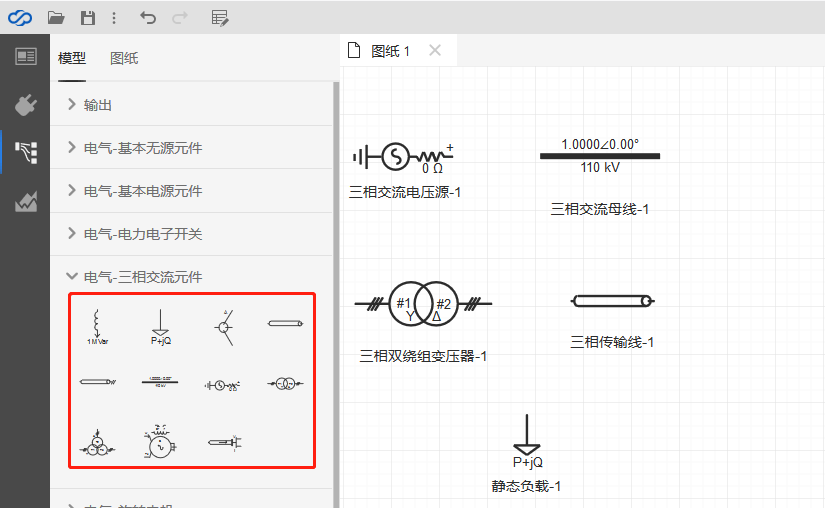
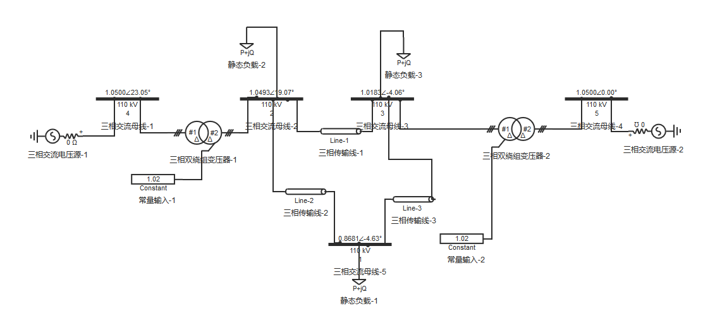
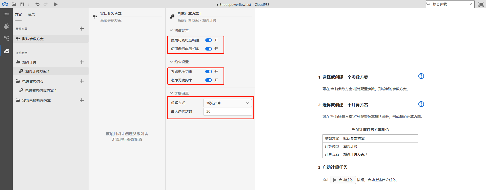

### 五节点电力网络潮流计算原理

五节点电力网络由发电机、变压器、传输线、负荷及交流母线组成，如图所示。母线1、2、3为PQ节点，各节点的负荷分别为：${S_1} = 1.6 + j0.8$,${S_2} = 2 + j1$,${S_3} = 3.7 + j1.3$;节点4为PV节点，给定${P_4} = 5$,${V_4} = 1.05$;节点5为平衡节点，给定${V_5} = 1.05 \angle {0^ \circ }$。

各PQ和PV节点已知的注入功率为${P_1S} = -1.6$，${Q_1S} = -0.8$，${Q_2S} = -2$，${P_3S} = -3.7$，${P_4S} = 5$。  
    
用牛顿-拉夫逊法计算潮流，
按以上步骤反复进行迭代，当收敛指标取${10^{ - 6}}$ 时，需要进行四次迭代。迭代过程中各节点电压变化情况如表所示：

| :-----:| :----: | :----: | :----: | :----: | :----: |:----: |:----: |
| 迭代次数 | ${\theta _1}$ |  ${\theta _2}$ | ${\theta _3}$ | ${\theta _4}$ | ${V_1}$ |${V_2}$ |${V_3}$ |
| 1 | -1.9982 |  21.0307 | -3.6913 | 25.2051 | 0.9726 |1.0712 |1.0374 |
| 2 | -4.2545 |  19.1453 | -4.0304 | 23.1260 | 0.8813 |1.0505 |1.0196 |
| 3 | -4.6213 |  19.0733 | -4.0641 | 23.0545 | 0.8684 |1.0494 |1.0183 |
| 4 | -4.6316 |  19.0736 | -4.0649 | 23.0549 | 0.8681 |1.0493 |1.0183 |

迭代结果各节点电压大小和相位角列于下表：

| :-----:| :----: | :----: |
| 节点编号 | ${V}$ |  ${\theta}$ | 
| 1 | 0.8681 |  -4.6316 | 
| 2 | 1.0493 |  19.0736 | 
| 3 | 1.0183 |  -4.0649 | 
| 4 | 1.0500 |  23.0549 | 
| 5 | 1.0500 |  0 | 

### 放置元件

首先点击`进入工作台`，即创建一个空白项目。进入工作台后，在左侧`模型`栏中点击`电气-三相交流元件`分别选择`三相交流电压源`、`三相交流母线`、`三相双绕组变压器`、`三相传输线`、`静态负荷`元件拖拽至工作空间，即可完成对相应元件的放置。可利用鼠标长按元件进行拖动或选中元件后用[[键盘方向键]]改变元件位置。可以[[鼠标右键]]点击元件进行元件的剪切、复制、粘贴、创建副本、删除、隐藏元件名称等操作，或者通过快捷键快速实现上述操作。点击元件上方的圆形箭头或利用[[Ctrl]]+[[R]]对元件进行旋转。元件放置结束后的工作空间如图所示。

### 连接元件

将鼠标光标移至元件引脚处，若该引脚出现绿色圆形阴影，说明该引脚可用。此时单击该引脚，并移动光标可形成以绿色虚线形式存在的连接路径。在连线过程中，单击[[鼠标左键]]可以在该处设置连线拐点，点击[[鼠标右键]]可退出连线。当路径移动到可以连接的另一引脚（或三相交流母线）时，该引脚（或三相交流母线）处同样产生绿色阴影，单击该引脚（或三相交流母线），即可实现两个元件的连接。元件连接示例如图所示。

### 设置参数

在完成对元件的连接后，需对各个元件的参数进行设置。点击任一元件(以三相交流电压源为例)，工作空间右侧将出现如图所示的`参数`面板，编辑完成后，系统自动保存相关参数。`参数`面板右侧为`格式`面板，用于设置元件的图标特性，如样式、文本以及排列。

各元件参数设置：
+ 三相交流电压源-1的线电压有效值设置为115.5kV，节点类型设置为PVBus，注入有功功率为500MW，电压幅值为1.05p.u.;

+ 三相交流电压源-2的的线电压有效值设置为115.5kV，节点类型设置为SlackBus，电压幅值为1.05p.u.，相位为0;
+ 三相交流母线电压基值设置为110kV；
+ 三相双绕组变压器-1的额定容量设置为100MVA，绕组1和绕组2的额定电压有效值设置为110V，连接方式为三角形连接，正序漏电抗为0.015p.u.，变压器分接头选择绕组2，变比为1.02；
+ 三相双绕组变压器-2的正序漏电抗为0.03p.u.，变压器分接头选择绕组1，变比为1.02；
+ 三相传输线的长度均为1km，额定电压为110kV，额定容量为100MVA，集中参数模型，标幺值输入方式；
+ 传输线-1的电阻为0.08p.u./km，电抗为0.3p.u./km，单位长度电纳为0.5p.u./km；
+ 传输线-2的电阻为0.04p.u./km，电抗为0.25p.u./km，单位长度电纳为0.5p.u./km；
+ 传输线-3的电阻为0.1p.u./km，电抗为0.35p.u./km，单位长度电纳为0.5p.u./km。
+ 其它参数为默认值。

::: tip
+ 当变压器设置了分接头选择后，需要将变压器分接头引脚和`常量输入`元件相连，`常量输入`元件的常量需设置为该变压器的变比。
:::

至此工作空间的仿真内容全部搭建完毕，总的仿真图如下图所示。

### 仿真运行方法

搭建完算例拓扑并设置好参数后，点击左侧`运行`，进入运行标签页，配置`计算方案`。在计算方案中选择`潮流计算方案`，其中`使用母线电压幅值`、`使用母线电压相角`、`考虑电压约束`、`考虑无功约束`开关按钮均为开，`求解方式`设置为`潮流计算`，`最大迭代次数`设置为30。

点击`启动任务`开始仿真，然后自动显示仿真结果窗口，仿真结果如下图所示。

