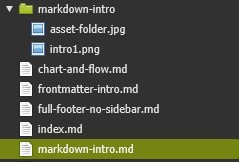

:::warning 你好
dd sd
:::

:::summary 在吗
x
:::
## 公式

使用 [$\KaTeX$](https://github.com/Khan/KaTeX) 引擎和 [markdown-it-katex](https://github.com/iktakahiro/markdown-it-katex) 插件渲染，兼容 $\LaTeX$ 公式，对 $\LaTeX$ 的支持情况见 [Things that $\KaTeX$ does not (yet) support](<https://github.com/Khan/KaTeX/wiki/Things-that-KaTeX-does-not-(yet)-support>)。使用 `$` 插入行内公式，使用 `$$` 插入行间公式。

```tex equation
行内公式：$\sin{x}$
行间公式：:arrow_left: ==注意行间公式需要**独行书写**==
$$ \sum_{i=1}^n a_i = 0 $$
... :arrow_left: ==同理，行间公式结束后也需要换行==
对于渲染错误的公式 $\error$，可以鼠标悬浮其上查看错误信息。
```

效果：

> 行内公式：$\sin{x}$  
> 行间公式：:arrow_left: ==注意行间公式需要**独行书写**==
> $$ \sum_{{i=1}}^n a_i = 0 $$
> ... :arrow_left: ==同理，行间公式结束后也需要换行==
> 对于渲染错误的公式 $\error$，可以鼠标悬浮其上查看错误信息。

## 链接


对于指向文档系统内部的链接，包括超链接和图片，一般应使用相对路径。如：



```md
<!-- in /zh/component/comp_newClarkTransform.md-->

[CloudPSS 同步电机标幺值和有名值系统](../other/SyncGenPerUnitSystem.md)
[Park 变换器](comp_newParkTransform.md)
```

## 图片

图片存储的文件结构如图
[](#Title)

即图片存储于和页面同名（此处为`markdown-intro`）的文件夹内，引用时使用 `` 语法。

图片显示规则如下：

- 当 `alt text` 为空，图片将嵌入文本，此时 `title` 为鼠标悬停时的提示文本；
- 当 `alt text` 非空，图片将居中显示，此时 `alt text` 为鼠标悬停时的提示文本，`title` 为图片题注。
- `size` 用于指定图片尺寸，具体使用方法见下文。

如 `` 得到 

可以使用题注进行交叉引用，如 `[link](#Title)` [link](#Title)。


可以使用以下语法指定图片的尺寸：

- 指定最大宽度

  ``

- 指定最大高度

  ``


不建议同时指定宽度和高度，可能导致图片变形。



## 表格

支持高级表格功能。

如：

```md table
[高级表格]
|              | Grouping                    ||
| First Header | Second Header | Third Header |
| ------------ | :-----------: | -----------: |
| Content      | _Long Cell_                 ||
| ^^           | **Cell**      | Cell         |
| Content      | **Cell**      | ^^           |

| New section  | More          | Data         |

如[上表](#高级表格)所示……
```

效果：

[高级表格]
|              | Grouping                    ||
| First Header | Second Header | Third Header |
| ------------ | :-----------: | -----------: |
| Content      | _Long Cell_                 ||
| ^^           | **Cell**      | Cell         |
| Content      | **Cell**      | ^^           |

| New section  | More          | Data         |

如[上表](#高级表格)所示……


省略开头的 `[Prototype table]` 将隐藏表名并不对表格进行编号。


## 文本居中

```md center
->centered
text<-
```

效果

> ->centered
> text<-

## 代码

语法如下：

````markdown codeblock
```[语言] [标题] [链接] [链接文字]

```
````

由于 `[语言]` 和 `[链接]` 中不会包含空格，另两项可以任意添加空格而不影响解析。

可用的 `[语言]` 包括 `plain` `tex` `md` `yaml` `js` `html` `css` `c` `cpp` `csharp` `pyhton` `matlab`……

如：

````md codeblock example
```javascript a simple js script /sample.js file: sample.js
console.log('hello world');
```
````

效果：

```javascript a simple js script /sample.js file: sample.js
console.log('hello world');
```

## 引用

如：

```md quote
> Level1
>
> > Level2
>
>  <!-- 退出层级需要一行空行-->
>
> Level1
```

效果：

> Level1
>
> > Level2
>
>  <!-- 退出层级需要一行空行-->
>
> Level1


同理，引用结束需要一行空行。


## 定义

如：

```tex deflist
有效值
: 在相同的电阻上分别通过直流电流和交流电流，经过一个交流周期的时间，如果它们在电阻上所消耗的电能相等的话，则把该直流电流（电压）的大小作为交流电流（电压）的有效值。
  $$ G_{rms} = \sqrt{\frac{1}{T} \int_{-\frac{T}{2} } ^{\frac{T}{2} }{ g(t)^{2} \operatorname{d}\! t } } $$
: 正弦电流（电压）的有效值等于其最大值（幅值）的 $\frac{1}{\sqrt{2}}$ ，约 $0.707$ 倍。

另一个定义
~ 也可以使用波浪线。
  通过缩进确定定义的范围。
~ 另起一段。
  ...
```

效果：

有效值
: 在相同的电阻上分别通过直流电流和交流电流，经过一个交流周期的时间，如果它们在电阻上所消耗的电能相等的话，则把该直流电流（电压）的大小作为交流电流（电压）的有效值。
  $$ G_{rms} = \sqrt{\frac{1}{T} \int_{-\frac{T}{2} } ^{\frac{T}{2} }{ g(t)^{2} \operatorname{d}\! t } } $$
: 正弦电流（电压）的有效值等于其最大值（幅值）的 $\frac{1}{\sqrt{2} }$ ，约 $0.707$ 倍。

另一个定义
~ 也可以使用波浪线。
通过缩进确定定义的范围。
~ 另起一段。
...


定义的前后需要空行分隔。


## 缩写

如：

```md abbr
定义一个缩写：
*[RMS]: 有效值
在文中使用缩写：
RMS 指有效值
```

效果：
> 定义一个缩写：
> *[RMS]: 有效值 
> 在文中使用缩写：
> RMS 指有效值

## 脚注

如：

```md footnote
定义一个脚注：
[^test-platform]: 测试平台为 NVIDIA(R) Tesla(R) V100

在文中使用脚注：
测试[^test-platform]结果如下：……

如果只使用一次的话，也可以使用内联语法。^[内联脚注更方便吗？]
```

效果：

> 定义一个脚注：
> [^test-platform]: 测试平台为 NVIDIA(R) Tesla(R) V100
>
> 在文中使用脚注：
> 测试[^test-platform]结果如下：……
>
> 如果只使用一次的话，也可以使用内联语法。^[内联脚注更方便吗？]

## 杂项

- **下标**：`H~2~0` H~2~0
- **上标**：`x^2^` x^2^
- **标记**：`==mark==` ==mark==
- **插入与删除**：`++Inserted++` ++Inserted++；`~~Del~~` ~~Del~~
- **[Emoji](https://www.webpagefx.com/tools/emoji-cheat-sheet/)**：`:smile:` :smile: `8-)` 8-) `(R)` (R) `(TM)` (TM)
- **键盘按键**：`[[Ctrl]]+[[Alt]]+[[Del]]` [[Ctrl]]+[[Alt]]+[[Del]]
- 其他标准 MarkDown 语法不再赘述。
