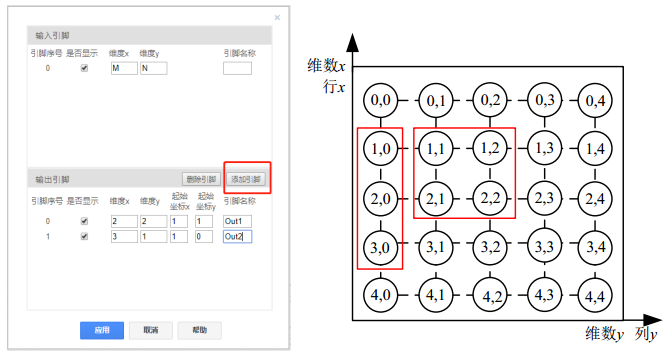

## 基本描述


> **该元件实现将单路多维输入信号拆分为多路输出信号，每路输出信号可以为多维。**

## 使用说明

### ChannelDeMerge多路信号分离工作原理

假设仿真过程中生成了一个M*N维(M行N列)的信号，如图所示。可利用ChannelDeMerge元件对该信号进行拆分。

例如，需要分别获得以坐标(1,1)起始的2\*2维的信号以及以坐标(1,0)起始的3\*1维信号，此时先拖拽ChannelDeMerge元件至工作空间，单击该元件进行设定，填写输入引脚维数与引脚名称(可不写)，点击添加引脚，并填写输出引脚的维数和起始坐标以及引脚名称。参数框设置如下图所示，点击应用即可。此时输出引脚Out1为一个2\*2维的信号，输出引脚Out2为一个3*1维的信号。


输入输出维数需要匹配，如在上例中原始M\*N维信号至少为4\*3维。


## 测试模型
[<test name>](<test link>)显示了多路信号分离的典型应用。

## 相关元件

[多路信号合并](/components/comp_ChannelMerge.html)