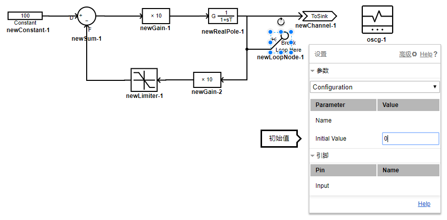

## 基本描述


> **该元件用以实现代数环解环功能。**

## 参数列表
### Configuration
| 参数名 | 单位 | 备注 | 类型 | 描述 |
| :--- | :--- | :--- | :--: | :--- |
| Name |  | 元件名称 | 文本 | 此处输入代数环解环点的名称（可缺省） |
| Initial Value |  | 初始值 | 实数（常量） | 该元件的初始输出值 |

## 端口列表

| 端口名 | 数据维数 | 描述 |
| :--- | :--:  | :--- |
| Input | 1×1 |输入端口 |                   

## 使用说明

该元件用以在出现控制环（代数环）的仿真算例中，通过加入一步延时的方法解开环，以使仿真能继续进行。 

通常，当搭建好一个含有反馈环的系统后（如图），点击开始仿真，`系统信息`会报多个`警告`。


1. **[warning]** There are loop nodes in system!You can use Component 'LoopNode' to specify the loop nodes and the initial value, or the program will choose random loop nodes.
2. **[warning]** Node 1 in component newGain-1 will be chosen as loop node with initial value 0.
3. **[warning]** Node 1 in component newGain-2 will be chosen as loop node with initial value 0.


此时，CloudPSS通过内置的延时解环算法，在`newGain-1`元件和`newGain-2`元件处各加入了一个延时，此时系统的反馈环被打开，从而可以正常仿真。

但自动的解环算法往往不是最优的。因此，建议用户采用本元件进行解环。例如，对上图所示的控制环，可在输出位置加入一步延时，即可解开反馈环。还可为解环后反馈路径设定一个初值，以降低解环带来的误差。

## 测试模型
[<test name>](<test link>)显示了代数环解环点的典型应用。

## 相关元件

