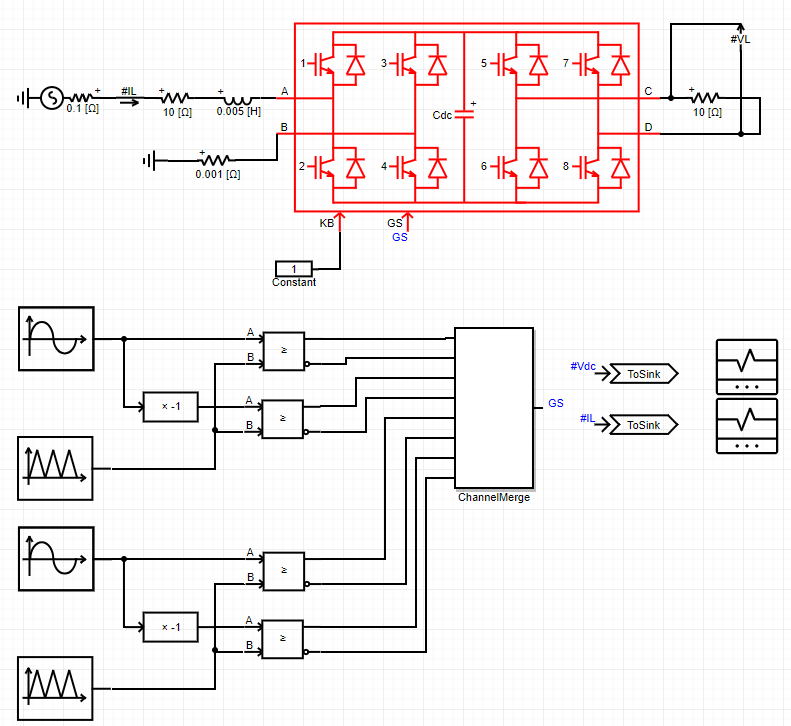

## 基本描述


> **该元件为背靠背H桥电路模块的快速化仿真模型，其与详细电磁暂态模型的精度相当。该元件可用于构建AC/AC变流器拓扑等**

## 参数列表
### Configuration
| 参数名 | 单位 | 备注 | 类型 | 描述 |
| :--- | :--- | :--- | :--: | :--- |
| Name |  | 元件名称 | 文本 |  |
| IGBT On Resistance | Ω | IGBT导通电阻 | 实数（常量） | IGBT导通电阻 |
| IGBT Off Resistance | Ω | IGBT关断电阻 | 实数（常量） | IGBT关断电阻 |
| Diode On Resistance | Ω | 二极管导通电阻 | 实数（常量） | 二极管导通电阻 |
| Diode Off Resistance | Ω | 二极管关断电阻 | 实数（常量） | 二极管关断电阻 |
| DC Side Capacitance | F | 直流侧电容值 | 实数（常量） | 直流侧电容值 |
| Initial Capacitor Voltage | kV | 初始电容电压 | 实数（常量） | 初始电容电压 |

### Monitoring
| 参数名 | 备注 | 类型 | 描述 |
| :--- | :--- | :--: | :--- |
| IGBT Voltage Vector \[kV\] | IGBT电压向量(8*1) | 文本 | 此处输入IBGT的电压向量量测信号的标签，以#号开头，如#Vt，其维数为8\*1 |
| IGBT Current Vector \[kA\] | IGBT电流向量(8*1) | 文本 | 此处输I入BGT的电流向量量测信号的标签，以#号开头，如#It，其维数为8\*1 |
| Diode Current Vector \[kA\] | 二极管电流向量(8*1) | 文本 | 此处输入二极管的电流向量量测信号的标签，以#号开头，如#Id，其维数为8\*1 |
| DC Voltage \[kV\] | 直流电压 | 文本 | 此处输入直流电容电压量测信号的标签，以#号开头，如#Vdc |

## 端口列表

| 端口名 | 数据维数 | 描述 |
| :--- | :--:  | :--- |
| AC1 + | 1×1 | 交流侧接线端口1的正端(A端) |
| AC1 - | 1×1 | 交流侧接线端口1的负端(B端) |
| AC2 + | 1×1 | 交流侧接线端口2的正端(C端) |
| AC2 - | 1×1 | 交流侧接线端口2的负端(D端) |
| GS | 8×1 | 开关输入信号，按照开关1~8号依次排列 |
| KB | 1×1 | 模块闭锁信号输入端，输入0则闭锁全部开关信号，输入非零则不闭锁 |

## 使用说明
下图示出了背靠背H桥模块的单元测试算例，算例详见[Test_BacktBackHBridge](https://www.cloudpss.net/editor/?id=1184)。

开关S1\~S4及开关S5\~S8的脉冲信号分别由两组正弦脉宽调制逻辑实现，开关频率为5KHz。两组脉宽调制器产生的8路PWM信号，经过**ChannelMerge**元件合成为一个8\*1维的输出信号，送至背靠背H桥模块的GS端。前级S1\~S4进行整流，直流电容电压为100Hz脉动直流，电感电流为准正弦波形。后级S5\~S8进行逆变，电阻负载侧为准正弦波形。

## 相关元件
[H桥模块](comp_HBridgeModule.html)
[三相H桥模块](comp_ThreePhaseHBridgeModule.html)
[H桥电感模块](comp_HBridgeWithInductanceModule.html)
[H桥变压器模块](comp_HBridgeWithTransformerModule.html)
[半桥模块](comp_HalfBridgeModule.html)
](](