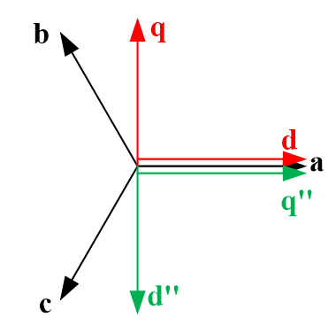

## Basic Description


> **This component performs Park transformation and inverse Park transformation.**

## Parameter
### Configuration
| Parameter name | Remark | Type | Description |
| :-------------------------- | :--------- | :---: | :----------------------------------- |
| Name | Name of component | Text  | Enter the name of this component |
| Direction of Transformation | Direction of transformation | Select | Select Park transformation or inverse Park transformation  |
| Rotating Frame Alignment | Rotating frame alignment | Select  | Select the d-axis of coordinate transformer is "Aligned with phase A" or "Delay 90 degrees" |

## Pin List

| Pin name | Dimension | Description |
| :----- | :------: | :------------------------ |
| Theta  |   1×1    |                           |
| d      |   1×1    | Input pin of d-axis during Inverse Park transformation |
| q      |   1×1    | Input pin of q-axis during Inverse Park transformation |
| A      |   1×1    | Output pin of phase A during Inverse Park transformation |
| B      |   1×1    | Output pin of phase B during Inverse Park transformation |
| C      |   1×1    | Output pin of phase C during Inverse Park transformation |
| A      |   1×1    | Input pin of phase A during Park transformation |
| B      |   1×1    | Input pin of phase B during Park transformation |
| C      |   1×1    | Input pin of phase C during Park transformation |
| d      |   1×1    | Output pin of d-axis during Park transformation |
| q      |   1×1    | Output pin of q-axis during Park transformation |

## Using Instructions

When the **Rotating Frame Alignment** is **Aligned with phase A**, the calculation formulas for the Park transformation and the inverse Park transformation are: 
+ **Park Transformation**
$$\begin{bmatrix}
U_{d }\\ 
U_{q}\\
U_{0 }
\end{bmatrix}
=\frac{2}{3}*\begin{bmatrix}
cos\theta &cos(\theta -2\pi/3) &cos(\theta +2\pi/3) \\ 
 -sin(\theta )&-sin(\theta -2\pi/3) &-sin(\theta +2\pi/3)\\
 1/2& 1/2& 1/2
\end{bmatrix}
\begin{bmatrix}
U_{a}\\ 
U_{b}\\ 
U_{c}
\end{bmatrix}$$
+ **inverse Park Transformation**
$$\begin{bmatrix}
U_{a }\\ 
U_{b}\\
U_{c }
\end{bmatrix}
=\begin{bmatrix}
cos\theta &  -sin(\theta )&1 \\ 
cos(\theta -2\pi/3)&-sin(\theta -2\pi/3) &1\\
cos(\theta +2\pi/3) &-sin(\theta +2\pi/3) & 1
\end{bmatrix}
\begin{bmatrix}
U_{d}\\ 
U_{q}\\ 
U_{0}
\end{bmatrix}$$

**Note**: In the traditional Park transformation, the d-axis leads the q-axis. The position of the dq axis is shown in the above figure **Red Line**. PSCAD uses the q-axis leading d-axis, as shown in the above figure **Blue line**. Therefore, under the same input, the q-axis component obtained by this component is opposite to the result of PSCAD.


When the **Rotating Frame Alignment** is **90° behind phase A**, the calculation formulas for the Park transformation and the inverse Park transformation are: 
+ **Park Transformation**
$$\begin{bmatrix}
U_{d }\\ 
U_{q}\\
U_{0 }
\end{bmatrix}
=\frac{2}{3}*\begin{bmatrix}
sin(\theta )&sin(\theta -2\pi/3) &sin(\theta +2\pi/3)\\
cos\theta &cos(\theta -2\pi/3) &cos(\theta +2\pi/3) \\ 
 1/2& 1/2& 1/2
\end{bmatrix}
\begin{bmatrix}
U_{a}\\ 
U_{b}\\ 
U_{c}
\end{bmatrix}$$
+ **inverse Park Transformation**
$$\begin{bmatrix}
U_{a }\\ 
U_{b}\\
U_{c }
\end{bmatrix}
=\begin{bmatrix}
sin(\theta )&cos\theta   &1 \\ 
sin(\theta -2\pi/3) &cos(\theta -2\pi/3)&1\\
sin(\theta +2\pi/3) &cos(\theta +2\pi/3) & 1
\end{bmatrix}
\begin{bmatrix}
U_{d}\\ 
U_{q}\\ 
U_{0}
\end{bmatrix}$$

## See Aslo

[Clark Transformation](comp_newClarkTransform.html), [dq-αβ Coordinates Transformation](comp_newXYtoDQ.html)
