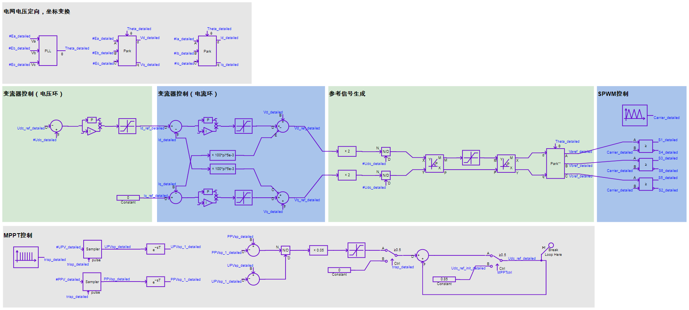
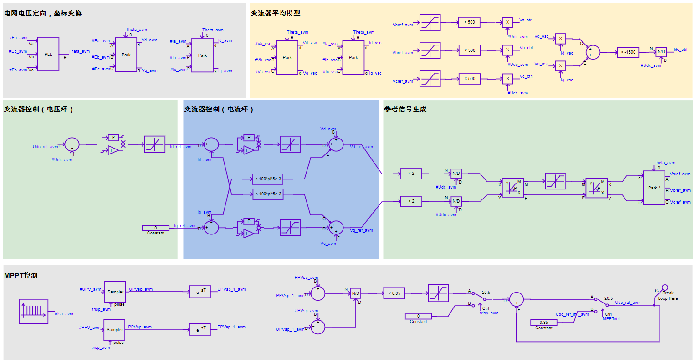
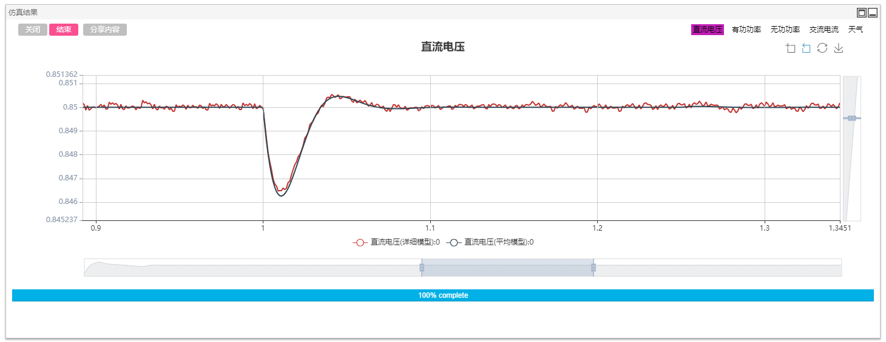
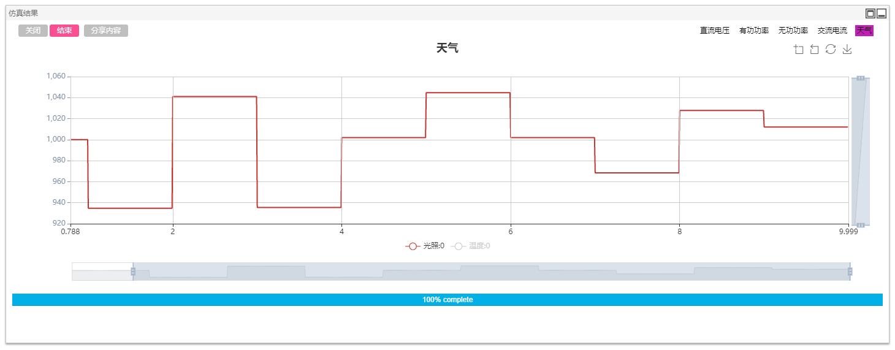
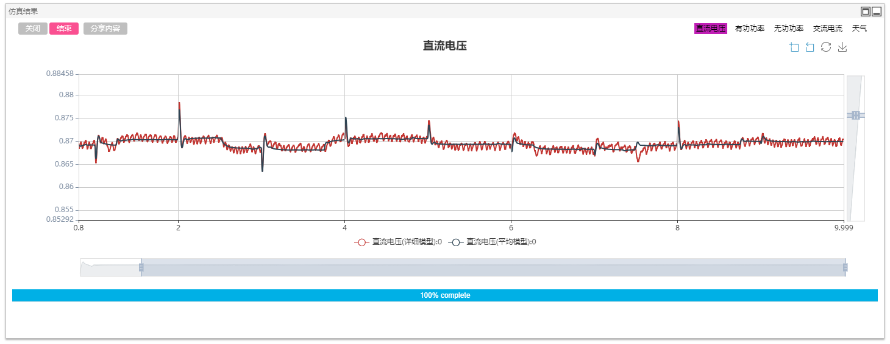

## 描述
随着电力电子变换技术的进步，太阳能光伏逆变并网发电比例逐步提升。对集中式、分布式光伏发电系统的详细建模和仿真对于研究光伏并网带来的影响具有重要意义。

CloudPSS提供了光伏并网发电系统的详细模型和平均模型，并提供了两种模型的对比。用户可根据需要，自行选择相应的模型，并在此基础上进行修改和研究。

## 模型介绍

光伏并网发电系统由光伏电池组的工程参数模型（参数更易获取）、电压源变换器（详细/平均模型）、变流器控制系统和最大功率点跟踪（MPPT）算法构成。

其中，电压源变换器的详细模型由6个分立的IGBT及其反并联二极管组成，如下图。

变换器的平均模型由交流侧3个受控电压源和直流侧一个受控电流源组成，如下图。

变流器的控制系统采用定直流电压-无功功率控制（VQ控制）。其中，直流电压给定值由MPPT控制模块指定。详细模型的控制系统由电网电压定向、电压环-电流环双闭环控制、参考信号生成、SPWM控制四部分构成。MPPT采用扰动算法。

平均模型的控制系统省略了SPWM控制，但增加了变流器平均模型控制（其主要作用是保证交流侧和直流侧的功率平衡）。

## 仿真

根据所选择的模型设定仿真步长，对光伏并网发电系统进行电磁暂态仿真。其中，详细模型由于含有离散开关事件，建议在`格式面板`->`电磁暂态`>`求解器设置`处勾选`开关/离散事件处理增强`选项，采用较小的仿真步长进行仿真。若PWM载波频率为$f_c$，则建议仿真步长应小于$1/({20f_c})$。选用平均模型时，由于不存在开关事件，故可选择`常规（默认）`选项，设置较高的仿真步长（建议50μs，通常不超过100μs）。 

### 仿真1：稳态光照、温度突变

将详细模型和平均模型建立在统一算例工程中，保持详细模型和平均模型的光照、温度等外界条件恒定，禁用MPPT控制（算例中MPPT控制由一个0.2s从0到1的阶跃信号控制，更改阶跃信号的Final Value为0即可禁用MPPT控制），设置算例的起止时间及积分步长（5μs）等基本信息。点击`格式面板`->`电磁暂态`>`仿真控制`>`开始`，选择相应的计算节点，即可得到仿真结果。绘制直流电压、有功/无功功率的对比图。

1s时光照和温度发生了变化，可见，直流电压和有功功率均有小幅调整。

### 仿真2：光照、温度变化下MPPT控制

设定光照、温度分别按照1Hz和0.8Hz的频率随机波动，启动MPPT控制，对比详细模型和平均模型的仿真结果。

可见，详细模型和平均模型结果一致。在实际应用时，若需研究控制算法、系统级动态，为提升仿真效率，可采用平均模型。