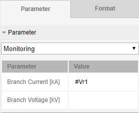
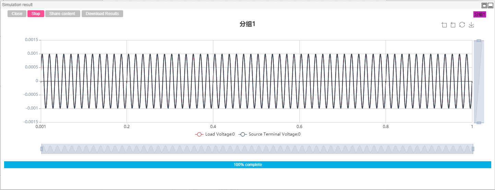
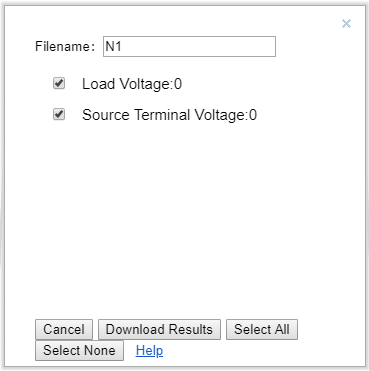

CloudPSS provides various measurement/output components for users.

## Electrical Quantity Measurement

There are two methods for electrical quantity (voltage, current, power, etc.) measurement.
+ Use measurement components (such as Voltage Meters, Current Meters, Power Meters, etc.) to obtain the measurement signal name (starting with mark #);
+ Fill in the output measurement signal name (starting with mark #) in the `Component parameter settings->Monitoring`.

For example, to measure the current of a resistance, drag the ammeter and connect it in series, and fill in the corresponding label name in `Parameter settings->Monitoring->Branch Current [kA]`, as shown in the figure below. The measured signal can be further connected to the control, electrical or output elements.




## Signal Management

The measurement signals of some components are multidimensional, for example, the signal of `Three-phase AC Voltage Source->Monitoring->3-phase Source Votage Vector` is 3D signal. If users need only a one-dimensional signal from the three dimension, such as phase A, `Control-Basic Components->Chanel Demerge Component` can be used to split the signal. See the description of [Chanel Demerge Component](../components/comp_ChannelDeMerge.html) for details. Similarly, if users need to combine multi one-dimensional signals into multi-dimensional signals, `Control-Basic Components->Chanel Merge Component` can be used. See the description of [Chanel Merge Component](../components/comp_ChannelMerge.html) for details.

## Signal Output

In order to display the output signal, both the `Output Channel` and the `Oscilloscope Group` components must be added into the main workspace. `Output Channel` collects the input signal, its input pin can be connected to the output pin of other component or the measurement signal name starting with mark #. Note that the dimensions of the input pins must match its dimensional requirement. Click the `Oscilloscope Group` component and select the corresponding signal name to be displayed. In theory, there can be any `Output Channel` and `Oscilloscope Group` comonents in a simulation project. Users can reasonably configure these components according to the type and size range of the input signal to facilitate the analysis of simulation results.

## Result Download

After the simulation is finished, users can click the `Data Download` button, and then select the corresponding data channels to download.





Data download can only be available for **The saved project**.


The downloaded data is a compressed data format and can be parsed by the following MatLab code. After parsing, the data of each channel is stored in the structure `Ch_X` (`X` is the serial number, `Ch_X.Name` is the channel name, and `Ch_X.Data` is the channel data). 


If the parsing code reports an error, please re-download the latest code and try again.


```matlab Import the data to MatLab /features/Measure/CloudPSSDataImport.m CloudPSSDataImport.m
clear;
clc;

[fname,pname]=uigetfile('*.*','open');
filename = strcat(pname,fname);

fid = fopen(filename,'r','n','utf-8');
config = fgetl(fid);
data = fscanf(fid,'%f');
fclose(fid);


textcell = regexp(config,'<[|]>','split');

starttime = textcell{1};
tempcell = regexp(starttime, '=', 'split');
Tstart = str2double(tempcell{2});

endtime = textcell{2};
tempcell = regexp(endtime, '=', 'split');
Tend = str2double(tempcell{2});

ChannelNo = length(textcell) - 2;

dataloc = 1;
for ptr = 1: ChannelNo
    loc = ptr + 2;
    temp = textcell{loc};
    tempcell = regexp(temp, '=', 'split');
    ChannelName{ptr} = tempcell{1};
    tempNum= regexp(tempcell{2}, ',', 'split');
    ChannelSpTime(ptr) = str2double(tempNum{1});
    ChannelPointNum(ptr) = str2double(tempNum{2});
    %generate Channel
    ChNo = sprintf('Ch_%d',ptr);
    Channel{ptr} = ChNo;
    %generate Channel Name
    eval(sprintf('%s.Name = ChannelName{ptr};',ChNo));
    %initialize Channel Data
    eval(sprintf('%s.Data = zeros(ChannelPointNum(ptr),2);',ChNo));
    %generate Timeline
    deltaT = 1/ChannelSpTime(ptr);
    timeline = (Tstart + deltaT):deltaT:(Tstart + deltaT*ChannelPointNum(ptr));
    timeline = timeline.';
    eval(sprintf('%s.Data(:,1)= timeline;',ChNo));
    eval(sprintf('%s.Data(:,2)= data(dataloc:(dataloc-1)+ChannelPointNum(ptr));',ChNo));
    
    %%
    dataloc = dataloc + ChannelPointNum(ptr);
end


disp('导入完成!');

for ptr = 1: ChannelNo
    fprintf('Ch_%d -> %s\n',ptr,ChannelName{ptr});
end

clear Channel ChannelNo ChannelPointNum ChannelSpTime ChNo config data dataloc deltaT endtime fid filename fname loc pname ptr starttime temp tempcell tempNum Tend textcell timeline Tstart ans
```


