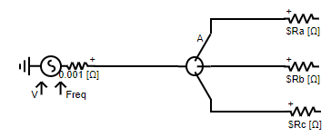
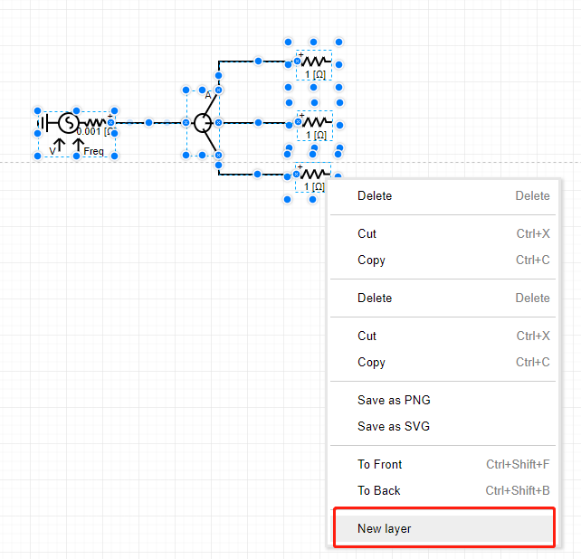
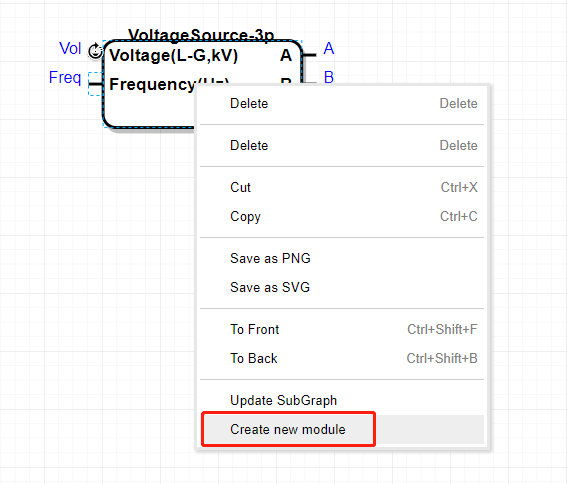
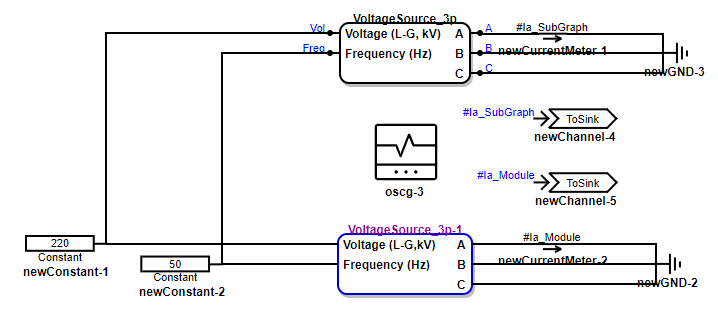
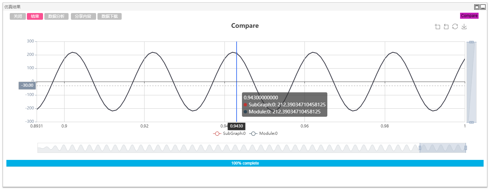

CloudPSS provides module function on the basis of subgraph function. It can further encapsulate the subgraph into common modules, which can be used in other simulation examples.

## Create Module

The module is directly created by the `Subgraph`, so the subgraph needs to be created first. This section introduces a three-phase asymmetric voltage source module as an example.

1. Build the three-phase asymmetric voltage source circuit as follows (pay attention to modify the phase number of the voltage source). 
  

2. Select the part to be encapsulated as subgraph/module, right-click and select `Create Subgraph`.
  

3. In the pop-up dialog box, click `OK` to enter the subgraph customization interface.
  

4. In the interface of `Subgraph Customization`, set the pin position and pin name (description) as follows.
   

5. Click `New` to create a subgraph. Its icon is as follows.
  

6. Right click to select the subgraph and click `Save as Module` to open the `Module Configuration` interface.
  

7. Click `Select the module icon`, upload the module icon (the icon displayed in the model library on the left), set the module name, module symbol, whether to publish, description, module parameters and other information.
  

    
    - It is recommended to select a **square** image as the module icon.
    - After ticking `Whether to publish or not`, the module is visible to all users (enter the `Personal Homepage` of the module creator, this module can be found in `My Module`).
    - The `parameters` on the right are all `global parameters` used in the module.
    

8. Click `Save` and a message will pop up indicating that the module has been saved successfully. After refreshing the workbench, the module will be displayed in the left `Module Library`->`Module`. 
   
    

    
    The module name is the unique identifier of the module and cannot be duplicate. If the save is not successful, please change the module name and try again.
    

## View Module

Drag the created module into workspace and double-click the module icon to view the internal topology details of the module.

Compared with the original subgraph, it can be seen that the two structures are identical.

## Test Module

The correctness of the result is tested by building a comparison example of the original circuit and the module.

It can be seen that the simulation results of the module are consistent with those of the original circuit.

## Delete Module

Users can delete the existing modules at `Personal Homepage`-> `Cloud Space`->`My Module`.


After the module is deleted, all simulation cases using the module will be affected! Please operate carefully.


## Modify Module

Users can open the encapsulated module at the `Personal Homepage`-> `Cloud Space`->`My Module`, view its internal details and modify them.

CloudPSS does not support module coverage. After the module is modified, only new modules can be created. If you want to overwrite the existing module after modification, delete the original module before saving, and fill in the information completely consistent with the previous module when saving the new module.
