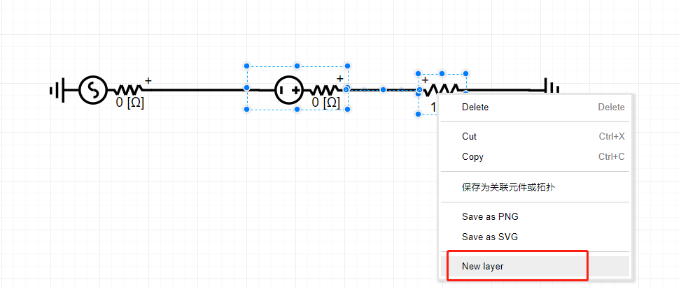
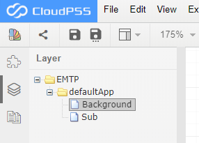

The subgraph function is used to integrate multiple components to form a new layer, and the nodes with the same label between layers are connected with each other. The function of sub diagram can realize the function division of simulation diagram, electrical-control division, etc. in large simulation system, it has the advantages of making the simulation diagram concise, clear and beautiful. In this section, the function of the sub diagram is explained in detail.

## Create Subgraph

Select multiple components in the main workspace, right-click to select `Create New Subgraph`, and name the subgraph as 'Sub' in the pop-up dialog box, as shown in the figure below. Click `OK` and then pop up `Whether to Customize Port Name`. Click `OK` to customize the port of  the subgraph.

The customized interface of the subgraph port is shown in the figure.

The subgraph ports are divided into two types, boundary ports and non boundary ports. The boundary port is the port of the interface between the selected component and the external circuit. If the port has been named, the name will be displayed in the option before modification in the interface above, such as A2. Otherwise, the system will specify the port name, such as sub.p01. The non boundary port is the port of the selected component which is not connected with the external circuit and whose pin is labeled, as shown in the figure, the connection point A1 of DC voltage source and resistance. In the interface above, you can choose whether to display ports or not. The column `Modified` can be edited. You can change the name of the port as required, that is, the label connected between layers. In the `Description` column, you can change the pin display name of the package sub diagram icon, and in the `Position` column, you can change the direction of the port.

In this example, change the port name to A2 and its description to R+, change sub.p01 to A0 and its description to Vs-. Display the non-boundary port, and change sub.a1 to A1 and its description to Vs+. Click `New` button to complete the creation of the subgraph. As shown in the figure.


New subgraphs cannot be created in subgraphs, that is, they are not allowed to be nested.


## Open Subgraph

After creation of subgraph, the footprint icon of the sub graph will appear in the workspace. Double click the icon to open the subgraph. The page name of the subgraph is 'Sub', which is the name of the new icon layer. Click the close button next to the page name to close the subgraph.

## Delete Subgraph

In the main layer, select the subgraph you want to delete. Right-click the subgraph, select `Delete` from the drop-down menu or directly press the keyboard [[Delete]] key, and select the type of deletion in the pop-up dialog box: `Only delete icon does not delete the subgraph` and `Delete icon and delete the subgraph`. When selecting the former, the subgraph will not be deleted. You can reopen the layer through the `Application Tree` on the left side of the workspace. 

If the `Delete icon and delete the subgraph` is selected, both the icon and the subgraph layer will be deleted.

## Update Subgraph

If users make any changes to the subgraph, such as adding new components, users need to right-click in the blank of the subgraph layer and select `Update subgraph`. The system will automatically identify the boundary ports and non-boundary ports in the subgraph, and pop up the user-defined interface of the subgraph ports again for users to modify. Click `New` to update the icon in the main layer.

