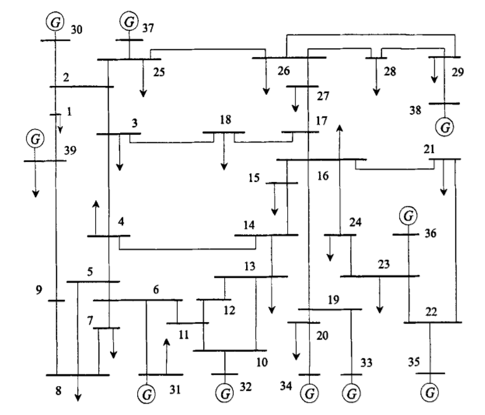
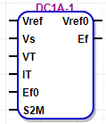
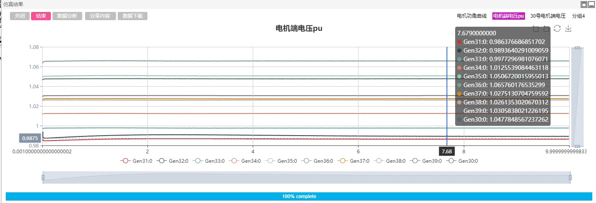
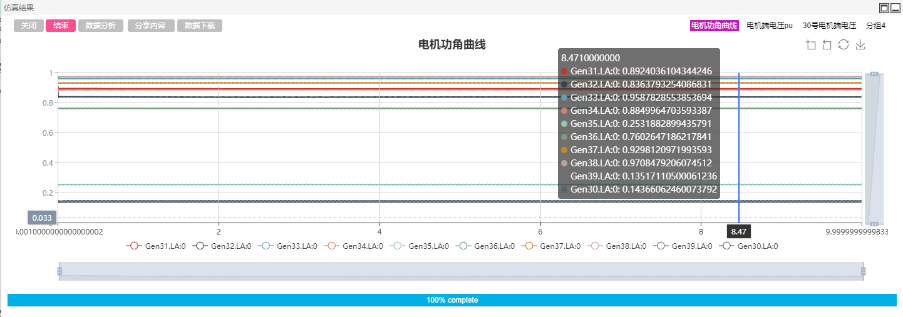

## 描述
IEEE 39节点标准系统，是美国新英格兰州的一个电力网络。该系统包括10台发电机，39个母线，12台变压器。
CloudPSS中提供了含潮流断面启动的完整39节点系统电磁暂态仿真算例，可以直接利用稳态潮流断面启动，所有模型不用经历启动过渡过程，直接进入稳态。该算例可用于传统暂态稳定分析，励磁、调速控制器设计，系统调频等特性分析等。

## 模型介绍

### 模型拓扑

IEEE39节点算例拓扑图如下，其中39号节点为松弛节点。除松弛节点外，各电机相连的母线（30-38）电压等级均为20kV，另外12号节点为25kV，剩下所有母线电压均为500kV.

CloudPSS上该算例采用单线图构建，其拓扑如下。

### 模型参数

所有电机参数、传输线参数、变压器参数来源于文献^[Luc Gérin-Lajoie. IEEE PES Task Force on Benchmark Systems for Stability Controls[R]. EMTP-RV 39-bus system, Version 1.5 - Mars 04, 2015]。

#### 发电机参数

发电机原始标幺值参数如下:

| UnitNo. | RatedPower | H | Ra | x'd | x'q | xd | xq | T'do | T'qo | xl |
| :--- | :--- | :--- | :--- | :--- | :--- | :--- | :--- | :--- | :--- | :--- |
| 1  | 10000  | 5.000  | 0.000 | 0.600  | 0.800  | 2.000  | 1.900  | 7.000  | 0.700  | 0.300  |
| 2  | 1000  | 3.030  | 0.000  | 0.697  | 1.700  | 2.950  | 2.820  | 6.560  | 1.500  | 0.350  |
| 3  | 1000  | 3.580  | 0.000  | 0.531  | 0.876  | 2.495  | 2.370  | 5.700  | 1.500  | 0.304  |
| 4  | 1000  | 2.860  | 0.000  | 0.436  | 1.660  | 2.620  | 2.580  | 5.690  | 1.500  | 0.295  |
| 5  | 600   | 4.333  | 0.000  | 0.792  | 0.996  | 4.020  | 3.720  | 5.400  | 0.440  | 0.324  |
| 6  | 1000  | 3.480  | 0.000  | 0.500  | 0.814  | 2.540  | 2.410  | 7.300  | 0.400  | 0.224  |
| 7  | 1000  | 2.640  | 0.000  | 0.490  | 1.860  | 2.950  | 2.920  | 5.660  | 1.500  | 0.322  |
| 8  | 1000  | 2.430  | 0.000  | 0.570  | 0.911  | 2.900  | 2.800  | 6.700  | 0.410  | 0.280  |
| 9  | 1000  | 3.450  | 0.000  | 0.570  | 0.587  | 2.106  | 2.050  | 4.790  | 1.960  | 0.298  |
| 10 | 1000  | 4.200  | 0.000  | 0.310  | 0.080  | 1.000  | 0.690  | 10.200  | 0.000  | 0.125  |

经过折算后（折算方法见2.2.1），实际使用的发电机参数如下：

| Bus No. | Rs | Xls | Xd | Xq | Rfd | Rkd | Rkq | Xlfd | Xlkd | Xlkq |
| :--- | :--- | :--- | :--- | :--- | :--- | :--- | :--- | :--- | :--- | :--- |
| 39 | 0.0002 | 0.3 | 2 | 1.9 | 0.00078  | 0.08842  | 0.07805  | 0.36429  | 0.30000  | 0.16552  |
| 31 | 0.0002 | 0.35 | 2.95 | 2.82 | 0.00121  | 0.08680  | 0.11626  | 0.40044  | 0.26421  | 0.15970  |
| 32 | 0.0002 | 0.304 | 2.495 | 2.37 | 0.00114  | 0.08339  | 0.09828  | 0.25324  | 0.40916  | 0.15710  |
| 33 | 0.0002 | 0.295 | 2.62 | 2.58 | 0.00115  | 0.22949  | 0.10351  | 0.15010  | 0.09017  | 0.05636  |
| 34 | 0.0002 | 0.324 | 4.02 | 3.72 | 0.00208  | 0.03440  | 0.17167  | 0.53585  | 1.07442  | 0.48710  |
| 35 | 0.0002 | 0.224 | 2.54 | 2.41 | 0.00096  | 0.06964  | 0.10510  | 0.31334  | 0.48576  | 0.19141  |
| 36 | 0.0002 | 0.322 | 2.95 | 2.92 | 0.00132  | 0.16917  | 0.11841  | 0.17947  | 0.14560  | 0.08041  |
| 37 | 0.0002 | 0.28 | 2.9 | 2.8 | 0.00117  | 0.07570  | 0.11947  | 0.32609  | 0.41083  | 0.18230  |
| 38 | 0.0002 | 0.298 | 2.106 | 2.05 | 0.00118  | 0.08605  | 0.08481  | 0.32017  | 0.34453  | 0.16644 | 
| 30 | 0.0002 | 0.125 | 1 | 0.69 | 0.00029  | 0.09301  | 0.03207  | 0.23460  | 0.38542  | 0.16051  |

#### 线路参数

传输线原始参数如下表。其中，标幺值参数为线路全长参数（潮流计算使用的参数），有名值参数为单位长度参数（根据标幺值参数和基准容量、电压、线路长度折算）。在CloudPSS提供的39节点标准算例中，线路参数采用标幺值的方式录入。

以下标么值的线路参数基值选取：电压基值为500kV，功率基值为100MW。

| | | R1(pu)  | X1(pu)  | B1(pu)  | km  | R1(ohm/km)  | X1(ohm/km)  | B1(uS/km)  | R0(ohm/km)  | X0(ohm/km)  | B0(uS/km) |
| :--- | :--- | :--- | :--- | :--- | :--- | :--- | :--- | :--- | :--- | :--- | :--- |
| 1   | 2   | 0.0035  | 0.0411  | 0.6987  | 275.5  | 0.032  | 0.373  | 1.015  | 0.318  | 1.119  | 0.609  |
| 1  | 39  | 0.001  | 0.025  | 0.75  | 167.6  | 0.015  | 0.373  | 1.790  | 0.149  | 1.119  | 1.074  |
| 2  | 3  | 0.0013  | 0.0151  | 0.2572  | 101.2  | 0.032  | 0.373  | 1.017  | 0.321  | 1.119  | 0.610  |
| 2  | 25  | 0.007  | 0.0086  | 0.146  | 57.6  | 0.304  | 0.373  | 1.013  | 3.036  | 1.119  | 0.608  |
| 3  | 4  | 0.0013  | 0.0213  | 0.2214  | 142.8  | 0.023  | 0.373  | 0.620  | 0.228  | 1.119  | 0.372  |
| 3  | 18  | 0.0011  | 0.0133  | 0.2138  | 89.1  | 0.031  | 0.373  | 0.959  | 0.308  | 1.119  | 0.576  |
| 4  | 5  | 0.0008  | 0.0128  | 0.1342  | 85.8  | 0.023  | 0.373  | 0.626  | 0.233  | 1.119  | 0.375  |
| 4  | 14  | 0.0008  | 0.0129  | 0.1382  | 86.5  | 0.023  | 0.373  | 0.639  | 0.231  | 1.119  | 0.384  |
| 5  | 6  | 0.0002  | 0.0026  | 0.0434  | 17.4  | 0.029  | 0.373  | 0.996  | 0.287  | 1.119  | 0.598  |
| 5  | 8  | 0.0008  | 0.0112  | 0.1476  | 75.1  | 0.027  | 0.373  | 0.786  | 0.266  | 1.119  | 0.472  |
| 6  | 7  | 0.0006  | 0.0092  | 0.113  | 61.7  | 0.024  | 0.373  | 0.733  | 0.243  | 1.119  | 0.440  |
| 6  | 11  | 0.0007  | 0.0082  | 0.1389  | 55.0  | 0.032  | 0.373  | 1.011  | 0.318  | 1.119  | 0.607  |
| 7  | 8  | 0.0004  | 0.0046  | 0.078  | 30.8  | 0.032  | 0.373  | 1.012  | 0.324  | 1.119  | 0.607  |
| 8  | 9  | 0.0023  | 0.0363  | 0.3804  | 243.3  | 0.024  | 0.373  | 0.625  | 0.236  | 1.119  | 0.375  |
| 9  | 39  | 0.001  | 0.025  | 1.2  | 167.6  | 0.015  | 0.373  | 2.865  | 0.149  | 1.119  | 1.719  |
| 10  | 11  | 0.0004  | 0.0043  | 0.0729  | 28.8  | 0.035  | 0.373  | 1.012  | 0.347  | 1.119  | 0.607  |
| 10  | 13  | 0.0004  | 0.0043  | 0.0729  | 28.8  | 0.035  | 0.373  | 1.012  | 0.347  | 1.119  | 0.607  |
| 13  | 14  | 0.0009  | 0.0101  | 0.1723  | 67.7  | 0.033  | 0.373  | 1.018  | 0.332  | 1.119  | 0.611  |
| 14  | 15  | 0.0018  | 0.0217  | 0.366  | 145.4  | 0.031  | 0.373  | 1.007  | 0.309  | 1.119  | 0.604  |
| 15  | 16  | 0.0009  | 0.0094  | 0.171  | 63.0  | 0.036  | 0.373  | 1.086  | 0.357  | 1.119  | 0.651  |

#### 变压器参数

|   |    | 额定功率（MVA） | 原边电压等级（kV） | 副边电压等级（kV） | R | X |
| :--- | :--- | :--- | :--- | :--- | :--- | :--- |
| 11  | 12  | 100 | 500 | 25 | 0.0016 | 0.0435 |
| 13  | 12  | 100 | 500 | 25 | 0.0016 | 0.0435 |
| 6  | 31  | 100 | 500 | 20 | 0 | 0.025 |
| 10  | 32  | 100 | 500 | 20 | 0 | 0.02 |
| 19  | 33  | 100 | 500 | 20 | 0.0007 | 0.0142 |
| 20  | 34  | 100 | 500 | 20 | 0.0009 | 0.018 |
| 22  | 35  | 100 | 500 | 20 | 0 | 0.0143 |
| 23  | 36  | 100 | 500 | 20 | 0.0005 | 0.0272 |
| 25  | 37  | 100 | 500 | 20 | 0.0006 | 0.0232 |
| 2  | 30  | 100 | 500 | 20 | 0 | 0.0181 |
| 29  | 38  | 100 | 500 | 20 | 0.0008 | 0.0156 |
| 19  | 20  | 100 | 500 | 500 | 0.0007 | 0.0138 |

#### 负荷参数

| 节点编号 | 有功功率P（MW） | 无功功率Q（MVar）|
| :--- | :--- | :--- |
| 1 | 97.6 | 44.2|
| 3 | 322 | 2.4|
| 4 | 500 | 184|
| 7 | 233.8 | 84|
| 8 | 522 | 176|
| 12 | 8.5 | 88|
| 15 | 320 | 153|
| 16 | 329 | 32.3|
| 18 | 158 | 30|
| 20 | 680 | 103|
| 21 | 274 | 115|
| 23 | 247.5 | 84.6|
| 24 | 308.6 | -92.2|
| 25 | 224 | 47.2|
| 26 | 139 | 17|
| 27 | 281 | 75.5|
| 28 | 206 | 27.6|
| 29 | 283.5 | 26.9|
| 31 | 9.2 | 4.6|
| 39 | 1104 | 250|
#### 励磁调节器参数

本算例中采用IEEE标准的DC1A型励磁调节器。具体信息见参考文献^[IEEE Std 421.5™-2005. IEEE Recommended Practice for Excitation System Models for Power System Stability Studies. New York, IEEE, 2005]。在Cloud PSS中搭建的模块仿真图如下：

 
各个引脚中，Vref、Vs、VT、IT、Ef0、S2M为输入引脚，其中：
+ Ef0引脚应与电机内部量测量#Ef0相连，为Ef的初值。
+ Ef输出连接电机的Ef端口。
+ Vs连接到PSS的输出，没有PSS时可以输入常数0。
+ Vref（参考电压）为参考电压初始值Vref0取采样保持得到，也可以直接设为1。
+ VT，IT为电机端电压和电流的标幺值。

其中参数设置如下：

| 节点编号 | 39 | 30 | 31 | 32 | 33 | 34 | 35 | 36 | 37 | 38 |
| :--- | :--- | :--- | :--- | :--- | :--- | :--- | :--- | :--- | :--- | :--- |
| 电机编号 | 1 | 2 | 3 | 4 | 5 | 6 | 7 | 8 | 9 | 10 |
| TC | 0 | 0 | 0 | 0 | 0 | 0 | 0 | 0 | 0 | 0 |
| TB | 0 | 0 | 0 | 0 | 0 | 0 | 0 | 0 | 0 | 0 |
| KA | 5 | 5 | 6.2 | 5 | 5 | 40 | 5 | 40 | 5 | 40 |
| TA | 0.06 | 0.06 | 0.05 | 0.06 | 0.06 | 0.02 | 0.02 | 0.02 | 0.02 | 0.02 |
| VRMAX | 1 | 1 | 1 | 1 | 1 | 10 | 1 | 6.5 | 1 | 10.5 |
| VRMIN | -1 | -1 | -1 | -1 | -1 | -10 | -1 | -6.5 | -1 | -10.5 |
| KE | 0 | 0 | 0 | 0 | 0 | 0 | 0 | 0 | 0 | 0 |
| TE | 0.46 | 0.25 | 0.405 | 0.5 | 0.5 | 0.785 | 0.471 | 0.73 | 0.528 | 1.4 |
| Efd1 | 3.191 | 3.54 | 3.036 | 2.342 | 2.868 | 3.927 | 3.587 | 2.802 | 3.191 | 4.257 |
| SE1 | 0.072 | 0.08 | 0.66 | 0.13 | 0.08 | 0.07 | 0.064 | 0.53 | 0.072 | 0.62 |
| Efd2 | 4.255 | 4.728 | 4.049 | 3.123 | 3.824 | 5.236 | 4.781 | 3.736 | 4.255 | 5.676 |
| SE2 | 0.282 | 0.26 | 0.88 | 0.34 | 0.314 | 0.91 | 0.251 | 0.74 | 0.282 | 0.85 |
| KF | 0.1 | 0.04 | 0.057 | 0.08 | 0.08 | 0.03 | 0.0754 | 0.03 | 0.0854 | 0.03 |
| TF | 1 | 1 | 0.5 | 1 | 1 | 1 | 1.246 | 1 | 1.26 | 1 |

参数说明如下：
+ TA, TB, TC：Voltage regulator time constants [s]电压校准器时间常数
+ VRMAX, VRMIN：Maximum and minimum regulator output limits [p.u.]电压校准器输出范围 
+ TE：Exciter time constant, integration rate associated with exciter control[s]励磁机积分时间常数
+ TF：Excitation control system stabilizer time constant [s] 励磁控制系统稳定器时间常数
+ KF：Excitation control system stabilizer gain [p.u.]励磁控制系统稳定器放大倍数

<!--#### 潮流电机参数

以下为用于潮流计算的电机参数设置，这些参数在发电机元件的Power Flow Data栏。

|  | Bus Type | Injected Active Power [MW] | Bus Voltage Magnitude [p.u.] |
| :--- | :--- | :--- | :--- |
| Gen30 | PV | 250 | 1.047 |
| Gen31 | PV | 660 | 0.982 |
| Gen32 | PV | 650 | 0.983 |
| Gen33 | PV | 632 | 0.997 |
| Gen34 | PV | 508 | 1.012 |
| Gen35 | PV | 650 | 1.049 |
| Gen36 | PV | 560 | 1.063 |
| Gen37 | PV | 540 | 1.027 |
| Gen38 | PV | 830 | 1.026 |
| Gen39 | Vδ | - | 1.03 |

此外，松弛节点Gen39的潮流角度δ=0，即Bus Voltage Angle [Deg]为0 -->

## 仿真

CloudPSS的电磁暂态仿真中电气系统的启动可以大体分为两种：从零启动以及从潮流断面直接启动。

从零启动就是系统各处从电压、电流等于0的状态启动到稳态的过程。对于同步电机，这种启动方式包括了平启动、端电压爬升启动、励磁电压爬升启动、电压源转电机这几种方式。这些方式下仿真不需要预启动流程，可以直接从t=0时开始仿真。

从潮流断面的启动方式则利用了潮流断面数据直接从稳态启动。这种启动方式有几个要求：
+ 全部设备元件的端口必须与母线直接相连（或通过分线器与母线相连），但理想电流表等量测模块可以串入母线与元件端口之间。
+ 电机、母线的启动参数需要与潮流结果一致，否则仿真无法达到稳定甚至出现错误。
+ 需要启用预启动功能，可在`电磁暂态->启动参数->是否开启预启动流程`中勾选开启。对于60Hz系统，电压爬升时间为0.05s；对于50Hz系统，爬升时间则为0.06s。最大启动时间则为预启动的最大时间，一般取一个大于0.5s的数。

依照上述参数和拓扑构建好39节点系统，使用从稳态方式启动运行仿真，点击`电磁暂态->开始`后选择神威节点，即可得到暂态结果。

以30号节点为例，机端电压波形的仿真结果为：

所有电机的端电压标幺值仿真结果如图所示：

机端瞬时功率波形如图所示：

电机功角波形如图所示：

