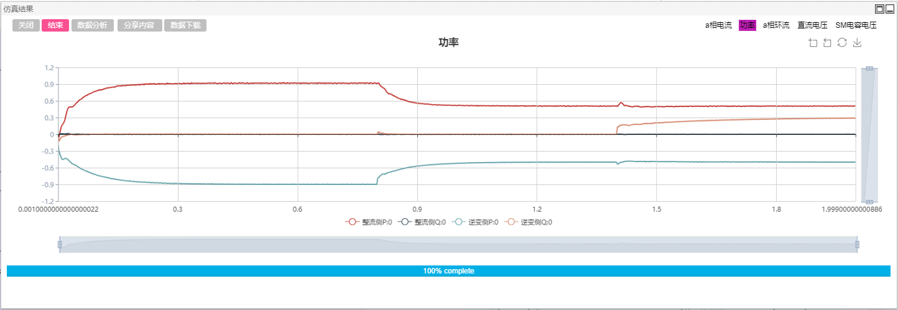
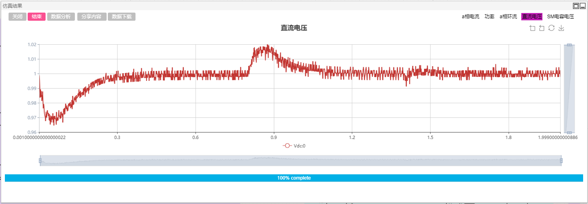

## 描述
模块化多电平换流器（MMC）是一种新型的电压变换电路，它通过将多个子模块级联，叠加输出高电压。具有输出谐波少、模块化程度高等特点，因而在电力系统中具有广泛的应用前景。 

本算例由国际大电网组织MMC工作组提供的双端MMC直流输电测试系统简化而来，默认为77电平640kV双端MMC-HVDC系统。用户可根据需要修改电平数（10-101）及系统电压、功率参数。为保证仿真速度，本模型中的半桥子模块(SM)采用戴维南等值的快速仿真模型，与详细电磁暂态仿真模型具有相同的精度，但计算效率大幅度提高。

## 模型介绍

MMC-HVDC系统分为整流侧（送端）与逆变侧（受端）两部分，两侧的电路拓扑及控制基本一致，仅存在微小差异。每侧的控制系统包括：标幺值换算、电流电压测量、电流电压坐标变换、瞬时功率计算、功率控制(整流侧为直流电压-无功功率控制，逆变侧为有功-无功功率控制)、环流抑制以及调制和排序算法多个模块。用户可在`全局参数`中更改拓扑和运行参数，实现不同的仿真组合及分析验证，拓扑图如下所示。

## 仿真

根据电平数和最大开关频率选择合适的仿真步长（电平数在101以下，采用最近电平调制时，建议采用10μs或20μs），对MMC-HVDC系统进行电磁暂态仿真。若希望得到更精确的开关过程波形，建议在`格式面板`->`电磁暂态`>`求解器设置`处勾选`开关/离散事件处理增强`选项，采用更小的仿真步长进行仿真。

### 仿真1：逆变侧功率控制暂态响应

点击工作空间右侧的“全局参数”栏，设定逆变侧的有功给定\$Pinv\_ref及无功给定\$Qinv\_ref。仿真默认为\$Pinv\_ref=-0.9，\$Qinv\_ref=0。在逆变侧控制中，有/无功的参考值由两个阶跃发生器给出，其初始输出值为\$Pinv\_ref和\$Qinv\_ref，0.8s后有功参考变为-0.5，1.4s后无功参考变为0.3。点击`格式面板`->`电磁暂态`>`仿真控制`>`开始`，选择相应的计算节点，即可得到仿真结果。可以发现，逆变侧的有/无功功率、整流侧无功以及直流电压在参考变化时可快速调整至设定值。

### 仿真2：环流抑制对比

环流抑制是MMC控制的关键环节之一，点击工作空间右侧的`全局参数`栏，设定整流侧环流抑制使能$CN_rec为0，即禁用整流侧的环流抑制。点击电磁暂态>仿真控制>开始，选择神威节点，即可得到仿真结果。可以发现，逆变侧环流峰峰值远小于整流侧，环流抑制效果明显。

### 仿真3：不同电平数/模块数仿真

点击工作空间右侧的`全局参数`栏，分别改变模块数$N的值为76和100，对应的输出电平数为77和101。重新运行，可以发现模块电容电压的值分别为8.42kV(640/76)、6.4kV(640/100)，且电容电压均衡效果明显。

