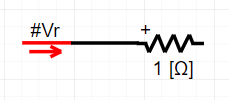
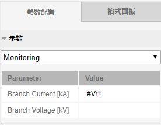

CloudPSS提供了灵活的量测方法及量测/输出元件供用户使用。

## 电气量量测方法

对于电气量(电压、电流、功率等)的量测主要有两种方法：
+ 利用量测元件(如电压表、电流表、功率表等)得到量测信号名称(以#号开头)或量测信号输出引脚；
+ 利用元件参数设置->Monitoring填写输出量测信号名称(以#号开头)。

例如要实现对某一电阻的电流测量可拖拽`电流表`与该电阻串联，并设置该电流表输出信号名称，或在该电阻的`参数设置->Monitoring`填写Branch Current [kA]对应的标签名称，如图所示。量测所得的信号或引脚可进一步连接至其余的控制、电气或输出元件。




## 信号整理

某些元件的量测信号为多维信号，例如`三相交流电压源->Monitoring->3 Phase Source Votage Vector`所对应的信号即为3维信号。用户若需要其中某一维的信号，如A相，则可利用`控制-基础->多路信号分离`进行信号拆分，详见：[多路信号分离元件说明](/components/comp_ChannelDeMerge.html)。同理，若要将多路信号合并为多维信号进行绘图，则可利用`控制-基础->多路信号合并`进行信号合并，详见：[多路信号合并元件说明](/components/comp_ChannelMerge.html)。

## 信号输出

为实现对某一信号的输出显示，必须同时加入`输出通道`与`示波器分组`两种元件。`输出通道`对输入信号进行采集并传递至示“波器分组”元件，其输入端口可以为元件的输出引脚，也可以为以#号开头的量测信号名称。注意输入引脚的维数与信号维数需匹配。单击`波器分组`元件可显示`输出通道`名称，勾选对应的名称即可在该`示波器分组`内显示该信号。在一个仿真工程文件内，`输出通道`和`示波器分组`理论上可存在任意个，用户可根据待输出信号的类型、大小范围等合理设置“示波器分组”所勾选的信号，便于仿真结果分析。

## 结果下载

仿真运行结束后（需手动点击`结束`按钮），可在弹出的波形展示界面中选择`数据下载`，即可选择相应的数据通道进行下载。
 


注意
: 只有**保存后**的算例工程才可进行数据下载。

下载的数据为经过压缩存储的数据格式。可通过以下Matab代码进行解析。解析后每个通道的数据存储在结构体`Ch_X`中（`X`为序号，`Ch_X.Name`为通道名称，`Ch_X.Data`为通道数据。）
 
```matlab CloudPSS Result Import /features/Measure/CloudPSSDataImport.m CloudPSSDataImport.m

clear;
clc;

[fname,pname]=uigetfile('*.*','open');
filename = strcat(pname,fname);

fid = fopen(filename,'r','n','utf-8');
config = fgetl(fid);
data = fscanf(fid,'%f');
fclose(fid);


textcell = regexp(config,' ','split');

starttime = textcell{1};
tempcell = regexp(starttime, '=', 'split');
Tstart = str2double(tempcell{2});

endtime = textcell{2};
tempcell = regexp(endtime, '=', 'split');
Tend = str2double(tempcell{2});

ChannelNo = length(textcell) - 2;

dataloc = 1;
for ptr = 1: ChannelNo
    loc = ptr + 2;
    temp = textcell{loc};
    tempcell = regexp(temp, '=', 'split');
    ChannelName{ptr} = tempcell{1};
    tempNum= regexp(tempcell{2}, ',', 'split');
    ChannelSpTime(ptr) = str2double(tempNum{1});
    ChannelPointNum(ptr) = str2double(tempNum{2});
    %generate Channel
    ChNo = sprintf('Ch_%d',ptr);
    Channel{ptr} = ChNo;
    %generate Channel Name
    eval(sprintf('%s.Name = ChannelName{ptr};',ChNo));
    %initialize Channel Data
    eval(sprintf('%s.Data = zeros(ChannelPointNum(ptr),2);',ChNo));
    %generate Timeline
    deltaT = 1/ChannelSpTime(ptr);
    timeline = (Tstart + deltaT):deltaT:(Tstart + deltaT*ChannelPointNum(ptr));
    timeline = timeline.';
    eval(sprintf('%s.Data(:,1)= timeline;',ChNo));
    eval(sprintf('%s.Data(:,2)= data(dataloc:(dataloc-1)+ChannelPointNum(ptr));',ChNo));
    
    %%
    dataloc = dataloc + ChannelPointNum(ptr);
end


disp('导入完成!');

for ptr = 1: ChannelNo
    fprintf('Ch_%d -> %s\n',ptr,ChannelName{ptr});
end

clear Channel ChannelNo ChannelPointNum ChannelSpTime ChNo config data dataloc deltaT endtime fid filename fname loc pname ptr starttime temp tempcell tempNum Tend textcell timeline Tstart ans


```


