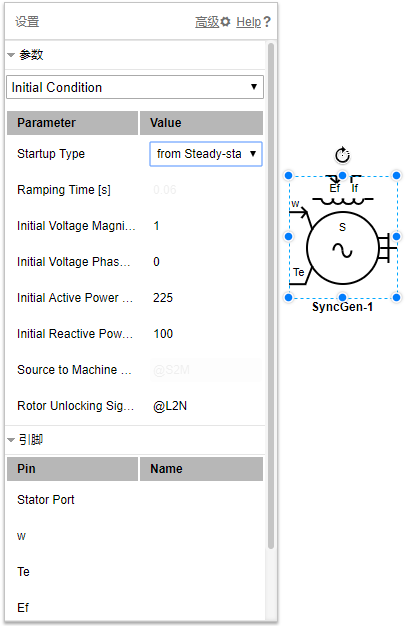
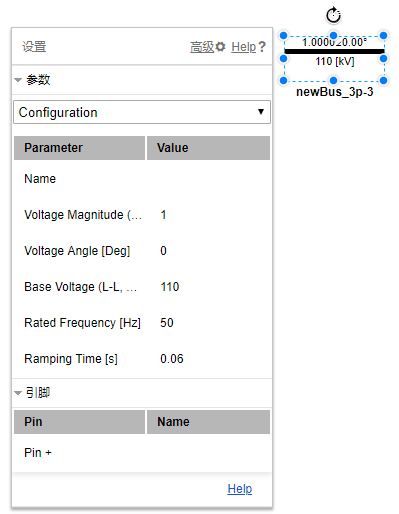
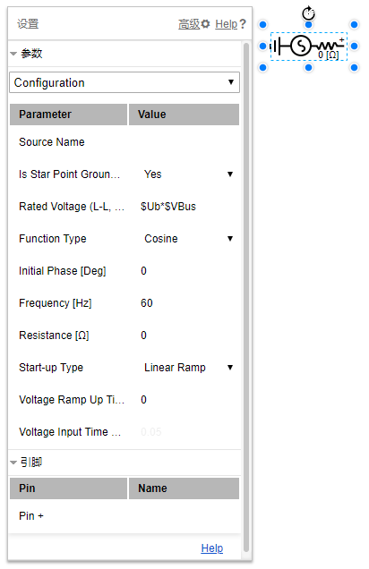

CloudPSS 3.0版本提供了从给定潮流断面启动电磁暂态仿真的功能。

CloudPSS的电磁暂态仿真中电气系统的启动分为两种：`从零启动`与`从潮流断面直接启动`。

## 从零启动至任意潮流断面
从零启动就是系统各处从电压、电流等于0的状态启动到稳态的过程。该方法适用于全部元件（包含电机除`from Steady-State`以外的全部启动方式）和全部连接方式。

对于同步发电机，在从零启动的过程中建议选择`Source to Machine`的启动方式。启动过程中，电机为理想电压源。启动至稳态后，通过指定`Source to Machine Signal`将电压源切换至电机即可。

## 从给定潮流断面直接启动

从潮流断面的启动方式则利用潮流断面数据直接从稳态启动。该方法可指定潮流断面，且启动耗时短，效率高。这种启动方式有几个要求：

1. 全部设备元件的端口**必须**与`母线`元件直接相连（或通过分线器与母线相连）。
1. 参与潮流计算的系统拓扑和参数应与电磁暂态仿真算例一致，以保证潮流断面可用。
1. `电机`、`电压源`、`母线`的启动参数需要与潮流计算结果一致，否则仿真无法达到稳态甚至出现错误。
1. 需要启用`格式面板`->`电磁暂态`->`启动参数`->`开启预启动流程`。

以下是需具体配置的参数。

### 同步电机启动参数配置

同步电机的`Initial Condition`页面中，
1. `Startup Type`需选择`from Steady-state`一项
2. 需将潮流计算结果中发电机节点的`节点电压幅值（p.u.）`、`节点电压相位（Deg）`、`注入有功（MW）`、`注入无功（MVar）`分别填入依次填入`Initial Voltage Magnitude [p.u.]`，`Initial Voltage Phase [Deg]`，`Initial Active Power [MW]`，`Initial Reactive Power [MVar]`四栏中。
    


同步发电机的相电压基值与所连母线的线电压基值匹配正确，否则填入的`节点电压幅值（p.u.）`应换算到同步电机的基值电压下。


### 母线启动参数配置

母线的`Cofiguration`页面中，应将潮流计算结果中各个母线的`节点电压幅值（p.u.）`、`节点电压相位（Deg）`填入`Voltage Magnitude [p.u.]`，`Voltage Angle [Deg]`选项中。潮流计算所用的`线电压基值`填入`Bus Voltage (L-L, RMS) [kV]`中，交流系统额定频率填入`Rated Frequency [Hz]`。`Ramping Time (s)`一项可留空（该参数暂无用处）。

### 三相电压源启动参数配置

若系统中还含有三相交流电压源，则电压源需特殊处理。其`Function Type`需设置为`Cosine`，`Initial Phase [Deg]`填入所连母线的母线电压相位，`Rated Voltage (L-L, RMS) [kV]`填入潮流计算结果的**母线电压有名值**，启动方式`Start-up Type`选择`Linear Ramp`，`Voltage Ramp Up Time [s]`设置为`0`。


上述潮流断面的配置可利用[元件表](ComponentTable.html)功能快速导入。


### 预启动参数配置

1. `格式面板`->`电磁暂态`->`启动参数`->`电压爬升时间`应根据交流系统的频率来确定，通常为3个工频周波，用于启动系统中的非线性元件。典型值：50Hz系统选择0.06s，60Hz系统选择0.05s。填入更大的爬升时间，启动效果更稳定，但相应耗时变长。
2. `格式面板`->`电磁暂态`->`启动参数`->`最大启动时间`应填入大于等于`电压爬升时间`的数值（典型值与`电压爬升时间`相等）。`最大启动时间`即启动过程中单个非线性元件的最长启动时间，该数值越大，启动效果更稳定，但相应耗时变长。

### 案例

详见[IEEE39节点系统](../examples/IEEE39.html)案例及模板，此处不再详述。

后续版本中，CloudPSS将提供潮流断面快速导入及更多的潮流断面启动方法，敬请关注！
