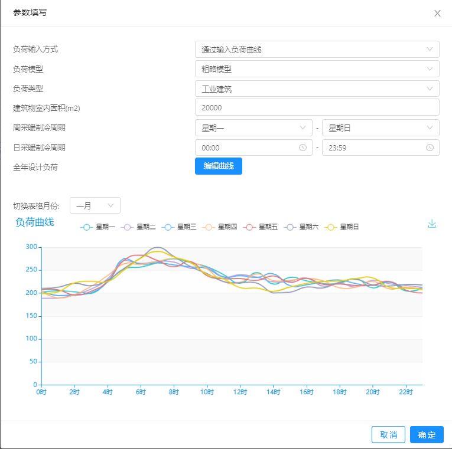
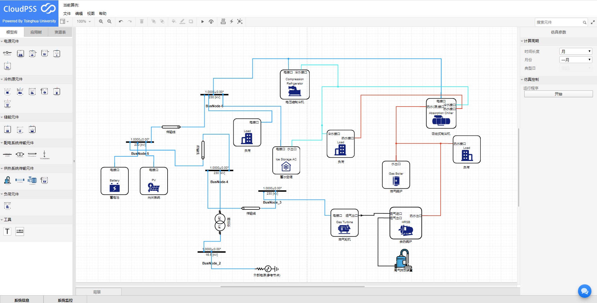
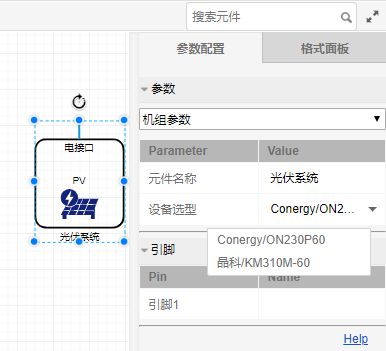
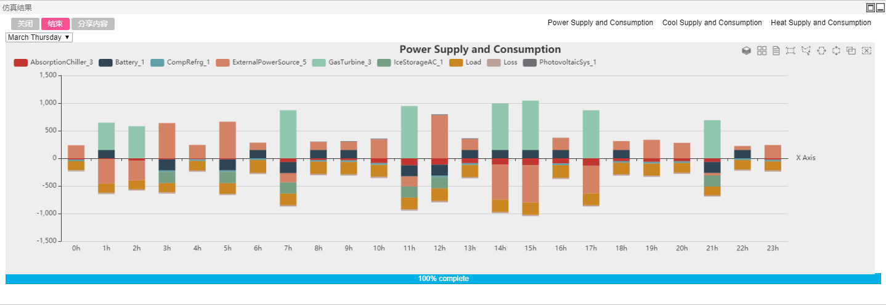
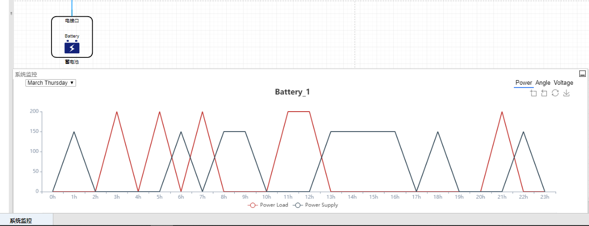

## 综合能源系统建模仿真平台简介

综合能源系统建模仿真平台主要面向区域电能、热能、太阳能、风能、电池与储能、天然气等多种能源系统，实现多种异质能源子系统之间的建模仿真，分析运行特性。平台由数据管理和建模仿真模块构成，数据管理模块可以对多种类型的基础数据进行录入和管理，建模仿真模块用于系统拓扑结构的搭建以及仿真计算结果的展示。

平台支持包括配电系统、供暖制冷系统、蒸汽供热系统及烟气余热回收系统在内的多能源系统耦合网络的建模仿真计算。与传统的综合能源系统仿真工具不同，平台集成了20余种常见的综合能源系统设备模型，允许用户灵活搭建任意能量梯级利用形式的综合能源系统，拓扑结构不受约束，同时支持并网系统、孤网系统的仿真计算。主要应用场景有：
1. 传统能源发电、新能源(风光集中式/分布式)、储能等多种能源形式构成的综合电网系统
2. 热电联产、热力锅炉、制冷制热等构成的综合热力系统
3. 天然气管网、燃气轮机、储气供气等构成的综合气网系统

平台旨在为用户在综合能源系统的建模仿真、能量管理、运行优化等方面提供帮助，未来将陆续加入更多的功能满足用户的多样化需求。

> **仿真步骤：建立项目→数据管理模块输入参数→建模仿真模块搭建拓扑仿真**

## 建立项目

1. 新建项目，输入项目信息；
2. 打开已有项目；

## 数据管理模块

**在数据管理模块输入仿真参数，输入参数信息后平台在建模仿真模块中将自动关联**

数据管理模块提供了友好的可视化界面，方便用户进行各类数据的录入、编辑和浏览，主要有以下几个部分：气象数据库、设备信息库、负荷信息库、运行策略库
主要功能有：保存参数、添加信息、从典型数据库导入、下载数据模板、上传数据模板等(按照下载的数据模板填写数据)

### 气象数据

气象数据库内置了美国国家航空航天局NASA提供的全球近一年的所有气象数据：主要包括风速、室外温度和太阳辐射强度三个参数，会自动为风电、光伏系统和太阳能集热器等提供气象数据，用户也可上传气象数据。

*气象数据库：*

### 设备数据

设备数据库中，用户可以将待选的设备数据分类录入到设备数据库中进行管理，平台将在后续的建模和仿真过程中自动关联该设备所对应的运行参数。

*设备信息库：*

### 负荷数据

负荷信息库中有电负荷、蒸汽负荷、采暖负荷及制冷负荷数据，其中电负荷以及采暖制冷负荷还提供了粗略模型和详细模型两种不同的负荷数据录入形式。对于粗略模型，用户只需要指定负荷的类型及平均负荷大小即可自动生成全年各典型日的负荷曲线；详细模型则需要用户完整地填入全年的负荷数据。

*负荷参数填写：*

### 运行策略

运行策略库保存了用户在建模仿真模块中上传的各元件所代表设备的运行策略，用户可进行统一管理和浏览。

*运行策略：*

## 建模仿真模块

**建模仿真模块用于系统拓扑结构的搭建以及仿真计算结果的展示。用户在此可以根据需要灵活搭建综合能源系统的拓扑结构、设置元件及计算参数，然后进行仿真获取模拟计算的结果。**

### 搭建拓扑结构

拓扑结构是真实物理系统的模型：进入建模仿真模块，在左侧模型库内选择模型拖至工作区，将各个元件连接起来搭建项目的模型，平台用不同颜色标识了电能流、热水流、冷水流、蒸汽流以及烟气流的连接线，方便用户正确识别不同子系统的连接关系。

### 编辑参数

建模仿真模块内，用户可通过右侧参数面板参数进行编辑，主要有基本额定参数和运行参数
建模仿真之前，1.输入基本额定参数或选择数据管理模块内已有的模型参数；2.在运行参数组处输入运行参数

运行参数是实际运行时的参数，主要有机组运行策略参数、参考节点模式和其他参数
1.机组运行策略：通过添加曲线，给定不同时刻机组数量来指定运行策略；
2.参考节点模式：参照潮流计算中的平衡节点，仿真计算以参考点为边界条件进行求解计算。主要有电力参考点和热力参考点，若设置为热力参考点，则以热力参数为边界条件求解其他参数如电力参数。

### 开始仿真

当正确设置完所有元件参数后，点击仿真控制模块中的“开始”按钮，系统自动校验通过后即可开始仿真。

### 结果展示及分析

仿真计算结果以能量供需组成图的形式显示在工作台中央，如电网、热网（供热供冷）、气网等；
用户可以通过选中具体元件在系统监控面板中查看其运行状态及分析

*电网仿真结果示例：*

*蓄电池仿真结果示例：*

## 相关视频

