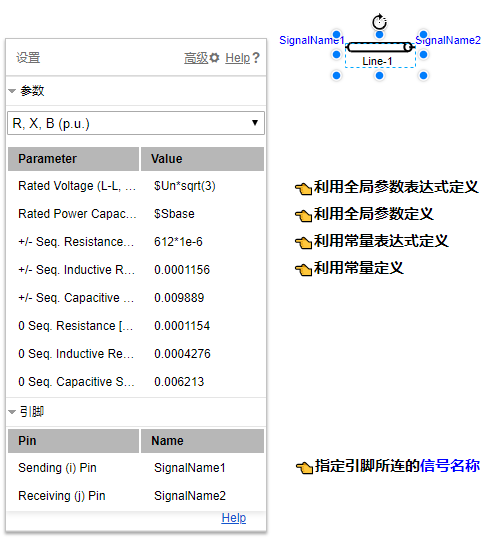
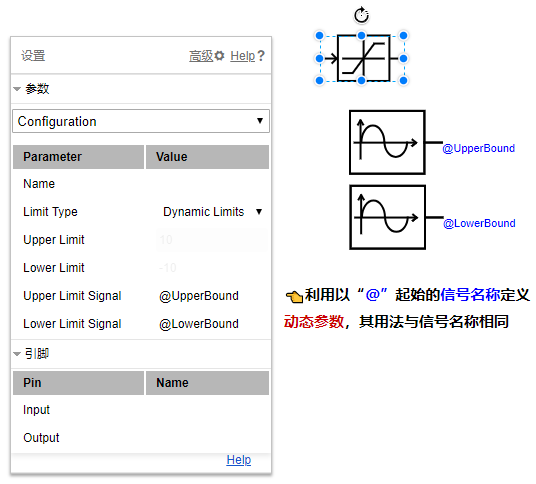
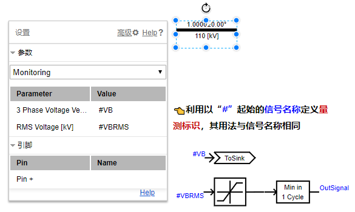
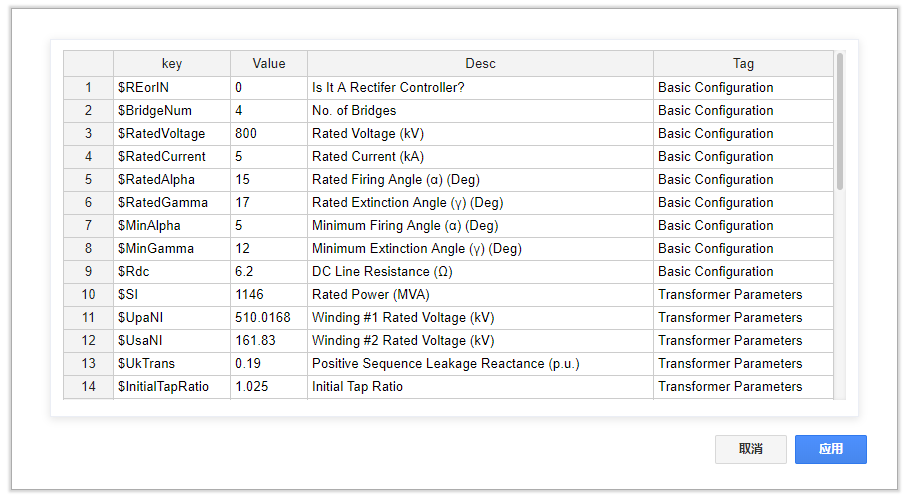
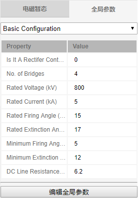


**摘要**
该文档为CloudPSS参数及引脚体系的介绍文档。用户可阅读该文档学习参数、变量、引脚之间的区别和联系，并学会利用该体系灵活、快速地构建算例。


CloudPSS提供了一套以`参数（Parameter）`和`引脚（Pin）`为核心的建模系统。用户可使用不同类型的参数和引脚实现对`系统`（包括元件、模块和算例）的灵活维护和管理，进而实现各种高级仿真功能。

采用以下方法可调出`参数配置面板`：
1. 点击相应元件或系统的`图标`后，选择右侧`属性栏`>`系统参数/变量`，即可调出`参数配置`面板。
2. 双击相应系统的`系统图标`进入系统内部，点击空白区域，进而选择`属性栏`>`系统参数/变量`，即可调出`参数配置`面板。
3. 开启`视图`菜单中的`参数弹出框`，点击相应元件或系统的`图标`后，即可出现浮动`参数配置`面板。

如图，CloudPSS中的每个`系统`（包括元件、模块和算例）都享有一套独立的参数和引脚体系。每个`系统`都包含`参数`、`变量`和`引脚`三个部分，其中，
1. `参数`是定义及描述系统特征的度量数据（如额定电压、电阻值等信息）。参数分为`Real`、`Integer`、`Choice`、`Text`、`PinLike`、`Legency`六种类型。
1. `变量`与`参数`具备相同的类别，其可以引用`参数`进行赋值或计算，但数值无法从外层传入。`变量`仅能在`系统`内部访问到，其引用方法与`参数`一致。
1. `引脚`是系统与内部、外部系统连接的输入输出接口。根据引脚类型的不同，引脚可分为`电气引脚（Electrical）`、`控制引脚（Input、Output）`、`热力引脚（Heat）`等不同类型。类型不同的引脚不能相连。`控制引脚`为有向引脚，根据数据流方向又分为`输入引脚（Input）`和`输出引脚（Output）`两类。


**参数、变量的作用域**
在某一系统内定义的参数和变量，其作用域仅局限在该系统内，无法在其外层或内层的系统中进行直接引用。若必须跨层传递`参数`数值，只能通过在外层或内层系统中设置相应`参数`，实现`参数值传递`。


```mermaid
graph TD
A[系统] --> B[参数/变量]
A --> C[引脚]
B --> D[实型/Real]
B --> E[整型/Integer]
B --> F[字典型/Choice]
B --> G[文本型/Text]
B --> H[类引脚型/PinLike]
B --> P[默认/Legency]
H --> |仿真中可变| I[类输入引脚型/Input]
H --> |内部量量测| J[类输出引脚型/Output]
C --> K[电气引脚]
C --> L[控制引脚]
C --> M[热力引脚]
L --> N[输入引脚]
L --> O[输出引脚] 
```

## 参数/变量

参数和变量分为整数型（Integer）、实数型（Real）、字典型（Choice）、文本（Text）、类引脚（PinLike）、默认（Lengency）六类。用户可直接在`系统`的参数列表框输入/选择相应类型的参数值和变量值。参数和变量具备如下特性：
1. 实数型参数/变量支持输入[math.js表达式](https://mathjs.org/)；
2. 类引脚型参数/变量其本质即为引脚，可以通过名称与引脚相连。
3. 默认型参数/变量用以兼容旧版本算例中的全局参数。


**参数与变量的区别**
针对某一系统，`参数`可以与系统外层、内层元件之间交互参数数据的方式，而`变量`则只能在系统内层交互数据。例如：CloudPSS平台提供的元件，由于用户无法看到元件内部信息，故从外部只能看到`参数`。
（待补充）


## 引脚

每个系统（元件、模块和算例）都具备可互相连接的接口（端子），称为`引脚`。引脚之间的连接方式有线连接、信号名连接和混合连接三种，如图所示。

1. **线连接**：即直接利用“连接线”即可连接相应的引脚。
1. **信号名连接**：在参数配置页面，指定连接到引脚的`信号名称`。若不同元件的`引脚`之间标注了相同的`信号名称`，则其相应的引脚即被认为是相连的。为便于区分`引脚名称（Pin Name）`和`信号名（Signal Name）`，`引脚名称`的默认颜色为黑色，`信号名称`的默认颜色为蓝色。 
1. **混合连接**：即可同时使用上述两种连接方式。如图。

## 类引脚型参数与引脚

类引脚型参数与控制引脚本质均为引脚，因此相同类型的参数或引脚之间可以通过**信号名连接**方式进行连接。

### 类输入引脚型参数

类输入引脚型参数，或称`动态参数`，其等同于系统的输入信号名称。信号名以`@`标识符为前缀，其使用方法与一般的引脚名称相同。例如：限幅器、线性传递函数的动态限幅参数均为类输入型参数。

### 类输出引脚型参数

类输出引脚型参数，或称`量测标识`，其等同于系统的输出信号名称。信号名以“#”标识符为前缀，其使用方法与一般的元件名称相同。例如：元件`Monitoring`参数页的全部参数、电压表、电流表中的`Name`参数均为类输出型参数。



**引脚的特殊用法**

`电气引脚`可以与`控制-输入引脚`直接相连，此时，传入控制系统的数值为电气引脚处的**节点电压（单位：V）**。但CloudPSS不建议此类用法。常规的操作是利用电压表测量节点电压，并利用`量测标识`传入控制系统。


## 多层系统嵌套与路径
由于参数和引脚只能作用于当前系统层，故在存在多个系统、多层系统嵌套时，不同系统的参数和引脚可能会存在重名。为此，CloudPSS引入`路径（Path）`这一概念，并为每个定义的参数和引脚提供含`绝对路径`的完整名称，用以区分不同系统的参数和引脚体系。例如，
1. 在Main系统下A系统的Pin信号名，其信号名的绝对名称为`Main.A.Pin`；
2. 在Main系统下A系统的类输入参数值@Input，其信号名的绝对名称为`@Main.A.@Input`，即系统会自动给绝对名称添加@前缀；
3. 在Main系统下A系统的类输出参数值@Msr，其信号名的绝对名称为`#Main.A.#Msr`，即系统会自动给绝对名称添加#前缀。

此外，CloudPSS提供了对`参数`、`变量`和`引脚`绝对名称、最终数值的实时计算和预览功能。用户将鼠标悬停在参数输入框上，即可在浮动框内查看到绝对名称和数值。

若想进一步了解如何配置系统参数，可参见[参数及引脚体系：编辑系统参数及变量](../features/Parameters_variables.html)。

## 旧版本功能：全局参数（已从CloudPSS 4.1.0版本移除）

全局参数为算例（或模块）范围内的全局变量。全局参数标识符以“$”标识符为前缀，可在算例（或模块）范围内被各个元件使用。全局参数以字典的形式存储，可在右侧`控制面板`->`全局参数`->`编辑全局参数`处进行编辑。
 

每个全局参数包含`全局参数标识符`、`数值/表达式`、`全局参数描述`、`全局参数组名`四个设置选项。其中，
1. `全局参数标识符（Identifier）`以“$”标识符为前缀，是全局参数的唯一标识符，可在算例或模块内填写元件参数时引用。
1. `数值/表达式（Value/Expression）`定义了全局参数的数值或包含全局参数的[math.js表达式](https://mathjs.org/)。
1. `全局参数描述（Parameter Description）`定义了全局参数的描述文字，显示在`控制面板`->`全局参数`->`全局参数列表`中的`Parameter`一项。
1. `全局参数组名（Group Name）`定义了全局参数的分组，用于在`全局参数列表`中控制全局参数的分组显示。

配置好全局参数信息后，可在`全局参数列表`中快速编辑每个全局参数的`数值/表达式`。

在使用全局参数过程中，需要注意以下几点：
1. 全局参数仅用于配置元件参数，因此必须在仿真开始前赋值，参数在仿真过程中不可改变。
1. 全局参数表支持复制、粘贴、自动填充功能。用户可将全局参数导入进Excel等表格工具继续处理，再粘贴回CloudPSS平台。
1. 后定义的全局参数可引用较先定义的全局参数，反之不可以。如图。

    