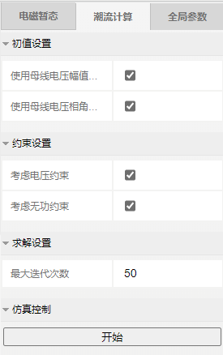
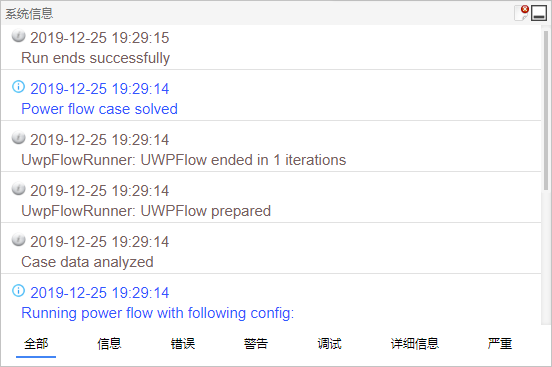

CloudPSS 提供了潮流计算功能，可以依据网络参数进行潮流计算，并将计算结果写入元件[启动参数](./Initialization.html)，实现稳态启动。

## 准备工作

要使用 CloudPSS 提供的潮流计算功能，首先需要搭建满足要求的算例。

目前，潮流计算功能支持的设备元件包含[静态负载](../components/comp_newExpLoad_3p.html)、[三相交流电压源](../components/comp_newACVoltageSource_3p.html)、[同步发电机](../components/compSyncGeneratorRouter.html)、[并联电容/电抗器](../components/comp_newShuntLC_3p.html)、[三相传输线](../components/compTranssmissionLineRouter.html)、三相[电阻](../components/compnewResistorRouter.html)、三相[电感](../components/compnewInductorRouter.html)、三相[电容](../components/compnewCapacitorRouterWithInitValue.html)、[三相双绕组变压器](../components/comp_newTransformer_3p2w.html)和[三相三绕组变压器](../components/comp_newTransformer_3p3w.html)，更多元件支持将在后续版本中逐步加入。

潮流计算功能是围绕着[三相交流母线](../components/comp_newBus_3p.html)进行的。因此，上述设备元件中，单电气端口的元件（静态负载、三相交流电压源、同步发电机、并联电容/电抗器）只有当其电器端口与母线**直接**相连时，才会被计入；对于多电器端口的元件，则其每一个电气端口都必须与母线**直接**相连。特别地，[电流表](../components/comp_NewCurrentMeter.html)可以串入电路中，在潮流计算过程中将被忽略。

每条母线至多连接一个电源（三相交流电压源或同步发电机），其节点的类型和相关参数在电源的 Power Flow Data 页面指定。未连接电源的母线将作为 PQ 节点参与计算。同一个算例中可以包含多个独立的网络，每个网络都必须包含且仅包含一个平衡节点。


潮流计算中暂不考虑[静态负载](../components/comp_newExpLoad_3p.html)的功率特性。


## 参数设定

潮流计算应用有以下几个可配置的参数：

+ 初值设置
  可以配置是否使用母线上设置的电压幅值和相角作为潮流计算的迭代初值。
+ 约束设置
  可以配置是否考虑三相交流电压源或同步发电机 Power Flow Data 页面指定的电压约束（作 PQ 节点时）和无功约束（作 PV 节点、平衡节点时）。
+ 求解设置
  可以配置求解器的相关参数。
<!-- + 求解器选择
  可以选择“仅求解当前母线电压下功率不平衡量”，此时，将不进行潮流计算，而是直接以母线的电压作为潮流计算的结果输出，并给出各线路在该电压下的潮流及母线上的功率不平衡量。 -->

## 操作流程

在界面右侧的“潮流计算”选项卡中配置计算参数后，可以点击“开始”进行潮流计算。

计算过程中，系统信息窗口将显示计算过程中的关键事件，如计算开始、电机越限或恢复控制、计算结束和计算未收敛等。如下图所示。

计算完成后，结果窗口将以表格的形式给出各母线电压及潮流和各线路的潮流，可以点击“数据下载”，将结果保存为 Excel 表格。


只有**保存后**的算例工程才可进行数据下载。


对于**收敛的**计算结果，可以点击“写入潮流断面”，将潮流计算的结果作为元件启动参数填入各元件。当潮流计算不收敛，此按钮会自动隐藏。

## 案例

详见 [IEEE 标准系统](../examples/IEEE39PF.html)案例及模板，此处不再详述。

## 常见问题


No bus was found. To start a PF calculation, all electric components must be connected to buses.

在潮流计算中，所有元件必须连接在[三相交流母线](../components/comp_newBus_3p.html)上。


Bus `name` is isolated.

说明该母线没有与平衡节点直接或间接相连。


Bus `names` belongs to multiple areas.

说明该母线与多个平衡节点直接或间接相连。

---
后续版本中，CloudPSS 将提供更多潮流计算的元件支持，敬请关注！
