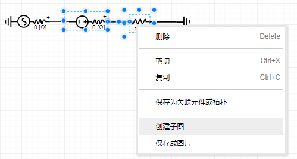
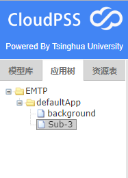

子图功能用于整合多个元件形成新的图层，图层间相同标号的节点互相连接。利用子图功能可实现仿真图功能划分、电气-控制划分等，在大型仿真系统中具有使仿真图简洁、清晰、美观的优点。本节对子图功能进行详细讲解。

## 创建子图

在工作窗口中选择多个元件，单击鼠标右键选择新图标图层，在弹出的对话框中对子图进行命名，设定为Sub，如图所示。点击确定弹出`是否自定义端口名称`对话框，点击确定，对子图的端口进行自定义。

子图端口的自定义界面如图所示。

子图端口分为两类，边界端口与非边界端口。边界端口为所选择元件与外部电路接口的端口，若该端口已经命名，则在上图界面中的修改前选项中显示该名称，如A2，否则由系统指定端口名，如Sub.p01。非边界端口为所选元件中不与外部电路连接的且引脚被标号的端口，如图中直流电压源与电阻的连接点A1。在上图的界面中，可以选择是否显示端口。`修改后`一栏可以编辑，用户可根据需要更改端口的名称，也即连接在图层间的标号。`描述`一栏可修改封装子图图标的引脚显示名称，`位置`一栏中可修改端口的方向。

在本例中，修改端口名称为：A2修改为A2，描述为R+，Sub.p01修改为A0，描述为Vs-。显示非边界端口，并修改Sub.A1为A1，描述为Vs+。点击新建，即可完成子图的建立。如图所示。


子图中不能继续创建新的子图，即不允许子图嵌套。


## 打开子图

创建完毕后工作空间中将出现该子图的封装图标，双击该图标可打开子图。子图所处的页面为Sub，即新图标图层的名称。点击页面名称旁边的关闭按钮可关闭该子图。

## 删除子图

在主图层中，选中需要删除的子图。可在子图上点击右键，在下拉菜单中选择`删除`或直接按下键盘[[Delete]]键，在弹出的对话框中选择删除的类型——`仅删除图标不删除子图`以及`删除图标且删除子图`。当选择前者时，子图并不会被删除，可通过工作空间左侧`应用树`重新打开该图层。

如选择`删除图标且删除子图`，则会将图标与元件所在图层一并删除。

## 更新子图

如果用户对子图进行了修改，如添加了新的元件，需在子图图层空白中鼠标右键选择更新子图。系统会自动识别子图中的边界端口与非边界端口，再次弹出子图端口的自定义界面供用户进行修改、添加。点击新建后，即可完成主图层中的图标更新。

