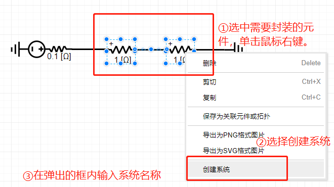
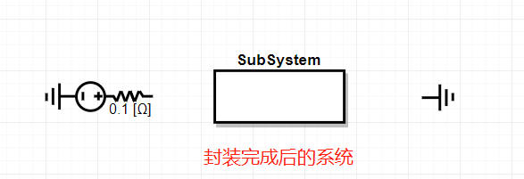
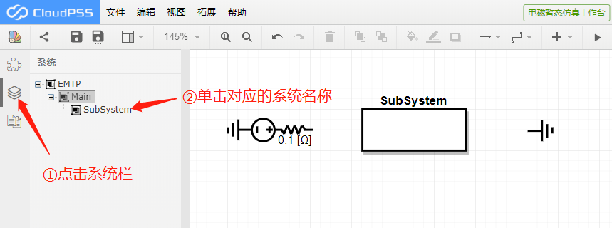
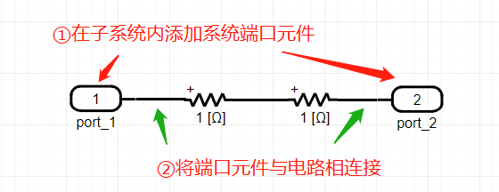
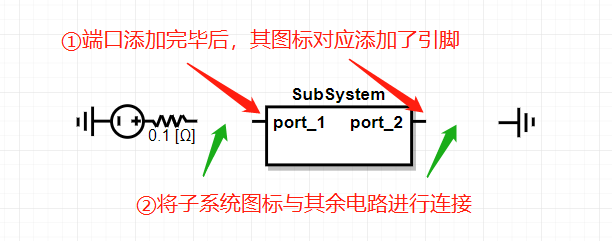
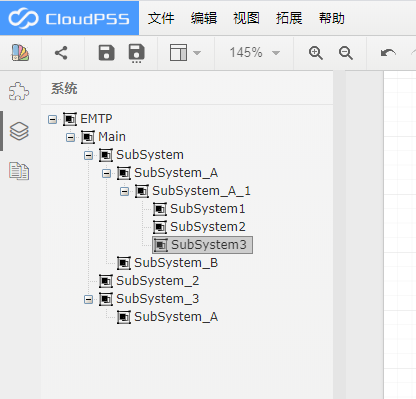

CloudPSS提供了灵活稳定的系统功能用于实现仿真拓扑的功能及结构封装。在大型仿真系统中使用系统功能可使得仿真图结构清晰、界面简洁。

## 系统定义

**系统**是CloudPSS描述模型信息的基本单元。CloudPSS中的**系统**概念类似于Matlab Simulink中的Module，可通过不同Module之间的连接和多层嵌套实现复杂系统的构建和组织。因此，在CloudPSS中，每个独立的元件、每个模块、甚至每个算例，都可认为是一个`系统`。

在CloudPSS平台中，一个系统包含
1. 若干`元件（Component）`，以及通过`连接线`和`引脚（Pin）`连接形成不同的拓扑，用以描述真实物理系统的模型；
2. 一套独立的`参数（Parameter）体系`，用以维护当前系统的全部可配置参数和引脚；
3. 若干`图纸（Canvas）`，用以承载元件和拓扑的图形化展示功能。每个`系统`至少需要包含一张`图纸`。

基于上述`系统`设计理念，保证了在CloudPSS中`系统`与`元件`具备一致的结构和使用体验。

## 创建系统

在工作窗口中选中任意个数元件，单击鼠标右键选择`创建系统`，在弹出对话框中对系统进行命名，点击`确定`后，所选中元件将被封装进一个`系统`，对外显示为`系统图标`，如下图所示。


**系统名称要求**
用户可自由定义该系统的名称，名称可为任意英文、中文字符串。**同一层级系统的名称不可重复**。


## 查看系统

+ **方法1**：双击`系统图标`，可打开并查看该系统的内部图纸。
+ **方法2**：单击左侧`系统栏`，单击该系统所对应的名称可打开并查看该系统的内部图纸，如下图所示。

`系统栏`的使用方法详见[系统栏、图纸栏及导航栏](SystemBar.html)。

## 系统重命名

在左侧`系统栏`处，鼠标移动对应系统名称，右击选择`重命名`可对系统名称进行更改。**同一层级系统的名称不可重复**。

## 系统端口引脚配置

当所选择元件被封装为系统后，其与上一级系统的各元件之间的连接将会断开。此时需要给封装的系统添加`端口（Port）`。其具体方法为：
+ **第1步**：双击待添加端口的`系统图标`，在`资源管理栏`>`模型库`>`系统-基础`中选择`系统端口`元件，并将其拖拽至工作台。
+ **第2步**：对`系统端口`元件进行参数、引脚配置，并对端口名称进行配置，完成后该系统图标将自动添加对应的引脚。配置方法详见[系统端口元件说明文档](../components/comp_SystemPort.html)。
+ **第3步**：将`系统端口`与系统内的元件拓扑进行连接，在上一级系统中将`系统图标`与外围元件拓扑进行连接。

## 系统参数、变量配置

CloudPSS提供了强大的参数和引脚编辑系统，且`系统`与`元件`兼容相同的参数和引脚配置方法。用户可先阅读[参数及引脚体系](../features/ParameterSystem.html)熟悉参数配置，进而阅读[系统参数及变量](../features/Parameter_variables.html)学习如何为`系统`配置参数及变量。


**系统参数、变量的作用范围**
在某一系统内定义的参数和变量，其作用域仅局限在该系统内，无法在其外层或内层的系统中进行直接引用。若必须跨层传递参数数值，只能通过在外层或内层系统中设置相应参数，实现`参数值传递`。


## 系统删除

选中需要删除的`系统图标`，鼠标右键选择`删除`、按下键盘`Delete`或`Backspace`键即可删除该系统。

## 系统复制、剪切和粘贴

选中`系统图标`，鼠标右键选择`复制`或按下`Ctrl+C`键可进行系统的复制；鼠标右键选择`剪切`或按下`Ctrl+X`键可进行系统的剪切；鼠标右键选择`粘贴在此处`或按下`Ctrl+V`键可进行系统的粘贴。`粘贴`操作后会自动对粘贴后的系统进行命名，命名规则为以被复制/剪切系统的名称为基础，添加序号作为后缀作为新名称。剪切、粘贴操作后，`系统栏`中显示的系统名称及树形结构也会相应改变。

**系统复制、剪切和粘贴要求**
不允许嵌套复制及剪切，即：**不允许将一个系统复制到该系统内部**。


## 系统嵌套

CloudPSS允许系统嵌套，即可在系统内构建新的子系统。理论上系统可嵌套层数没有限制，但不建议用户嵌套超过10层以上的系统。嵌套后的各子系统的树形关系可在左侧 “系统栏“处进行查看，如图所示。

## 撤销、重做操作

CloudPSS提供对系统全部操作动作的撤销和重做。鼠标右键工作台的空白区域选择`撤销`或按下`Ctrl+Z`键可进行操作动作的`撤销`；鼠标右键工作台的空白区域选择`重做`或按下`Ctrl+Y`键可进行操作动作的`重做`。